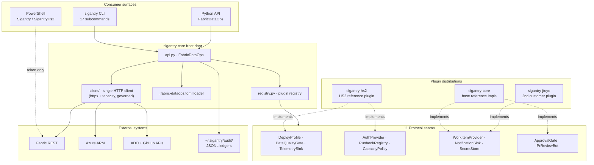
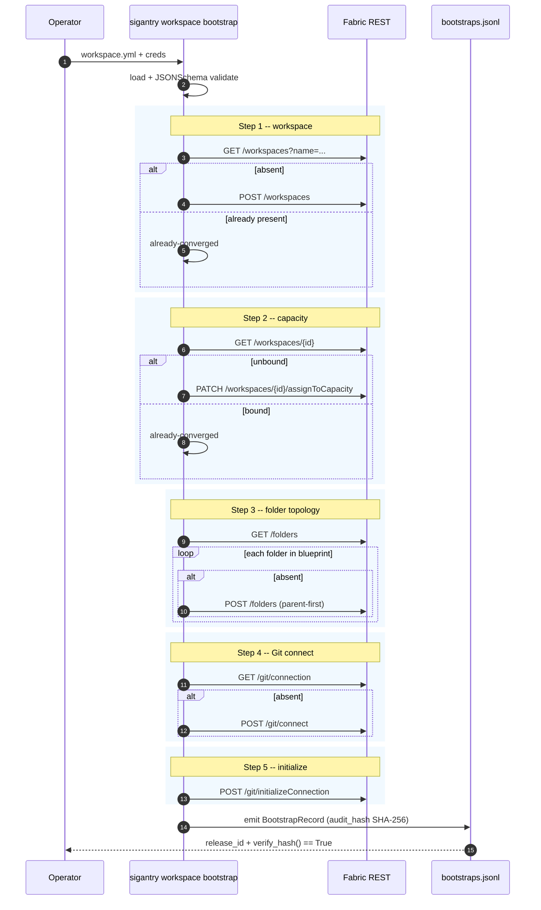
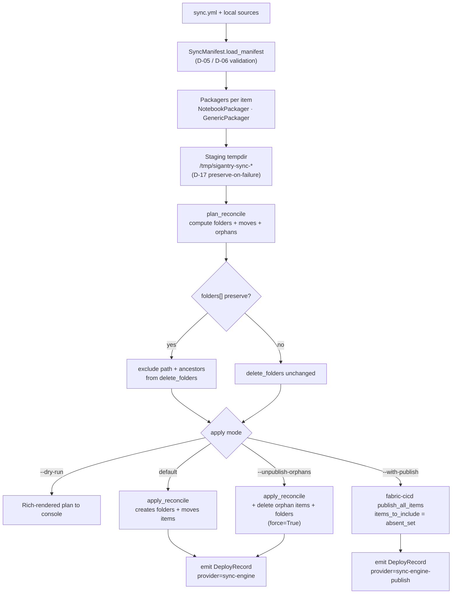
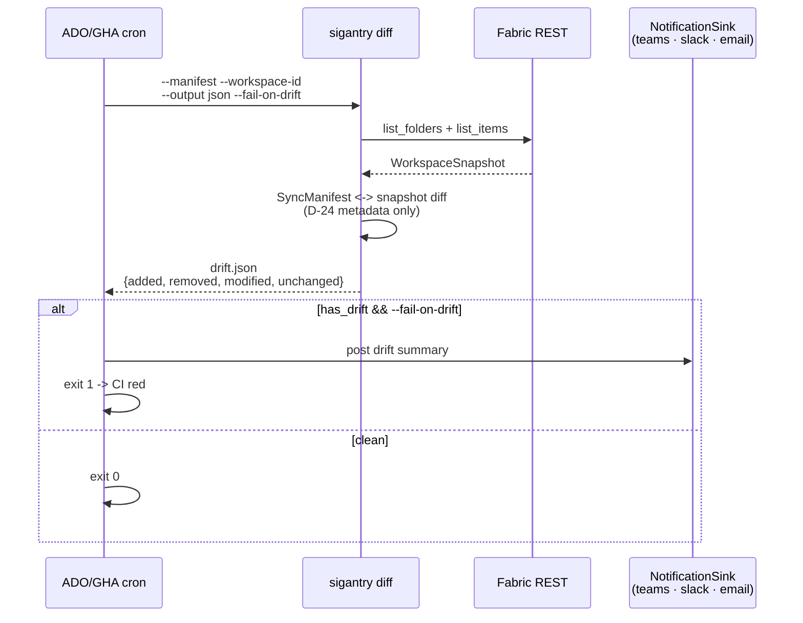
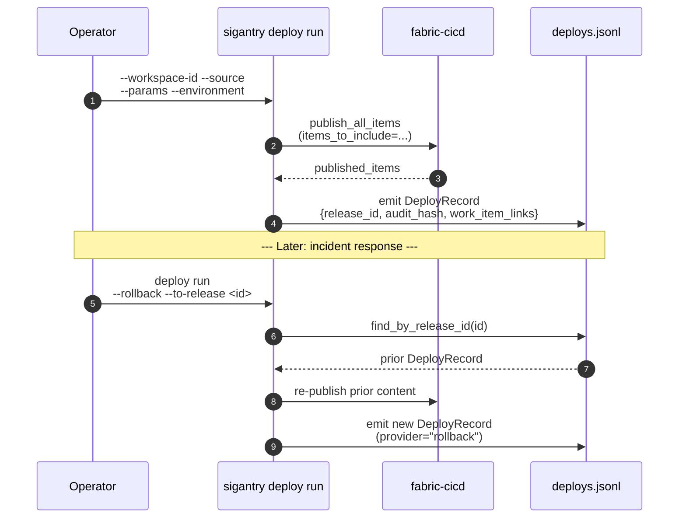
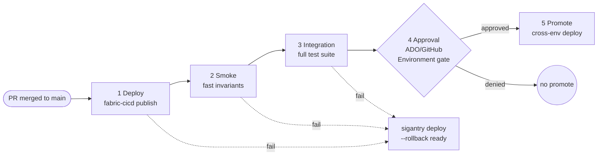
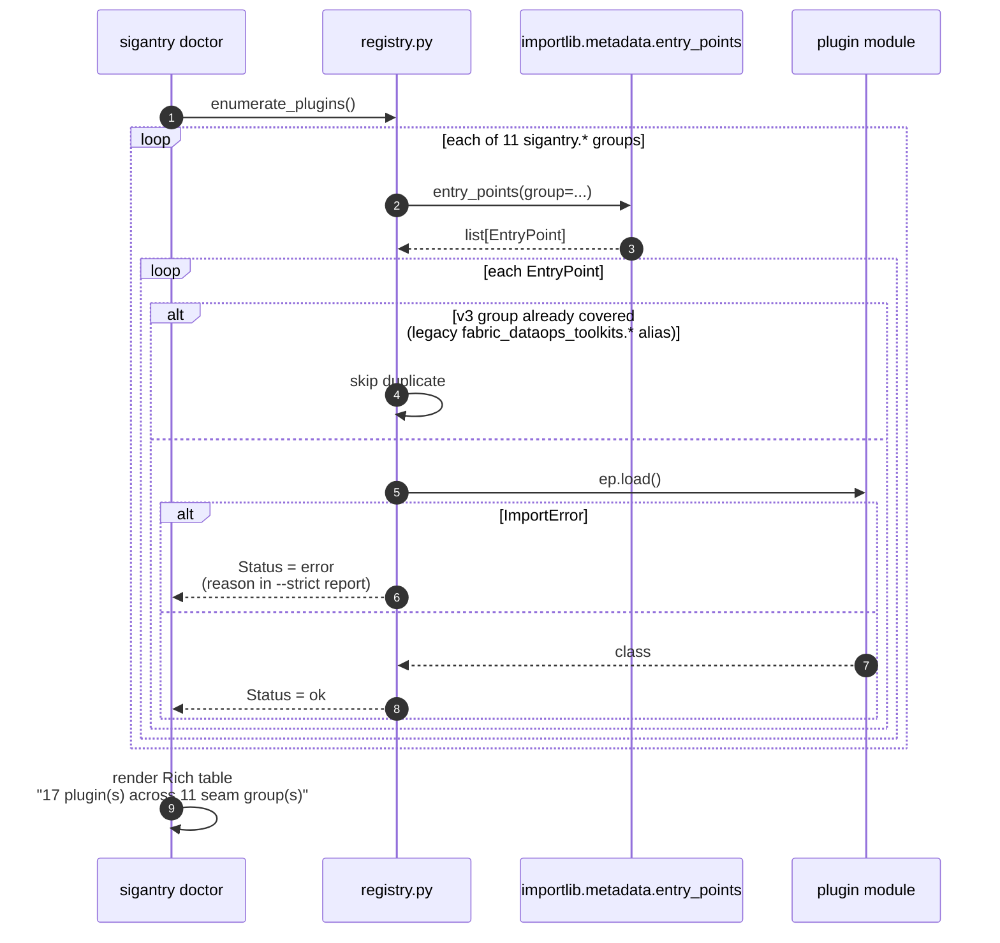
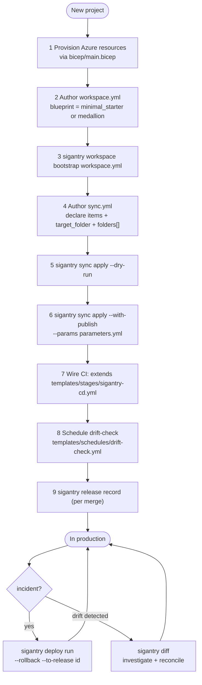
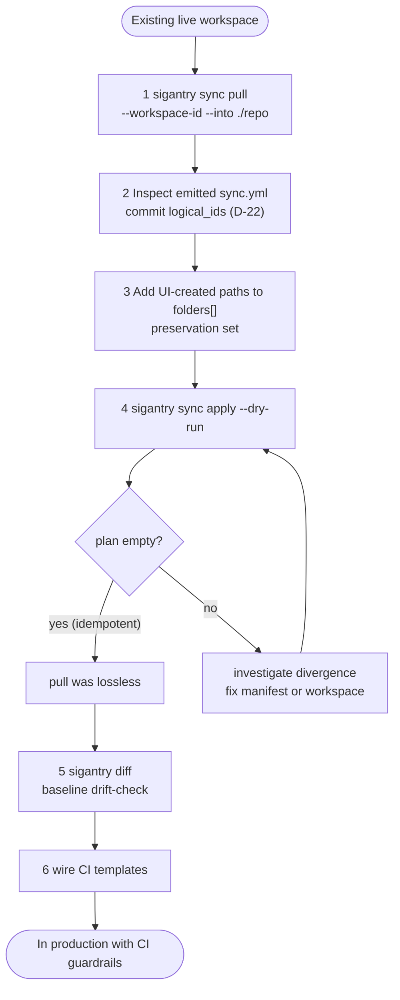

# Sigantry Capability Catalogue

**Generated:** 2026-06-12 -- master @ `f577ab0` (v3.2.1 release-day refresh)
**Toolkit version:** `3.4.0` (`sigantry_core/_version.py`)
**Audience:** operators evaluating what Sigantry can do today, and contributors mapping the surface to the source.

This document is the authoritative inventory of operational capability, complementing the day-to-day usage reference in [`handbook.md`](handbook.md). Every claim is grounded in a `file:line` citation; every command was verified live against `sigantry --help` on the date stamped above.

## How to read this document

Each capability is labelled with one of:

- **VERIFIED** -- confirmed against the live tool output and/or a falsifiability test in `tests/`.
- **PARTIAL** -- the surface exists but is gated, deferred, or conditionally wired (e.g. requires an opt-in flag or a plugin not in the base distribution).
- **OPEN** -- documented design that is NOT yet wired in code; tracked in [`../V3.X-ROADMAP.md`](operator/V3.X-ROADMAP.md) or [`../OPERATOR-PUNCHLIST.md`](operator/OPERATOR-PUNCHLIST.md).

When a capability cites a test, you can falsify the claim by deleting the test file and re-running -- if the related code still passes spec, the test was load-bearing and the citation is honest; if not, the gap is real.

---

## Table of contents

1. [Architecture at a glance](#1-architecture-at-a-glance)
2. [CLI capability catalogue](#2-cli-capability-catalogue)
   1. [Workspace lifecycle](#21-workspace-lifecycle)
   2. [Capacity lifecycle](#22-capacity-lifecycle)
   3. [Folder-aware sync engine](#23-folder-aware-sync-engine)
   4. [Drift detection](#24-drift-detection)
   5. [Item deployment + rollback](#25-item-deployment--rollback)
   6. [Git integration](#26-git-integration)
   7. [Variable Library, Environments, DQ gates](#27-variable-library-environments-dq-gates)
   8. [Release records (work-item traceability)](#28-release-records-work-item-traceability)
   9. [Governance: RBAC + label sync + tenant settings](#29-governance-rbac--label-sync--tenant-settings)
   10. [PR-review bot](#210-pr-review-bot)
   11. [Operational diagnostics](#211-operational-diagnostics)
3. [Python API](#3-python-api)
4. [PowerShell modules](#4-powershell-modules)
5. [CI/CD pipeline templates](#5-cicd-pipeline-templates)
6. [Plugin development -- 11 protocol seams](#6-plugin-development--11-protocol-seams)
7. [Audit + observability](#7-audit--observability)
8. [End-to-end operator workflows](#8-end-to-end-operator-workflows)
9. [What is NOT yet available](#9-what-is-not-yet-available)
10. [References](#10-references)

---

## 1. Architecture at a glance

Sigantry is a thin governance and orchestration layer over Microsoft Fabric REST + Azure ARM + Git provider APIs. It exposes three consumer surfaces that funnel through one front door, dispatch to plugin-supplied behaviour via 11 protocol seams, and emit immutable audit records.



**Source citations:**

- 17 subcommands wired in `sigantry_core/cli.py:66-82` (`add_typer` calls). [VERIFIED]
- 11 entry-point groups enumerated in `sigantry_core/registry.py:46-60`. [VERIFIED]
- One HTTP client governed by the banned-API gate in `tests/prereqs/test_phase8_banned_apis.py` (no module outside `sigantry_core.client` may `import httpx` directly). [VERIFIED]

---

## 2. CLI capability catalogue

The full CLI surface is registered in [`sigantry_core/cli.py`](../sigantry_core/cli.py). Each subapp below is the second-level Typer app; many carry their own subcommands.

### 2.1 Workspace lifecycle

[VERIFIED]. Wraps Fabric REST `/v1/workspaces` plus Phase 13.5's BOOTSTRAP-XX greenfield materialiser.

| Verb | Purpose | Source | Audit |
|---|---|---|---|
| `sigantry workspace list` | List every workspace the principal can see (`GET /v1/workspaces`). | `sigantry_core/workspace/cli.py:35` | -- |
| `sigantry workspace get <id>` | Inspect a single workspace. | `cli.py:68` | -- |
| `sigantry workspace create` | Create a new workspace. | `cli.py:87` | -- |
| `sigantry workspace delete` | Destructive; gated by `force=True` (DestructiveOpError without it). | `cli.py:106` | `delete_item` audit |
| `sigantry workspace assign-capacity` | Bind a workspace to a capacity. | `cli.py:124` | -- |
| `sigantry workspace list-items` | Enumerate every item in a workspace. | `cli.py:135` | -- |
| `sigantry workspace bootstrap workspace.yml` | Greenfield materialiser: workspace + capacity bind + folders + Git connect + initialize. | `cli.py:165` | `BootstrapRecord` (`bootstraps.jsonl`) |

The `bootstrap` verb runs a probe-before-act sequence -- every step probes current state and no-ops when already-converged. This is the load-bearing idempotency property; the 5-call shape is enforced by the audit record's `steps[].outcome` field.



**Available blueprints** (verified in `sigantry_core/workspace/blueprints.py`):

- `minimal_starter` -- 8 folders in numbered pipeline-flow order: `000 Orchestrate`, `100 Ingest`, `200 Store`, `300 Prepare`, `400 Model`, `500 Visualize`, `999 Libraries`, `Archive`.
- `medallion` -- alias for the identical `minimal_starter` layout (for operators who prefer the medallion framing; there are no bronze/silver/gold folders). [VERIFIED 2026-06-11]

**Test pinning:** 40 unit tests across `tests/sigantry_core/workspace/test_bootstrap.py` (23 -- step probe logic), `tests/sigantry_core/workspace/test_records.py` (12 -- `BootstrapRecord` shape + audit-hash invariant), `tests/sigantry_core/workspace/test_blueprints.py` (5 -- blueprint catalog). [VERIFIED 2026-05-12]

### 2.2 Capacity lifecycle

[VERIFIED]. Lightweight ARM-driven control plane. Pause and resume both run through 202-LRO polling and are gated by `@destructive_op`.

| Verb | Purpose | Source |
|---|---|---|
| `sigantry capacity list` | `GET /v1/capacities`. | `sigantry_core/capacity/cli.py:38` |
| `sigantry capacity pause` | ARM 202 LRO; `force=True` required (cost-control gate). | `cli.py:79` |
| `sigantry capacity resume` | ARM 202 LRO; `force=True` required. | `cli.py:105` |

### 2.3 Folder-aware sync engine

[VERIFIED]. Phase 13's manifest-driven push/pull engine, augmented with the audit-2026-05-05 folder-preservation closure.

| Verb | Purpose | Source |
|---|---|---|
| `sigantry sync apply` | Push manifest items into a workspace; default additive (creates folders, moves items). | `sigantry_core/sync/cli.py:130` |
| `sigantry sync pull` | IaC-fy a live workspace into `sync.yml` + per-folder item sources at `<folder-path>/<display_name>/` (no separate `sources/` dir; D-22 `logical_id` round-trip). | `cli.py:363` |
| `sigantry sync snapshot` | Emit a `WorkspaceSnapshot` JSON for diffing (INTROSPECT-01). | `cli.py:306` |

**The `sync apply` flag matrix (verified live):**

| Flag | Semantics |
|---|---|
| `--manifest` (req) | Path to `sync.yml`. |
| `--workspace-id` (req) | Target Fabric workspace GUID. |
| `--environment` | Optional `parameters.yml` environment label. |
| `--audit-dir` | Override `~/.sigantry/audit/`. |
| `--dry-run` | Compute the plan; print to console; exit 0 without applying. |
| `--with-publish` | Compose folder reconcile with `fabric-cicd.publish_all_items` for first-time items (Phase 17, ADR-0012 Option C). Requires `--params`. |
| `--params` | Path to `parameters.yml`. Required when `--with-publish` is set. |
| `--unpublish-orphans` | Delete workspace folders + items absent from the manifest. The manifest's `folders[]` preservation set + every ancestor of each declared path is excluded. Default off. |

**Sync apply lifecycle:**



**`folders[]` preservation contract** (audit-2026-05-05 closure):

The manifest's top-level `folders` list is a preservation set. When `--unpublish-orphans` is passed, the reconciler computes the orphan-folder list, then filters out every entry that matches a preserved path or is an ancestor of one. Declaring `/raw/UI-Created` therefore implicitly keeps `/raw` alive too -- otherwise leaf-first deletion of the parent would still drop the protected child.

- Helper: `sigantry_core/workspace/reconciler.py::_normalise_preserve_set` (ancestor-inclusive expansion).
- Wiring: `sigantry_core/sync/apply.py:apply_sync` -> `reconcile_folders_from_repo(preserve_paths=manifest.folders, ...)`.
- Falsifiability: 5 tests in `tests/sigantry_core/workspace/test_reconciler.py` (`test_normalise_preserve_set_*`, `test_plan_preserve_paths_*`, `test_reconcile_folders_from_repo_threads_preserve_paths_through`).

**Schema reference:** [`reference/sync-schema.md`](reference/sync-schema.md) -- top-level `items[]` + `folders[]` shape, validation rules, folder-less item types (D-07 / SYNC-06).

**Item types accepted:** Whatever `fabric_cicd.constants.ItemType` enumerates -- canonical PascalCase strings such as `Notebook`, `DataPipeline`, `SemanticModel`, `Report`, `SparkJobDefinition`, `Lakehouse`, `Warehouse`, `MLModel`, `MLExperiment`, `Eventstream`, `KQLDatabase`, `KQLQueryset`, `MirroredDatabase`. See `sigantry_core/sync/manifest.py:50-90`. The single folder-less type override (`Dataflow` -> `target_folder='/'`) is at `manifest.py:94-111`.

**Worked example -- the AIMS 9-notebook canonical fixture** (used in Phase 13 tests):

```yaml
schema_version: "1.0.0"
items:
  - {local_path: notebooks/00_AIMS_Orchestration.ipynb, type: Notebook, target_folder: AIMS/01_NOTEBOOKS_AIMS_2026_V2, display_name: 00_AIMS_Orchestration}
  - {local_path: notebooks/01_AIMS_Bronze.ipynb,         type: Notebook, target_folder: AIMS/01_NOTEBOOKS_AIMS_2026_V2, display_name: 01_AIMS_Bronze}
  # ... 7 more
folders:
  - /AIMS/02_NOTEBOOKS_AIMS_2026_V2_ARCHIVE   # operator-created via Fabric UI
```

Run `sigantry sync apply --manifest sync.yml --workspace-id <id> --dry-run` to preview; add `--unpublish-orphans` to enable cleanup.

### 2.4 Drift detection

[VERIFIED]. Compares a manifest against a live workspace and emits a SemVer-pinned JSON diff (`docs/reference/drift-schema.json`).

| Verb | Purpose | Source |
|---|---|---|
| `sigantry diff --manifest sync.yml --workspace-id <id>` | Drift report (`added` / `removed` / `modified` / `unchanged`). | `sigantry_core/diff_cli.py:131` |

**Flag matrix:**

- `--output human|json` -- human is default; `json` is the SemVer-pinned wire contract consumed by CI.
- `--fail-on-drift` -- exit 1 if any drift detected.
- `--no-hint` -- suppress the operator hint trailer (CI-friendly).
- `--environment` -- recorded in output for log scoping (informational only).

**Behaviour:** D-24 metadata-only -- compares `display_name`, `type`, `folder_path`. Content-level drift is OUT of scope (tracked as a candidate enhancement in [`../V3.X-ROADMAP.md`](operator/V3.X-ROADMAP.md)).

**Shared-workspace caveat:** on a workspace the manifest only partially governs, every ungoverned item counts as `+ added`, so `--fail-on-drift` is permanently red there. Scope it to fully-governed workspaces, or consume the JSON and alert on `removed`/`modified` only ([tutorial 03](tutorials/03-drift-detection.md)).



**Test pinning:** `tests/sync/test_drift_schema_committed.py` -- runtime emission validates against the committed JSON Schema.

### 2.5 Item deployment + rollback

[VERIFIED]. Wraps `fabric-cicd` for Git-tree deploys and emits an immutable `DeployRecord` for every release.

| Verb | Purpose | Source |
|---|---|---|
| `sigantry deploy run` | Deploy a Fabric item tree. Non-zero exit on item-publish failure. | `sigantry_core/deploy/cli.py:47` |
| `sigantry deploy validate` | Validate WITHOUT deploying (ADOPIPE-05 pre-flight). | `cli.py:281` |
| `sigantry deploy run --rollback --to-release <id>` | Re-publish content from a prior `DeployRecord`. | `sigantry_core/deploy/rollback.py:44` |
| `sigantry fabric-item copy` | Duplicate an item folder with a fresh `logicalId`. | `sigantry_core/deploy/cli.py:429` |



**`unpublish_orphans` flag** is also exposed on `deploy run` (separate from `sync apply --unpublish-orphans` -- different code path; deploy's variant runs through `_unpublish_orphans_gated` in `sigantry_core/deploy/core.py:233`).

**Toolkit-side `$ENV:` substitution** (PR #54): `sigantry_core/deploy/parameters.py` substitutes `$ENV:VAR` references into a tempfile copy of `parameters.yml` BEFORE handoff to fabric-cicd (which rejects raw `$ENV:` references). PR #54 added 7 unit tests for the substitution invariants on top of the existing parameters-validation suite; `tests/sigantry_core/deploy/test_parameters.py` totals 18 tests as of master `8753202`.

**Runbook:** [`runbooks/pipeline-orchestration/deploy-with-tests.md`](runbooks/pipeline-orchestration/deploy-with-tests.md) (Phase 12).

### 2.6 Git integration

[VERIFIED]. Direct mappings onto Fabric's 7-endpoint Git surface.

| Verb | Endpoint | Source |
|---|---|---|
| `sigantry git connect` | `POST /git/connect` | `sigantry_core/deploy/cli.py:490` |
| `sigantry git init` | `POST /git/initializeConnection` | `cli.py:526` |
| `sigantry git update` | `POST /git/updateFromGit` (workspace <- repo) | `cli.py:538` |
| `sigantry git commit` | `POST /git/commitToGit` (workspace -> repo) | `cli.py:556` |
| `sigantry git status` | `GET /git/status` | `cli.py:576` |
| `sigantry git connection` | `GET /git/connection` | `cli.py:587` |
| `sigantry git disconnect` | `POST /git/disconnect` (destructive; `--force`) | `cli.py:608` |

### 2.7 Variable Library, Environments, DQ gates

[VERIFIED].

**Variable Library** (DEPLOY-06) -- full CRUD:

| Verb | Source |
|---|---|
| `sigantry variable-library create` | `sigantry_core/deploy/cli.py:645` |
| `sigantry variable-library list` | `cli.py:669` |
| `sigantry variable-library get` | `cli.py:687` |
| `sigantry variable-library update` | `cli.py:706` |
| `sigantry variable-library delete` | `cli.py:726` (force-required) |

**Fabric Environments**:

| Verb | Purpose | Source |
|---|---|---|
| `sigantry env sync` | Upload + publish a Python wheel to a Fabric Environment (Pitfall-6 primitive used by AIMS). | `sigantry_core/deploy/cli.py:786` |
| `sigantry env sync-all` | Config-driven fan-out of a wheel set across many Environments from an `environments.yml` (per-target pin/float, gating, idempotent skip, fail-isolation, dry-run). | `sigantry_core/deploy/cli.py:815` |
| `sigantry env reconcile` | Reconcile an Environment's custom libraries to the desired wheel **versions**: removes superseded versions of each named package, uploads the new wheels, publishes **once**, blocks to completion. The upgrade-safe counterpart to add-only `env sync`; idempotent; `--dry-run`. | `sigantry_core/deploy/cli.py` (`env reconcile`) |

Notes on `env sync` (proven live against `COE_F_EUC_P2`, 2026-06-14):

- **Blocks to completion (#142).** It uploads to staging (`POST .../staging/libraries`),
  triggers `POST .../staging/publish`, then polls `GET .../environments/<env>` until
  `publishDetails.state` is terminal. A zero exit means the Spark image actually
  rebuilt and the wheel is *importable* — not merely staged. Budget minutes per call.
- **Auth is identity-agnostic.** It uses `DefaultAzureCredential`, so it works as a
  normal user (`az login` → AzureCliCredential) just as well as a service principal /
  ADO service connection. Any identity with **write** on the target workspace can publish.
- **Add-only — use `env reconcile` for upgrades.** `env sync` adds a wheel; it never
  removes older versions. Two versions of one package in staging (e.g.
  `aims_data_platform` 1.5.1 *and* 1.6.0) make the publish **fail**
  (`componentPublishInfo.sparkLibraries.state = "Failed"`). For a version upgrade use
  `sigantry env reconcile --wheel <new.whl>` (repeatable), which removes the superseded
  version, uploads the new wheel, and publishes once — proven live on `COE_F_EUC_P2`
  (2026-06-14, `fabric_data_quality` 2.1.2 → 2.2.0 while leaving `aims_data_platform`
  untouched). The equivalent raw REST is
  `DELETE /v1/workspaces/{ws}/environments/{env}/staging/libraries?libraryToDelete=<file.whl>`
  then re-publish. See [Tutorial 11 — Troubleshooting](tutorials/11-environments-and-libraries.md#troubleshooting--the-dual-version-pitfall).

**Data Quality gates**:

| Verb | Purpose | Source |
|---|---|---|
| `sigantry dq gate` | Run a registered `DqGate` plugin (e.g. HS2's `DqFrameworkGate`) against a dataset. Exit 0 clean / 1 violation / 2 invocation error. | `sigantry_core/dq/cli.py:31` |

### 2.8 Release records (work-item traceability)

[VERIFIED]. Phase 11's `WorkItemProvider` seam + `DeployRecord` audit-hash chain.

| Verb | Purpose | Source |
|---|---|---|
| `sigantry release record` | Build + audit a `DeployRecord`; link to ADO / GitHub work items. Reads `GITHUB_TOKEN` envvar (gh CLI convention). | `sigantry_core/release/cli.py:154` |
| `sigantry release list` | List releases (most recent first). | `cli.py:302` |
| `sigantry release show <id>` | Show one `DeployRecord`. | `cli.py:371` |
| `sigantry release diff <id1> <id2>` | Diff `fabric_items_changed` between two releases. | `cli.py:415` |

**Audit invariants:**

- `DeployRecord.audit_hash` is a SHA-256 over canonical-JSON of all other fields.
- `DeployRecord.verify_hash()` returns `True` iff content was not tampered.
- `BootstrapRecord` mirrors this algorithm.

Runbook: [`runbooks/work-item-traceability/comment-rendering.md`](runbooks/work-item-traceability/comment-rendering.md) -- byte-equal cross-provider rendering of release-record comments.

### 2.9 Governance: RBAC + label sync + tenant settings

[VERIFIED].

| Verb | Purpose | Source |
|---|---|---|
| `sigantry label-sync` | Apply a sensitivity label to every item in a workspace (GOV-02). | `sigantry_core/governance/cli.py` |
| `sigantry rbac-audit [--output csv|json]` | Tenant-wide three-layer RBAC dump (GOV-04): every visible workspace + capacity + item placeholders, with `via-group:` membership expansion. No per-workspace flag -- scope by filtering the output (verified live 2026-06-11). 401/403 handling on `/admin/capacities` was fixed in PR #72 (merged 2026-05-06). | `sigantry_core/governance/rbac.py` |
| `sigantry tenant-settings export` | Export Fabric admin tenant-settings baseline (GOV-05). | `sigantry_core/governance/cli.py:161` |

### 2.10 PR-review bot

[VERIFIED]. Phase 14 cross-provider PR comment poster.

| Verb | Purpose | Source |
|---|---|---|
| `sigantry pr-bot run` | Detect provider (ADO / GitHub), diff TMDL + Lakehouse metadata files, post a structured comment. POST-body byte-identical across providers. | `sigantry_core/pr_bot/cli.py:217` |

Runbook: [`runbooks/pr-bot-operator.md`](runbooks/pr-bot-operator.md).

### 2.11 Operational diagnostics

[VERIFIED].

| Verb | Purpose | Source |
|---|---|---|
| `sigantry doctor` | List discovered plugins; flag entry-point import failures. `--strict` exits non-zero on any failure. | `sigantry_core/doctor.py:108` |
| `sigantry config validate <parameters.yml>` | Validate a `fabric-cicd` `parameters.yml` (catches `HardcodedGuidError` + unset `$ENV:`). | `sigantry_core/config_cli.py:37` |

Live `sigantry doctor` output (verified 2026-05-12) reports **17 plugins discovered across 11 seam group(s)** -- see Section 6.

---

## 3. Python API

[VERIFIED]. The `FabricDataOps` facade in [`sigantry_core/api.py`](../sigantry_core/api.py) is the recommended entry-point for embedding Sigantry inside notebooks, scripts, or services where you don't want to shell out to the CLI.

```python
from sigantry_core import FabricDataOps

# 1. Construct from .fabric-dataops.toml + plugin registry
fdo = FabricDataOps.from_config()

# 2. Programmatic deploy via a registered DeployProfile (e.g. HS2 'aims')
fdo.deploy(
    workspace_id="<guid>",
    source_dir="./fabric_items",
    parameters_path="./parameters.yml",
    environment="prod",
)

# 3. Inline DQ gate via a registered DqGate (e.g. HS2 'dq_framework')
result = fdo.run_dq_gate("dq_framework", dataset_path="./table")

# 4. Telemetry emission via a registered TelemetrySink (e.g. HS2 'log_analytics')
fdo.emit("deploy_finished", {"release_id": "...", "duration_ms": 1234})

# 5. Release client connections cleanly
fdo.close()
```

**Method signatures** (from `api.py`):

| Method | Line | Purpose |
|---|---|---|
| `from_config(...)` | `api.py:83` | Constructor; loads `.fabric-dataops.toml`, resolves seams via registry. |
| `deploy(...)` | `api.py:133` | Programmatic deploy. |
| `run_dq_gate(...)` | `api.py:155` | Inline DQ gate execution. |
| `emit(...)` | `api.py:179` | Telemetry emission. |
| `close()` | `api.py:201` | Releases HTTP client + plugin handles. |

**In-memory testing doubles** ship at `sigantry_core/testing/doubles.py` and `sigantry_core/testing/fixtures.py`. The pytest11 entry-point auto-registers contract fixtures on install.

---

## 4. PowerShell modules

[VERIFIED].

| Module | Path | Exports |
|---|---|---|
| `Sigantry` (formerly `Fabric/`) | `Sigantry/Sigantry.psd1` | `Get-FabricToken`, `Get-FabricTenantSetting`, plus v3 additions. |
| `SigantryHs2` (formerly `Hs2Fabric/`) | `SigantryHs2/SigantryHs2.psd1` | `Get-Hs2FabricToken`, `Get-Hs2FabricTenantSetting`. `RequiredModules = Sigantry`. |

PowerShell support is intentionally minimal -- it's the operator's "I just need a Fabric token" surface. The full control plane is the Python CLI.

---

## 5. CI/CD pipeline templates

[VERIFIED]. Templates in [`templates/`](../templates/) are imported by consumer pipelines via ADO `template:` or GHA `uses:` and gated by the dual-CI parity registry at `scripts/ci/check-dual-ci-parity.py` (`pairs=3 exceptions=9 errors=0`).

**Template subdirectory map:**

| Path | Contents |
|---|---|
| [`templates/stages/`](../templates/stages/) | `cd-dev.yml`, `cd-test.yml`, `cd-prod.yml`, `ci.yml`, `approval-gate.yml`, `validate-fabric-items.yml`, `sigantry-cd.yml` |
| [`templates/jobs/`](../templates/jobs/) | `build-python.yml`, `lint-python.yml`, `build-powershell.yml`, `lint-powershell.yml` |
| [`templates/steps/`](../templates/steps/) | `fabric-deploy.yml`, `fabric-validate.yml`, `fabric-vl-apply.yml`, `fabric-git-commit.yml`, `post-pr-comment.yml` |
| [`templates/extends/`](../templates/extends/) | `secure-pipeline.yml` |
| [`templates/environments/`](../templates/environments/) | `spark-diagnostic-emitter.yml` |
| [`templates/schedules/`](../templates/schedules/) | `drift-check.yml` |
| [`templates/pr-review/`](../templates/pr-review/) | `sigantry-pr-bot.yml` |
| [`templates/starter/`](../templates/starter/) | Full greenfield consumer scaffold (parity-gated mirror to `sigantry/sigantry-starter` post-UAT). |
| [`templates/demo/`](../templates/demo/) | 15-minute walkthrough scaffold (byte-extends starter). |

**The 5-stage Phase 12 pipeline (`sigantry-cd.yml`):**



**GitHub Actions workflow inventory** (verified 2026-05-12):

| Workflow | Purpose |
|---|---|
| [`.github/workflows/ci.yml`](../.github/workflows/ci.yml) | Multi-OS and Python matrix test, lint, and build verification. |
| `.github/workflows/drift-check.yml` | Scheduled drift detection (cron). |
| `.github/workflows/release-alpha.yml` | Tag-driven alpha publish. |
| `.github/workflows/sigantry-cd.yml` | The 5-stage CD workflow. |
| `.github/workflows/sigantry-pr-bot.yml` | PR-bot trigger workflow. |
| `.github/workflows/sigantry-demo-mp4.yml` | Remotion mp4 build for the public demo. |

---

## 6. Plugin development -- 11 protocol seams

[VERIFIED]. Sigantry's extensibility surface. Every plugin is a Python wheel that registers a class against one of the 11 entry-point groups in [`sigantry_core/registry.py:46-60`](../sigantry_core/registry.py).

**The 11 seams:**

| Group | Protocol class | Source line | Plugin examples |
|---|---|---|---|
| `sigantry.deploy_profiles` | `DeployProfile` | `protocols.py:213` | `aims` (sigantry-hs2) |
| `sigantry.dq_gates` | `DataQualityGate` | `protocols.py:224` | `dq_framework` (sigantry-hs2) |
| `sigantry.telemetry_sinks` | `TelemetrySink` | `protocols.py:233` | `log_analytics` (sigantry-hs2) |
| `sigantry.auth_providers` | `AuthProvider` | `protocols.py:244` | `hs2_entra_group` (sigantry-hs2) |
| `sigantry.runbook_registries` | `RunbookRegistry` | `protocols.py:253` | `hs2_teams` (sigantry-hs2) |
| `sigantry.capacity_policies` | `CapacityPolicy` | `protocols.py:262` | `hs2` (sigantry-hs2) |
| `sigantry.work_item_providers` | `WorkItemProvider` | `protocols.py:273` | `jtoye` (sigantry-jtoye); ADO + GitHub providers in base |
| `sigantry.notification_sinks` | `NotificationSink` | `protocols.py:351` | `email`, `slack`, `teams` (base); `jtoye` (sigantry-jtoye) |
| `sigantry.secret_stores` | `SecretStore` | `protocols.py:371` | `key_vault`, `ado_variable_group`, `github_secrets` (base) |
| `sigantry.approval_gates` | `ApprovalGate` | `protocols.py:526` | `ado_environments`, `github_environments`, `opa` (base) |
| `sigantry.pr_review_bots` | `PrReviewBot` | `protocols.py:493` | none yet -- 11th group reserved for plugin authors |

**Plugin discovery sequence:**



**Live discovery** (verified 2026-06-12, post-v3.2.1):

```
Group               | Name                | Module        | Version | Status
approval_gates      | ado_environments    | sigantry_core | 3.2.1    | ok
approval_gates      | github_environments | sigantry_core | 3.2.1    | ok
approval_gates      | opa                 | sigantry_core | 3.2.1    | ok
auth_providers      | hs2_entra_group     | sigantry_hs2  | 3.2.1    | ok
capacity_policies   | hs2                 | sigantry_hs2  | 3.2.1    | ok
deploy_profiles     | aims                | sigantry_hs2  | 3.2.1    | ok
dq_gates            | dq_framework        | sigantry_hs2  | 3.2.1    | ok
notification_sinks  | email               | sigantry_core | 3.2.1    | ok
notification_sinks  | jtoye               | sigantry_jtoye| 3.2.1    | ok
notification_sinks  | slack               | sigantry_core | 3.2.1    | ok
notification_sinks  | teams               | sigantry_core | 3.2.1    | ok
runbook_registries  | hs2_teams           | sigantry_hs2  | 3.2.1    | ok
secret_stores       | ado_variable_group  | sigantry_core | 3.2.1    | ok
secret_stores       | github_secrets      | sigantry_core | 3.2.1    | ok
secret_stores       | key_vault           | sigantry_core | 3.2.1    | ok
telemetry_sinks     | log_analytics       | sigantry_hs2  | 3.2.1    | ok
work_item_providers | jtoye               | sigantry_jtoye| 3.2.1    | ok
```

**Authoring a new plugin** (worked example -- a PagerDuty notification sink):

```toml
# my_org_pagerduty/pyproject.toml
[project]
name = "my-org-sigantry-pagerduty"
dependencies = ["sigantry-core>=3.0,<4"]

[project.entry-points."sigantry.notification_sinks"]
pagerduty = "my_org_pagerduty:PagerDutySink"
```

```python
# my_org_pagerduty/__init__.py
class PagerDutySink:
    name = "pagerduty"
    def emit(self, event_name: str, payload: dict) -> None:
        ...  # POST to PD events API
```

After `pip install`, `sigantry doctor` discovers it; `SIGANTRY_NOTIFICATION_SINK=pagerduty` in CI selects it.

Detailed protocol contracts live in [`docs/reference/protocols.md`](reference/protocols.md). Migration recipe (v2 -> v3 entry-point group rename) in [`docs/migration/2.x-to-3.0.md`](migration/2.x-to-3.0.md).

---

## 7. Audit + observability

[VERIFIED]. Sigantry maintains four append-only JSONL ledgers under `~/.sigantry/audit/` (override via `--audit-dir` for hermetic CI). Every record carries an `audit_hash` SHA-256 chain so tampering is detectable.

| Record | File | Source | Emitted by |
|---|---|---|---|
| `DeployRecord` | `deploys.jsonl` | `sigantry_core/release/record.py:43` | `sigantry deploy run`, `sigantry sync apply --with-publish` or `--unpublish-orphans`, `sigantry release record` |
| `BootstrapRecord` | `bootstraps.jsonl` | `sigantry_core/workspace/records.py:54` | `sigantry workspace bootstrap` |
| `SecretChangeRecord` | `secret_changes.jsonl` | `sigantry_core/governance/records.py:46` | `SecretStore` plugin operations |
| `ApprovalRecord` | `approvals.jsonl` | `sigantry_core/governance/records.py:133` | `ApprovalGate` plugin operations |

**Hash-verification API** -- every record class exposes `verify_hash() -> bool`. The audit-hash is a SHA-256 over canonical-JSON of all fields except the hash itself, so a single tampered byte breaks the verification.

**Telemetry**: governance audit is non-pluggable; **business telemetry** (deploy duration, DQ gate counts, custom events) flows through whichever `TelemetrySink` plugin is wired. HS2 ships `LogAnalyticsSink` (Azure Monitor DCR/DCE).

**Destructive-op gate**: every destructive Fabric REST call is wrapped by `@destructive_op(resource_kind, action)` from `sigantry_core/governance/destructive.py:64` (re-exported via `sigantry_core/governance/audit.py`). The decorator demands `force=True` keyword, refuses on missing audit-dir, emits a structured log line, and refuses to mutate without an explicit `runbook_id` (operator-bound traceability).

---

## 8. End-to-end operator workflows

[VERIFIED]. Two canonical paths cover most of the operational lifecycle.

### 8.1 Greenfield onboarding



### 8.2 Brownfield IaC-fy



The brownfield path was live-tested 2026-05-01 against the `COE_F_SBDEVOPS_POC` workspace (8 existing folders + 42 existing items). The brownfield invariant (no existing items disturbed) and idempotency invariant (re-run reports `folders_created=0 items_moved=0`) both held; that test surfaced ADR-0012 / Phase 17 SYNC-PUBLISH.

---

## 9. What is NOT yet available

Honest scope documentation. None of these items block the capabilities listed above; they're tracked for future milestones.

| Item | Status | Tracked at |
|---|---|---|
| `sigantry-core` on PyPI | held | [`OPERATOR-PUNCHLIST.md`](operator/OPERATOR-PUNCHLIST.md) F1; gates on UAT closure + `PYPI_API_TOKEN` secret |
| Public `sigantry/sigantry-starter` GitHub repo | held | [`OPERATOR-PUNCHLIST.md`](operator/OPERATOR-PUNCHLIST.md) A1, B1 |
| Public `sigantry/demo-sigantry` GitHub repo | held | [`OPERATOR-PUNCHLIST.md`](operator/OPERATOR-PUNCHLIST.md) B2 |
| Phase 18 NOTIFICATION-V2 (sinks via SEAM-04 plugin model, not stand-ins) | not started | [`V3.X-ROADMAP.md`](operator/V3.X-ROADMAP.md) Phase 18; soft-blocked on operator-bound Teams webhook E2E (PUNCHLIST C2) |
| Phase 20 SHIM-DROP (delete `shim/` deprecation layer) | not started | [`V3.X-ROADMAP.md`](operator/V3.X-ROADMAP.md) Phase 20; hard-blocked on v3.0 PyPI publish + 60-day soak (ADR-0011) |
| `--with-publish` + `manifest.folders[]` interaction (propagate preservation to fabric-cicd `_unpublish_folders`) | candidate | [`V3.X-ROADMAP.md`](operator/V3.X-ROADMAP.md) -- candidate enhancement noted in `docs/runbooks/sync/folder-preservation.md` |
| Content-level drift in `sigantry diff` | by-design out of scope (D-24 metadata-only) | [`V3.X-ROADMAP.md`](operator/V3.X-ROADMAP.md) candidate |
| Structured `--output json` for `sigantry sync apply` (deletion-plan inclusive) | candidate | [`V3.X-ROADMAP.md`](operator/V3.X-ROADMAP.md); current output is Rich console only |
| `PrReviewBot` plugin slot (11th seam group) | reserved; no plugin yet | `sigantry_core/registry.py:60` |
| `sigantry_core/purview/`, `pipelines/`, `utils/`, `monitor/config.py` | acknowledged placeholders | not in current scope; populated when a phase calls for them |
| `--rename-in-content` on `fabric-item copy` | TODO(v2) -- deferred | `sigantry_core/deploy/item_copy.py` |

Live-tenant test failures: `tests/integration/{client,workspace}/test_live_*.py` carry 2 inherited 401 failures requiring `HS2_FABRIC_TEST_*` credentials. Documented in CLAUDE.md under "Known tech debt".

---

## 10. References

**Top-level project docs:**

- [`README.md`](../README.md) -- Status, layout, install
- `CLAUDE.md` -- Project contract (env, conventions, gates)
- [`CONSUMING.md`](CONSUMING.md) -- Consumer (operator) entry-point
- [`CONTRIBUTING.md`](../CONTRIBUTING.md) -- Contributor entry-point
- [`OPERATOR-PUNCHLIST.md`](operator/OPERATOR-PUNCHLIST.md) -- Operator-bound v3.0 ship gates
- [`V3.X-ROADMAP.md`](operator/V3.X-ROADMAP.md) -- Post-v3.0 candidates + committed phases

**Reference docs (`docs/reference/`):**

- [`architecture.md`](reference/architecture.md) -- System architecture
- [`scope.md`](reference/scope.md) -- Capability boundary (verified)
- [`sync-schema.md`](reference/sync-schema.md) -- `sync.yml` field reference
- [`protocols.md`](reference/protocols.md) -- Plugin protocol contracts
- [`observation-planes.md`](reference/observation-planes.md) -- Audit vs telemetry
- [`thread-safety.md`](reference/thread-safety.md) -- Threading model
- [`api-stability.md`](reference/api-stability.md) -- SemVer commitments

**Operator runbooks (`docs/runbooks/`):**

- [`INDEX.md`](runbooks/INDEX.md) -- Runbook hub
- [`workspace-bootstrap-operator.md`](runbooks/workspace-bootstrap-operator.md) -- Phase 13.5 BOOTSTRAP-XX
- [`sync/apply.md`](runbooks/sync/apply.md) -- `sigantry sync apply`
- [`sync/pull.md`](runbooks/sync/pull.md) -- `sigantry sync pull`
- [`sync/folder-preservation.md`](runbooks/sync/folder-preservation.md) -- `folders[]` + `--unpublish-orphans` (audit-2026-05-05 closure)
- [`sync/snapshot-freshness.md`](runbooks/sync/snapshot-freshness.md) -- D-10 cache discipline
- [`drift-detection/scheduled-drift.md`](runbooks/drift-detection/scheduled-drift.md) -- Scheduled drift CI
- [`pipeline-orchestration/deploy-with-tests.md`](runbooks/pipeline-orchestration/deploy-with-tests.md) -- 5-stage pipeline
- [`approval-gates/opa-quickstart.md`](runbooks/approval-gates/opa-quickstart.md) -- ApprovalGate via OPA
- [`work-item-traceability/comment-rendering.md`](runbooks/work-item-traceability/comment-rendering.md) -- Phase 11 cross-provider rendering
- [`pr-bot-operator.md`](runbooks/pr-bot-operator.md) -- PR-review bot
- [`jtoye-onboarding-operator.md`](runbooks/jtoye-onboarding-operator.md) -- 2nd-customer onboarding
- [`demo-tenant-operator.md`](runbooks/demo-tenant-operator.md) -- Public demo tenant

**Architecture Decision Records (`docs/decisions/`):**

- ADR-0011 -- Rename to Sigantry (deprecation shims, v3.1 drop)
- ADR-0012 -- `sync apply` vs `deploy run` boundary; Option C `--with-publish`
- ADR-0013 -- Sync-publish `parameters.yml` resolution

**Migration recipes:**

- [`migration/1.x-to-2.0.md`](migration/1.x-to-2.0.md) -- Phase 8 platform-base refactor
- [`migration/2.x-to-3.0.md`](migration/2.x-to-3.0.md) -- v2 -> v3 rename + entry-point migration
- [`migration/3.x-pr-bot.md`](migration/3.x-pr-bot.md) -- PR-bot adoption

---

*This catalogue is generated from authoritative source as of master `8753202`. Numerical claims (plugin counts, entry-point groups, audit record types, template counts, workflow counts) were verified live on 2026-05-12 against `sigantry --help`, `sigantry doctor`, and source greps. When the toolkit ships a new milestone, regenerate against the new master tip and update the time-stamp banner.*
