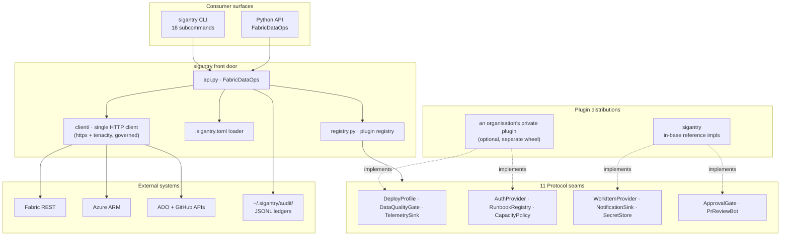
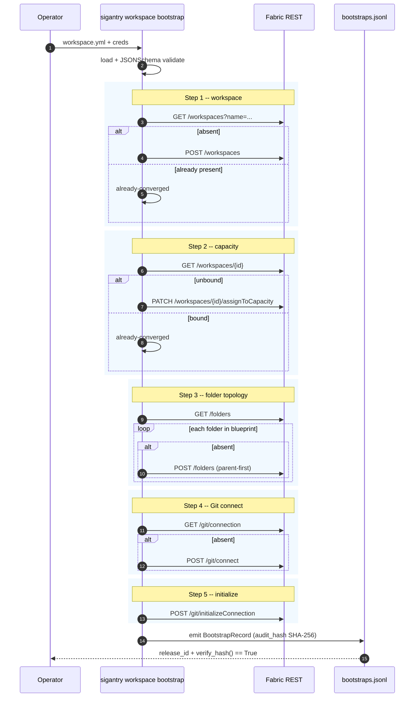
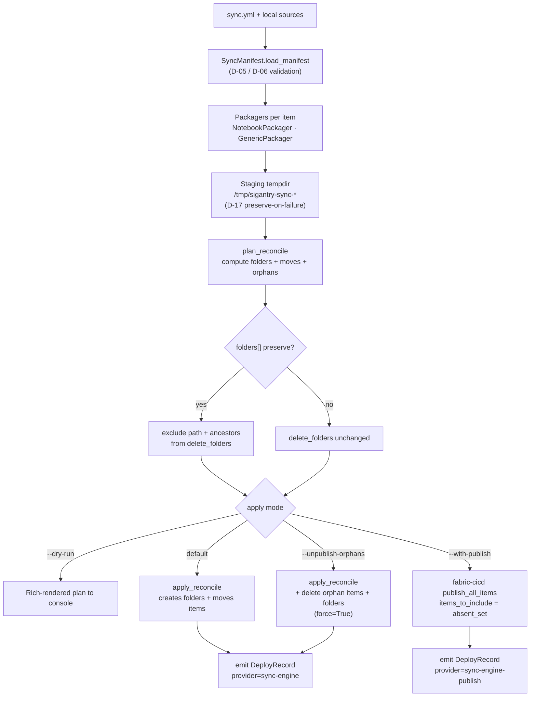
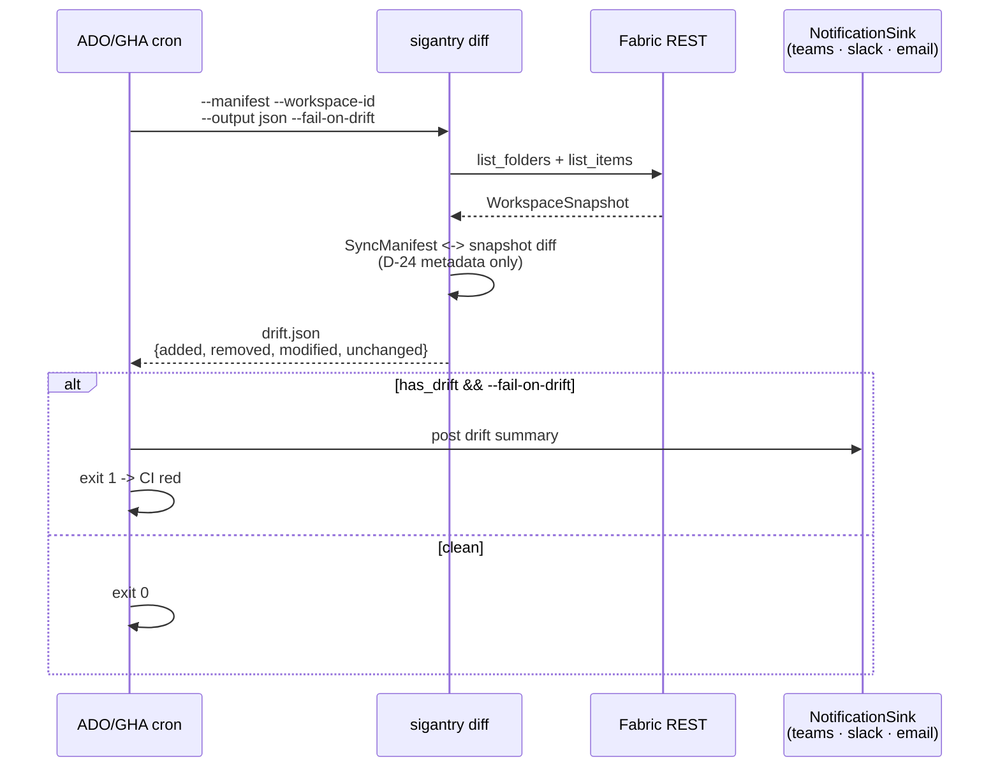
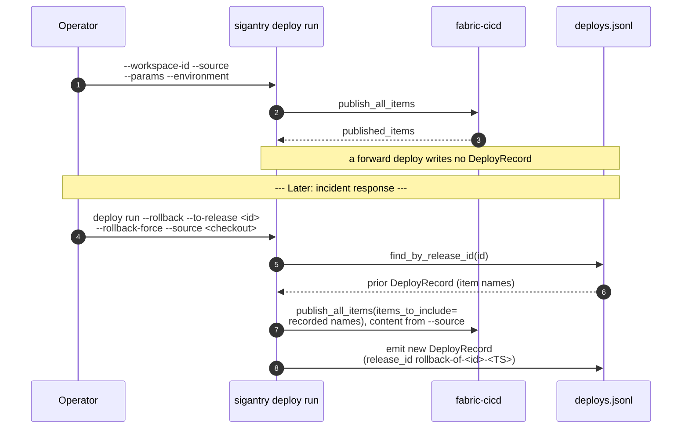
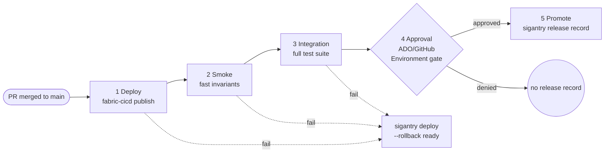
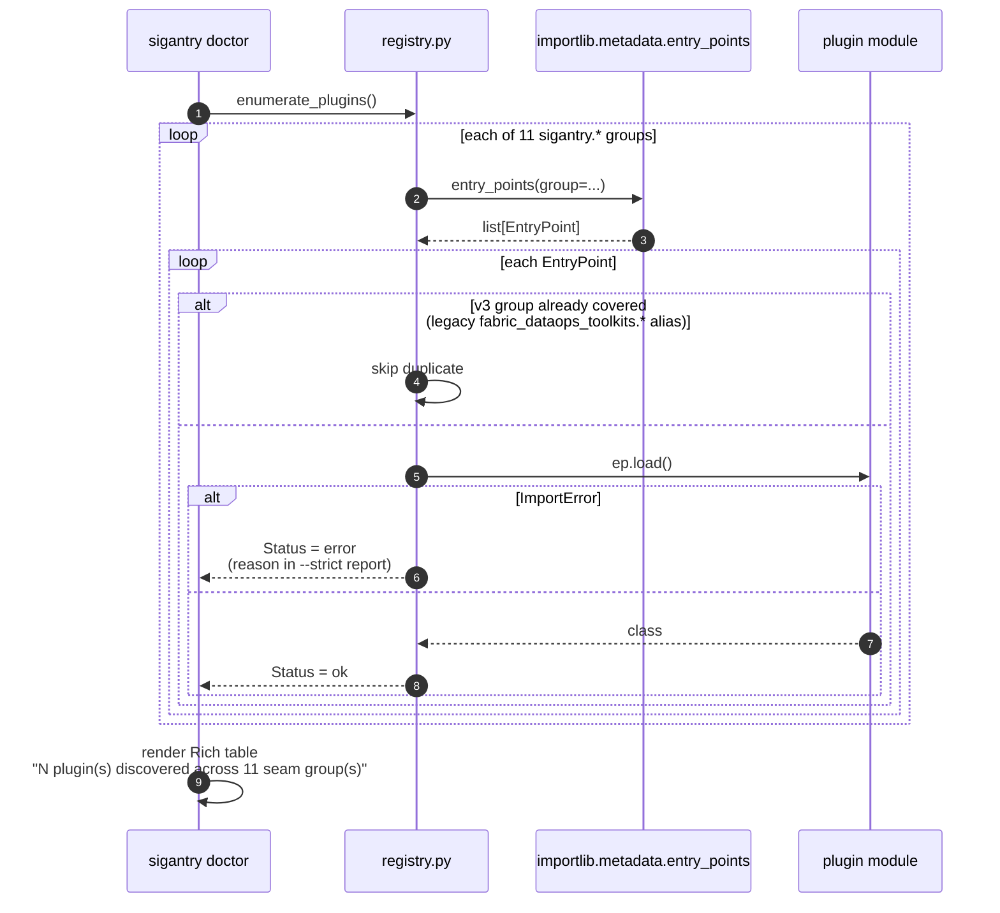
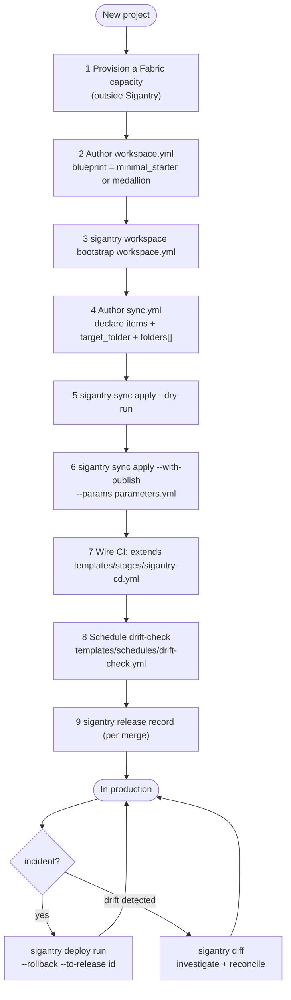
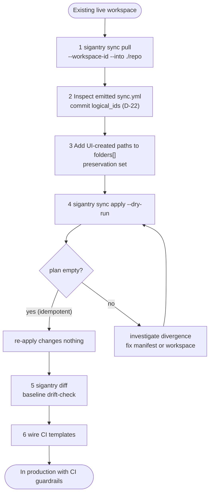

# Sigantry Capability Catalogue

**Describes:** the `sigantry` distribution (import package `sigantry_core`) as it stands on this repository's `main` branch. A release on PyPI can differ from `main`: the `[Unreleased]` section of [`CHANGELOG.md`](../CHANGELOG.md) lists the changes since the last release, and [Section 4](#4-configuration) gives the configuration names the 1.0.0 release reads.
**Audience:** operators evaluating what Sigantry can do today, and contributors mapping the surface to the source.

This document is the inventory of operational capability, complementing the day-to-day usage reference in [`handbook.md`](handbook.md). Each claim cites the source that implements it. For the flags of the version you installed, `sigantry <verb> --help` is authoritative.

## How to read this document

Each capability is labelled with one of:

- **VERIFIED** -- confirmed against the source and/or a falsifiability test in `tests/`.
- **PARTIAL** -- the surface exists but is gated, deferred, or conditionally wired (e.g. requires an opt-in flag or a plugin not in the base distribution).
- **OPEN** -- documented design that is NOT yet wired in code; listed in [section 9](#9-what-is-not-yet-available).

When a capability cites a test, you can falsify the claim by breaking the code under test and re-running the test: if the test still passes, the citation is not load-bearing.

---

## Table of contents

1. [Architecture at a glance](#1-architecture-at-a-glance)
2. [CLI capability catalogue](#2-cli-capability-catalogue)
   1. [Workspace lifecycle](#21-workspace-lifecycle)
   2. [Capacity lifecycle](#22-capacity-lifecycle)
   3. [Folder-aware sync engine](#23-folder-aware-sync-engine)
   4. [Drift detection](#24-drift-detection)
   5. [Item deployment + rollback](#25-item-deployment--rollback)
   6. [Git integration](#26-git-integration)
   7. [Variable Library, Environments, DQ gates](#27-variable-library-environments-dq-gates)
   8. [Release records (work-item traceability)](#28-release-records-work-item-traceability)
   9. [Governance: RBAC + label sync + tenant settings](#29-governance-rbac--label-sync--tenant-settings)
   10. [PR-review bot](#210-pr-review-bot)
   11. [Operational diagnostics](#211-operational-diagnostics)
3. [Python API](#3-python-api)
4. [Configuration](#4-configuration)
5. [CI/CD pipeline templates](#5-cicd-pipeline-templates)
6. [Plugin development -- 11 protocol seams](#6-plugin-development----11-protocol-seams)
7. [Audit + observability](#7-audit--observability)
8. [End-to-end operator workflows](#8-end-to-end-operator-workflows)
9. [What is NOT yet available](#9-what-is-not-yet-available)
10. [References](#10-references)

---

## 1. Architecture at a glance

Sigantry is a thin governance and orchestration layer over Microsoft Fabric REST + Azure ARM + Git provider APIs. It exposes two consumer surfaces that funnel through one front door, dispatch to plugin-supplied behaviour via 11 protocol seams, and append integrity-checked audit records (unkeyed; see [section 7](#7-audit--observability)).


```mermaid
flowchart TB
    subgraph CONS["Consumer surfaces"]
        CLI["sigantry CLI<br/>18 subcommands"]
        PYAPI["Python API<br/>FabricDataOps"]
    end

    subgraph CORE["sigantry front door"]
        API["api.py · FabricDataOps"]
        REGISTRY["registry.py · plugin registry"]
        CONFIG[".sigantry.toml loader"]
        CLIENT["client/ · single HTTP client<br/>(httpx + tenacity, governed)"]
    end

    subgraph SEAMS["11 Protocol seams"]
        S1["DeployProfile · DataQualityGate · TelemetrySink"]
        S2["AuthProvider · RunbookRegistry · CapacityPolicy"]
        S3["WorkItemProvider · NotificationSink · SecretStore"]
        S4["ApprovalGate · PrReviewBot"]
    end

    subgraph PLUGINS["Plugin distributions"]
        BASE["sigantry<br/>in-base reference impls"]
        ORG["an organisation's private plugin<br/>(optional, separate wheel)"]
    end

    subgraph EXT["External systems"]
        FAB["Fabric REST"]
        ARM["Azure ARM"]
        GIT["ADO + GitHub APIs"]
        AUDIT["~/.sigantry/audit/<br/>JSONL ledgers"]
    end

    CLI --> API
    PYAPI --> API
    API --> REGISTRY
    API --> CLIENT
    API --> CONFIG
    REGISTRY --> SEAMS
    BASE -. implements .-> S3
    BASE -. implements .-> S4
    ORG -. implements .-> S1
    ORG -. implements .-> S2
    CLIENT --> FAB
    CLIENT --> ARM
    CLIENT --> GIT
    API --> AUDIT
```

**Source citations:**

- 18 subcommands wired in `sigantry_core/cli.py:67-84` (`add_typer` calls). [VERIFIED]
- 11 entry-point groups enumerated in `sigantry_core/registry.py:54-64`. [VERIFIED]
- One HTTP client: ruff's TID251 `banned-api` rule, configured in `pyproject.toml`, flags any import of `httpx`. The per-file ignores in the same file allow it only in `sigantry_core/client/`, `sigantry_core/auth/diagnose.py`, `sigantry_core/auth/github_app.py`, `sigantry_core/notifications/__init__.py`, `sigantry_core/notifications/teams.py`, `sigantry_core/notifications/slack.py` and `tests/`. [VERIFIED]

---

## 2. CLI capability catalogue

The full CLI surface is registered in [`sigantry_core/cli.py`](../sigantry_core/cli.py). Each subapp below is the second-level Typer app; many carry their own subcommands.

### 2.1 Workspace lifecycle

[VERIFIED]. Wraps Fabric REST `/v1/workspaces` plus Phase 13.5's BOOTSTRAP-XX greenfield materialiser.

| Verb | Purpose | Source | Audit |
|---|---|---|---|
| `sigantry workspace list` | List every workspace the principal can see (`GET /v1/workspaces`). | `sigantry_core/workspace/cli.py:35` | -- |
| `sigantry workspace get <id>` | Inspect a single workspace. | `cli.py:68` | -- |
| `sigantry workspace create` | Create a new workspace. | `cli.py:87` | -- |
| `sigantry workspace delete` | Destructive; refuses without `--force` (`DestructiveOpError`). | `cli.py:106` | `DestructiveOpRecord` (`destructive_ops.jsonl`) |
| `sigantry workspace assign-capacity` | Bind a workspace to a capacity. | `cli.py:124` | -- |
| `sigantry workspace list-items` | Enumerate every item in a workspace. | `cli.py:135` | -- |
| `sigantry workspace bootstrap workspace.yml` | Greenfield materialiser: workspace + capacity bind + folders + Git connect + initialize. | `cli.py:165` | `BootstrapRecord` (`bootstraps.jsonl`) |

The `bootstrap` verb runs a probe-before-act sequence -- every step probes current state and no-ops when already-converged. This is the load-bearing idempotency property; the 5-call shape is enforced by the audit record's `steps[].outcome` field.


```mermaid
sequenceDiagram
    autonumber
    participant Op as Operator
    participant CLI as sigantry workspace bootstrap
    participant FAB as Fabric REST
    participant LEDGER as bootstraps.jsonl

    Op->>CLI: workspace.yml + creds
    CLI->>CLI: load + JSONSchema validate

    rect rgba(220,240,255,0.4)
    Note over CLI,FAB: Step 1 -- workspace
    CLI->>FAB: GET /workspaces?name=...
    alt absent
        CLI->>FAB: POST /workspaces
    else already present
        CLI->>CLI: already-converged
    end
    end

    rect rgba(220,240,255,0.4)
    Note over CLI,FAB: Step 2 -- capacity
    CLI->>FAB: GET /workspaces/{id}
    alt unbound
        CLI->>FAB: PATCH /workspaces/{id}/assignToCapacity
    else bound
        CLI->>CLI: already-converged
    end
    end

    rect rgba(220,240,255,0.4)
    Note over CLI,FAB: Step 3 -- folder topology
    CLI->>FAB: GET /folders
    loop each folder in blueprint
        alt absent
            CLI->>FAB: POST /folders (parent-first)
        end
    end
    end

    rect rgba(220,240,255,0.4)
    Note over CLI,FAB: Step 4 -- Git connect
    CLI->>FAB: GET /git/connection
    alt absent
        CLI->>FAB: POST /git/connect
    end
    end

    rect rgba(220,240,255,0.4)
    Note over CLI,FAB: Step 5 -- initialize
    CLI->>FAB: POST /git/initializeConnection
    end

    CLI->>LEDGER: emit BootstrapRecord (audit_hash SHA-256)
    LEDGER-->>Op: release_id + verify_hash() == True
```

**Available blueprints** (in `sigantry_core/workspace/blueprints.py`, which holds the folder names):

- `minimal_starter` -- 8 folders in numbered pipeline-flow order: `00_control`, `10_intake`, `20_storage`, `30_transform`, `40_semantic`, `50_reporting`, `90_shared`, `99_retired`.
- `medallion` -- alias for the identical `minimal_starter` layout (for operators who prefer the medallion framing; there are no bronze/silver/gold folders). [VERIFIED]

**Upgrading from 1.0.0:** sigantry 1.0.1 changed these folder names, and bootstrap never renames or deletes a folder, so re-running either blueprint on a workspace that 1.0.0 bootstrapped creates the new folders beside the old ones. To keep the existing layout, list its folder names under `folders.list` in `workspace.yml` instead of naming a blueprint. When a blueprint will create any of its folders at the top level of a workspace that already has top-level folders with other names, bootstrap warns before it creates them: a `sigantry: warning:` line on stderr and a `warnings` list in the JSON report, in a dry run too. It still creates the folders, because 1.0.0 also allowed a first bootstrap into a workspace that already had folders. The check compares the workspace only with the blueprint's own names. [VERIFIED]

**Test pinning:** 55 unit tests across `tests/sigantry_core/workspace/test_bootstrap.py` (38 -- step probe logic and the existing-layout warning), `tests/sigantry_core/workspace/test_records.py` (12 -- `BootstrapRecord` shape + audit-hash invariant), `tests/sigantry_core/workspace/test_blueprints.py` (5 -- blueprint catalogue). [VERIFIED]

### 2.2 Capacity lifecycle

[VERIFIED]. Lightweight ARM-driven control plane. Pause and resume both run through 202-LRO polling and are gated by `@destructive_op`.

| Verb | Purpose | Source |
|---|---|---|
| `sigantry capacity list` | `GET /v1/capacities`. | `sigantry_core/capacity/cli.py:38` |
| `sigantry capacity pause` | ARM 202 LRO; requires `--force` and a non-empty `--runbook-id` (cost-control gate). | `cli.py:79` |
| `sigantry capacity resume` | ARM 202 LRO; requires `--force` and a non-empty `--runbook-id`. | `cli.py:105` |

### 2.3 Folder-aware sync engine

[VERIFIED]. Phase 13's manifest-driven push/pull engine, augmented with the audit-2026-05-05 folder-preservation closure.

| Verb | Purpose | Source |
|---|---|---|
| `sigantry sync apply` | Push manifest items into a workspace; default additive (creates folders, moves items). | `sigantry_core/sync/cli.py:154` |
| `sigantry sync pull` | IaC-fy a live workspace into `sync.yml` + per-folder item sources at `<folder-path>/<display_name>/` (no separate `sources/` dir; D-22 `logical_id` round-trip). | `cli.py:438` |
| `sigantry sync snapshot` | Emit a `WorkspaceSnapshot` JSON for diffing (INTROSPECT-01). | `cli.py:381` |

**The `sync apply` flag matrix:**

| Flag | Semantics |
|---|---|
| `--manifest` (req) | Path to `sync.yml`. |
| `--workspace-id` (req) | Target Fabric workspace GUID. |
| `--environment` | The `parameters.yml` environment to publish with `--with-publish`; required there when `parameters.yml` names any environment beyond `_ALL_`. |
| `--audit-dir` | Directory for the `deploys.jsonl` record this command writes (default `~/.sigantry/audit/`). The `destructive_ops.jsonl` records of an `--unpublish-orphans` run are always written under `~/.sigantry/audit/`. |
| `--dry-run` | Compute the plan; print to console; exit 0 without applying. |
| `--with-publish` | Compose folder reconcile with `fabric-cicd.publish_all_items` for first-time items (Phase 17, ADR-0012 Option C). Requires `--params`. |
| `--republish-existing` | Modifier on `--with-publish`: also refresh the content of manifest items that already exist in the workspace (matched by display name + type). |
| `--params` | Path to `parameters.yml`. Required when `--with-publish` is set. |
| `--bulk` | Modifier on `--with-publish`: when more than one item is published, publish them through a concurrent worker pool. Has no effect without `--with-publish`. |
| `--unpublish-orphans` | Delete workspace folders + items absent from the manifest. The manifest's `folders[]` preservation set + every ancestor of each declared path is excluded. Default off. |

**Sync apply lifecycle:**


```mermaid
flowchart TD
    M["sync.yml + local sources"] --> LOAD["SyncManifest.load_manifest<br/>(D-05 / D-06 validation)"]
    LOAD --> PACK["Packagers per item<br/>NotebookPackager · GenericPackager"]
    PACK --> STG["Staging tempdir<br/>/tmp/sigantry-sync-*<br/>(D-17 preserve-on-failure)"]
    STG --> RECON["plan_reconcile<br/>compute folders + moves + orphans"]
    RECON --> FILTER{"folders[] preserve?"}
    FILTER -->|yes| EXCL["exclude path + ancestors<br/>from delete_folders"]
    FILTER -->|no| KEEP["delete_folders unchanged"]
    EXCL --> APPLY{"apply mode"}
    KEEP --> APPLY
    APPLY -->|"--dry-run"| RICH["Rich-rendered plan to console"]
    APPLY -->|"default"| ADD["apply_reconcile<br/>creates folders + moves items"]
    APPLY -->|"--unpublish-orphans"| FULL["apply_reconcile<br/>+ delete orphan items + folders<br/>(force=True)"]
    APPLY -->|"--with-publish"| PUB["fabric-cicd publish_all_items<br/>items_to_include = absent_set"]
    ADD --> AUDIT["emit DeployRecord<br/>provider=sync-engine"]
    FULL --> AUDIT
    PUB --> AUDIT2["emit DeployRecord<br/>provider=sync-engine-publish"]
```

**`folders[]` preservation contract** (audit-2026-05-05 closure):

The manifest's top-level `folders` list is a preservation set. When `--unpublish-orphans` is passed, the reconciler computes the orphan-folder list, then filters out every entry that matches a preserved path or is an ancestor of one. Declaring `/raw/UI-Created` therefore implicitly keeps `/raw` alive too -- otherwise leaf-first deletion of the parent would still drop the protected child.

- Helper: `sigantry_core/workspace/reconciler.py::_normalise_preserve_set` (ancestor-inclusive expansion).
- Wiring: `sigantry_core/sync/apply.py:apply_sync` -> `reconcile_folders_from_repo(preserve_paths=manifest.folders, ...)`.
- Falsifiability: 5 tests in `tests/sigantry_core/workspace/test_reconciler.py` (`test_normalise_preserve_set_*`, `test_plan_preserve_paths_*`, `test_reconcile_folders_from_repo_threads_preserve_paths_through`).

**Schema reference:** [`reference/sync-schema.md`](reference/sync-schema.md) -- top-level `items[]` + `folders[]` shape, validation rules, folder-less item types (D-07 / SYNC-06).

**Item types accepted:** Whatever `fabric_cicd.constants.ItemType` enumerates -- canonical PascalCase strings such as `Notebook`, `DataPipeline`, `SemanticModel`, `Report`, `SparkJobDefinition`, `Lakehouse`, `Warehouse`, `MLModel`, `MLExperiment`, `Eventstream`, `KQLDatabase`, `KQLQueryset`, `MirroredDatabase`. See `sigantry_core/sync/manifest.py`, which also holds the single folder-less type override (`Dataflow` -> `target_folder='/'`).

**Worked example** -- nine notebooks under an `Orders` folder:

```yaml
schema_version: "1.0.0"
items:
  - {local_path: notebooks/00_Orders_Orchestration.ipynb, type: Notebook, target_folder: Orders/01_Notebooks, display_name: 00_Orders_Orchestration}
  - {local_path: notebooks/01_Orders_Bronze.ipynb,         type: Notebook, target_folder: Orders/01_Notebooks, display_name: 01_Orders_Bronze}
  # ... 7 more
folders:
  - /Orders/02_Notebooks_Archive   # operator-created via Fabric UI
```

Run `sigantry sync apply --manifest sync.yml --workspace-id <id> --dry-run` to preview; add `--unpublish-orphans` to enable cleanup.

### 2.4 Drift detection

[VERIFIED]. Compares a manifest against a live workspace when you run it, and emits a SemVer-pinned JSON diff (`docs/reference/drift-schema.json`). It does not run by itself: scheduling it is the adopter's job (see the scheduled templates in [Section 5](#5-cicd-pipeline-templates)).

| Verb | Purpose | Source |
|---|---|---|
| `sigantry diff --manifest sync.yml --workspace-id <id>` | Drift report (`added` / `removed` / `modified` / `unchanged`). | `sigantry_core/diff_cli.py:136` |

**Flag matrix:**

- `--output human|json|html` -- human is default; `json` is the SemVer-pinned wire contract consumed by CI; `html` renders a standalone report to stdout, or to the file named by `--html-out`.
- `--fail-on-drift` -- exit 1 if any drift detected.
- `--no-hint` -- suppress the operator hint trailer (CI-friendly).
- `--environment` / `-e` -- recorded in output for log scoping (informational only; default `prod`).

**Behaviour:** D-24 metadata-only -- compares `display_name`, `type`, `folder_path`. Content-level drift is OUT of scope (a candidate enhancement; see [section 9](#9-what-is-not-yet-available)).

**Shared-workspace caveat:** on a workspace the manifest only partially governs, every ungoverned item counts as `+ added`, so `--fail-on-drift` is permanently red there. Scope it to fully-governed workspaces, or consume the JSON and alert on `removed`/`modified` only ([tutorial 03](tutorials/03-drift-detection.md)).


```mermaid
sequenceDiagram
    participant CRON as ADO/GHA cron
    participant CLI as sigantry diff
    participant FAB as Fabric REST
    participant SINK as NotificationSink<br/>(teams · slack · email)

    CRON->>CLI: --manifest --workspace-id<br/>--output json --fail-on-drift
    CLI->>FAB: list_folders + list_items
    FAB-->>CLI: WorkspaceSnapshot
    CLI->>CLI: SyncManifest <-> snapshot diff<br/>(D-24 metadata only)
    CLI-->>CRON: drift.json<br/>{added, removed, modified, unchanged}
    alt has_drift && --fail-on-drift
        CRON->>SINK: post drift summary
        CRON->>CRON: exit 1 -> CI red
    else clean
        CRON->>CRON: exit 0
    end
```

**Test pinning:** `tests/sync/test_drift_schema_committed.py` -- runtime emission validates against the committed JSON Schema.

### 2.5 Item deployment + rollback

[VERIFIED]. Wraps `fabric-cicd` for Git-tree deploys. A forward `deploy run` writes no `DeployRecord`; a release is recorded by `sigantry release record` (section 2.8), and a rollback writes a record of its own. The `DeployRecord` emitters are listed in [section 7](#7-audit--observability).

| Verb | Purpose | Source |
|---|---|---|
| `sigantry deploy run` | Deploy a Fabric item tree. Non-zero exit on item-publish failure. `--bulk` publishes through a concurrent worker pool; `--items-to-include`, `--item-name-exclude-regex`, `--folder-path-to-include`, `--folder-path-exclude-regex` and `--shortcut-exclude-regex` scope the publish. | `sigantry_core/deploy/cli.py:53` |
| `sigantry deploy validate` | Validate WITHOUT deploying (ADOPIPE-05 pre-flight). | `cli.py:315` |
| `sigantry deploy run --rollback --to-release <id>` | Publish again the items a prior `DeployRecord` names (`fabric_items_changed`) whose type is in `--item-types`, with their content read from the `--source` checkout. The record holds item names only, no content and no commit; a record that names no items makes the rollback publish nothing. | `sigantry_core/deploy/rollback.py:88` |
| `sigantry fabric-item copy` | Duplicate an item folder with a fresh `logicalId`. | `sigantry_core/deploy/cli.py:463` |
| `sigantry fabric-item set-binding` | Attach an Environment and/or a default Lakehouse to a deployed notebook. | `sigantry_core/deploy/cli.py:504` |


```mermaid
sequenceDiagram
    autonumber
    participant Op as Operator
    participant CLI as sigantry deploy run
    participant FCC as fabric-cicd
    participant LEDGER as deploys.jsonl

    Op->>CLI: --workspace-id --source<br/>--params --environment
    CLI->>FCC: publish_all_items
    FCC-->>CLI: published_items
    Note over CLI,LEDGER: a forward deploy writes no DeployRecord

    Note over Op,LEDGER: --- Later: incident response ---

    Op->>CLI: deploy run --rollback --to-release <id><br/>--rollback-force --source <checkout>
    CLI->>LEDGER: find_by_release_id(id)
    LEDGER-->>CLI: prior DeployRecord (item names)
    CLI->>FCC: publish_all_items(items_to_include=<br/>recorded names), content from --source
    CLI->>LEDGER: emit new DeployRecord<br/>(release_id rollback-of-<id>-<TS>)
```

**`unpublish_orphans` flag** is also exposed on `deploy run` (separate from `sync apply --unpublish-orphans` -- different code path; deploy's variant runs through `_unpublish_orphans_gated` in `sigantry_core/deploy/core.py:319`).

**Toolkit-side `$ENV:` substitution:** `sigantry_core/deploy/parameters.py` substitutes `$ENV:VAR` references into a tempfile copy of `parameters.yml` BEFORE handoff to fabric-cicd (which rejects raw `$ENV:` references). Tests: `tests/sigantry_core/deploy/test_parameters.py` (18 tests).

**Runbook:** [`runbooks/pipeline-orchestration/deploy-with-tests.md`](runbooks/pipeline-orchestration/deploy-with-tests.md) (Phase 12).

### 2.6 Git integration

[VERIFIED]. Direct mappings onto Fabric's 7-endpoint Git surface.

| Verb | Endpoint | Source |
|---|---|---|
| `sigantry git connect` | `POST /git/connect` | `sigantry_core/deploy/cli.py:579` |
| `sigantry git init` | `POST /git/initializeConnection` | `cli.py:615` |
| `sigantry git update` | `POST /git/updateFromGit` (workspace <- repo) | `cli.py:627` |
| `sigantry git commit` | `POST /git/commitToGit` (workspace -> repo) | `cli.py:645` |
| `sigantry git status` | `GET /git/status` | `cli.py:665` |
| `sigantry git connection` | `GET /git/connection` | `cli.py:676` |
| `sigantry git disconnect` | `POST /git/disconnect` (destructive; `--force`) | `cli.py:697` |

### 2.7 Variable Library, Environments, DQ gates

[VERIFIED].

**Variable Library** (DEPLOY-06) -- full CRUD:

| Verb | Source |
|---|---|
| `sigantry variable-library create` | `sigantry_core/deploy/cli.py:734` |
| `sigantry variable-library list` | `cli.py:758` |
| `sigantry variable-library get` | `cli.py:776` |
| `sigantry variable-library update` | `cli.py:795` |
| `sigantry variable-library delete` | `cli.py:815` (force-required) |

**Fabric Environments**:

| Verb | Purpose | Source |
|---|---|---|
| `sigantry env sync` | Upload + publish a Python wheel to a Fabric Environment. | `sigantry_core/deploy/cli.py:848` |
| `sigantry env sync-all` | Config-driven fan-out of a wheel set across many Environments from an `environments.yml` (per-target pin/float, gating, idempotent skip, fail-isolation, dry-run). | `sigantry_core/deploy/cli.py:877` |
| `sigantry env reconcile` | Reconcile an Environment's custom libraries to the desired wheel **versions**: removes superseded versions of each named package, uploads the new wheels, publishes **once**, blocks to completion. The upgrade-safe counterpart to add-only `env sync`; idempotent; `--dry-run`. | `sigantry_core/deploy/cli.py:933` |

Notes on `env sync` (proven live on a production workspace, 2026-06-14):

- **Blocks to completion.** It uploads to staging (`POST .../staging/libraries`),
  triggers `POST .../staging/publish`, then polls `GET .../environments/<env>` until
  `publishDetails.state` is terminal. A zero exit means the Spark image actually
  rebuilt and the wheel is *importable* — not merely staged. Budget minutes per call.
- **Auth is identity-agnostic.** It uses `DefaultAzureCredential`, so it works as a
  normal user (`az login` → AzureCliCredential) just as well as a service principal /
  ADO service connection. Any identity with **write** on the target workspace can publish.
- **Add-only — use `env reconcile` for upgrades.** `env sync` adds a wheel; it never
  removes older versions. Two versions of one package in staging make the publish
  **fail** (`componentPublishInfo.sparkLibraries.state = "Failed"`). For a version upgrade use
  `sigantry env reconcile --wheel <new.whl>` (repeatable), which removes the superseded
  version, uploads the new wheel, and publishes once -- proven live on a production
  workspace, 2026-06-14. The equivalent raw REST is
  `DELETE /v1/workspaces/{ws}/environments/{env}/staging/libraries?libraryToDelete=<file.whl>`
  then re-publish. See [Tutorial 11 — Troubleshooting](tutorials/11-environments-and-libraries.md#troubleshooting--the-dual-version-pitfall).

**Data Quality gates**:

| Verb | Purpose | Source |
|---|---|---|
| `sigantry dq gate` | Run a registered `DataQualityGate` plugin against a dataset. The base package registers none: the gate comes from a plugin. Exit 0 clean / 1 violation / 2 resolution error. | `sigantry_core/dq/cli.py:31` |

### 2.8 Release records (work-item traceability)

[VERIFIED]. Phase 11's `WorkItemProvider` seam + `DeployRecord` audit-hash chain.

| Verb | Purpose | Source |
|---|---|---|
| `sigantry release record` | Build + audit a `DeployRecord`; link to ADO / GitHub work items. Reads `GITHUB_TOKEN` envvar (gh CLI convention). | `sigantry_core/release/cli.py:162` |
| `sigantry release list` | List releases (most recent first). | `cli.py:310` |
| `sigantry release show <id>` | Show one `DeployRecord`. | `cli.py:378` |
| `sigantry release diff <id1> <id2>` | Diff `fabric_items_changed` between two releases. | `cli.py:432` |
| `sigantry release verify` | Check that the deploy ledger forms an unbroken SHA-256 chain. The chain is unkeyed; see the [audit ledger threat model](reference/audit-ledger-threat-model.md). | `cli.py:562` |

**Audit invariants:**

- `DeployRecord.audit_hash` is a SHA-256 over canonical-JSON of all other fields.
- `DeployRecord.verify_hash()` returns `True` iff the stored `audit_hash` matches a hash recomputed from the record's other fields. A field changed without recomputing the hash makes it `False`; a record whose hash was recomputed after an edit (a re-seal) returns `True`.
- `BootstrapRecord` mirrors this algorithm. `sigantry release verify` does not read the bootstrap ledger.

Runbook: [`runbooks/work-item-traceability/comment-rendering.md`](runbooks/work-item-traceability/comment-rendering.md) -- byte-equal cross-provider rendering of release-record comments.

### 2.9 Governance: RBAC + label sync + tenant settings

[VERIFIED].

| Verb | Purpose | Source |
|---|---|---|
| `sigantry label-sync` | Apply a sensitivity label to every item in a workspace (GOV-02). | `sigantry_core/governance/cli.py:77` |
| `sigantry rbac-audit [--output csv|json]` | Three-layer RBAC dump (GOV-04): every visible workspace + capacity + item placeholders, with `via-group:` membership expansion. Tenant-wide by default; `-w/--workspace-id` (repeatable) scopes the sweep; `--out` / `--out-dir` write the audit to a file. | `sigantry_core/governance/cli.py:139` |
| `sigantry tenant-settings export` | Export Fabric admin tenant-settings baseline (GOV-05). | `sigantry_core/governance/cli.py:222` |

### 2.10 PR-review bot

[VERIFIED]. Phase 14 cross-provider PR comment poster.

| Verb | Purpose | Source |
|---|---|---|
| `sigantry pr-bot run` | Detect provider (ADO / GitHub), diff TMDL + Lakehouse metadata files, post a structured comment. POST-body byte-identical across providers. `--fail-on-breaking` exits 1 when dropped tables, columns, measures or relationships are detected. `--dry-run` prints the body instead of posting it, but still fetches the PR metadata and changed-file list from the provider, so it needs network access and a token. | `sigantry_core/pr_bot/cli.py:217` |

Runbook: [`runbooks/pr-bot-operator.md`](runbooks/pr-bot-operator.md).

### 2.11 Operational diagnostics

[VERIFIED].

| Verb | Purpose | Source |
|---|---|---|
| `sigantry doctor` | List discovered plugins with a Trust column. `--strict` exits non-zero on any entry-point import failure; `--strict-trust` exits non-zero when any plugin's Trust is `untrusted`, meaning `SIGANTRY_TRUSTED_PLUGIN_DISTS` is non-empty and does not list that plugin's distribution; with the variable unset or empty every plugin shows `unknown` and the flag passes ([ADR-0014](decisions/ADR-0014-plugin-trust-model.md)). | `sigantry_core/doctor.py:249` |
| `sigantry config validate <parameters.yml>` | Validate a `fabric-cicd` `parameters.yml` (catches `HardcodedGuidError` + unset `$ENV:`). | `sigantry_core/config_cli.py:37` |
| `sigantry preflight` | Four non-destructive probes (schema syntax, dependency graph, Entra scope, capacity state) against a `sync.yml` or `workspace.yml`. Exits 1 on any failed probe, and also on any warning under `--strict` ([ADR-0015](decisions/ADR-0015-config-driven-preflight.md)). | `sigantry_core/preflight/cli.py:24` |
| `diagnose-auth` | Standalone console script (not a `sigantry` subcommand): which credential resolved, and whether the tenant toggle is visible. Exit 0 healthy / 2 degraded / 3 no token / 4 invalid `--output` value. | `sigantry_core/auth/cli.py` |

On a base install, `sigantry doctor` reports **9 plugins discovered across 11 seam group(s)** -- see Section 6.

---

## 3. Python API

[VERIFIED]. The `FabricDataOps` facade in [`sigantry_core/api.py`](../sigantry_core/api.py) is the recommended entry-point for embedding Sigantry inside notebooks, scripts, or services where you don't want to shell out to the CLI.

```python
from sigantry_core import DataRef, DeployContext, FabricDataOps

# 1. Construct from .sigantry.toml + the plugin registry
fdo = FabricDataOps.from_config()

# 2. Deploy through the DeployProfile named by `[deploy] profile = "..."`
result = fdo.deploy(DeployContext(workspace_id="<guid>", environment="prod"))

# 3. Run a suite through the DataQualityGate named by `[dq] gate = "..."`
gate_result = fdo.run_dq_gate("orders_suite", DataRef(name="orders", path="Tables/orders"))

# 4. Emit through the TelemetrySink named by `[telemetry] sink = "..."`
fdo.emit("deploy_finished", {"release_id": "...", "duration_ms": 1234})

# 5. Release plugin resources
fdo.close()
```

The base package registers no deploy profile, DQ gate or telemetry sink, so steps 2-4 resolve implementations that a plugin provides -- or that you inject directly: `FabricDataOps(deploy_profile=..., dq_gate=..., telemetry=...)`. With no sink configured, `emit` is a silent no-op.

**Method signatures** (from `api.py`):

| Method | Line | Purpose |
|---|---|---|
| `from_config(...)` | `api.py:107` | Constructor; loads the config file (Section 4) and resolves each named seam through the registry. |
| `deploy(...)` | `api.py:227` | Programmatic deploy. |
| `run_dq_gate(...)` | `api.py:249` | Inline DQ gate execution. |
| `emit(...)` | `api.py:273` | Telemetry emission. |
| `close()` | `api.py:295` | Calls `close()` on every seam plugin that implements `Closeable` (for example, to release a plugin's HTTP pool). |

**In-memory testing doubles** ship at `sigantry_core/testing/doubles.py` and `sigantry_core/testing/fixtures.py`. The pytest11 entry-point auto-registers contract fixtures on install.

---

## 4. Configuration

[VERIFIED]. `sigantry_core/config.py` loads one TOML file into `ToolkitSettings`: a `[core]` section, one section per seam (`[auth]`, `[telemetry]`, `[deploy]`, `[dq]`, `[runbooks]`, `[capacity]`, `[release]`, `[notifications]`, `[secrets]`, `[approvals]`, `[pr_review_bots]`) and `[workflow]`. `FabricDataOps.from_config()` reads the plugin names from those sections and resolves each through the registry.

- **File.** Called with no path, `load_settings()` reads `.sigantry.toml` from the working directory, or the legacy `.fabric-dataops.toml` with a `DeprecationWarning` when `.sigantry.toml` is absent. When both exist and differ, the legacy file is read, as on 1.0.0, with a `UserWarning`. A missing file is not an error: every setting keeps its default. An explicit path is read as given, whatever its name.
- **Environment overrides.** `SIGANTRY_<SECTION>__<KEY>`, for example `SIGANTRY_CORE__TENANT_ID`, wins over `.sigantry.toml`; over the legacy file or a file passed by path, which 1.0.0 also read, it only fills what the file leaves unset. The legacy `FDT_<SECTION>__<KEY>` is still read, warns, and through 1.0.x wins over both `SIGANTRY_` and the file, as on 1.0.0.
- **1.0.0.** Given no path, sigantry 1.0.0 looks only for `.fabric-dataops.toml`, and it reads settings overrides as `FDT_<SECTION>__<KEY>`, not `SIGANTRY_`. See the note in [`README.md`](../README.md) and [`migration/2.x-to-3.0.md`](migration/2.x-to-3.0.md).

No PowerShell module ships in this repository. The `templates/jobs/build-powershell.yml` and `lint-powershell.yml` job templates run Pester and PSScriptAnalyzer over a consumer's own PowerShell code.

---

## 5. CI/CD pipeline templates

[VERIFIED]. Templates in [`templates/`](../templates/) are imported by consumer pipelines via ADO `template:` or GHA `uses:`. The dual-CI parity lint `scripts/ci/check-dual-ci-parity.py` pairs the ADO templates under `templates/stages/`, `templates/schedules/` and `templates/pr-review/` with the GitHub Actions workflows of the same basename and compares their stage graphs and parameters (`pairs=3 exceptions=11 errors=0` on 2026-10-04; run the script for the current state). It does not read `jobs/`, `steps/`, `extends/` or `environments/`.

**Template subdirectory map:**

| Path | Contents |
|---|---|
| [`templates/stages/`](../templates/stages/) | `cd-dev.yml`, `cd-test.yml`, `cd-prod.yml`, `ci.yml`, `approval-gate.yml`, `validate-fabric-items.yml`, `sigantry-cd.yml` |
| [`templates/jobs/`](../templates/jobs/) | `build-python.yml`, `lint-python.yml`, `build-powershell.yml`, `lint-powershell.yml` |
| [`templates/steps/`](../templates/steps/) | `fabric-deploy.yml`, `fabric-validate.yml`, `fabric-vl-apply.yml`, `fabric-git-commit.yml`, `post-pr-comment.yml` |
| [`templates/extends/`](../templates/extends/) | `secure-pipeline.yml` |
| [`templates/environments/`](../templates/environments/) | `spark-diagnostic-emitter.yml` |
| [`templates/schedules/`](../templates/schedules/) | `drift-check.yml` |
| [`templates/pr-review/`](../templates/pr-review/) | `sigantry-pr-bot.yml` |
| [`templates/starter/`](../templates/starter/) | Greenfield consumer scaffold, written to be copied into a consumer repository. |
| [`templates/demo/`](../templates/demo/) | Demo walkthrough scaffold (byte-extends starter); the demo does not run end to end on it yet. |

**The 5-stage Phase 12 pipeline (`sigantry-cd.yml`):**


```mermaid
flowchart LR
    PR(["PR merged to main"]) --> S1["1 Deploy<br/>fabric-cicd publish"]
    S1 --> S2["2 Smoke<br/>fast invariants"]
    S2 --> S3["3 Integration<br/>full test suite"]
    S3 --> APP{"4 Approval<br/>ADO/GitHub<br/>Environment gate"}
    APP -->|approved| S5["5 Promote<br/>sigantry release record"]
    APP -->|denied| END(("no release record"))
    S1 -. fail .-> ROLL["sigantry deploy<br/>--rollback ready"]
    S2 -. fail .-> ROLL
    S3 -. fail .-> ROLL
```

Stage 5 deploys nothing. It runs `sigantry release record`, so the approval gates the release record, not the deployment, which stage 1 has already made. The rollback node marks where an operator would run `sigantry deploy run --rollback`; no stage runs it automatically.

**GitHub Actions workflow inventory** (one row per file in `.github/workflows/`):

| Workflow | Purpose |
|---|---|
| [`.github/workflows/ci.yml`](../.github/workflows/ci.yml) | Multi-OS and Python matrix test, lint, and build verification. |
| `.github/workflows/drift-check.yml` | Reusable drift detection (`workflow_call` / `workflow_dispatch`); the caller owns the schedule. |
| `.github/workflows/publish-pypi.yml` | The only workflow that publishes this package, on a published GitHub Release only. It runs the `ci.yml` quality jobs, whose build job builds and checks the sdist and wheel; it then verifies those same files against their recorded SHA-256, scans them and the tree with the name gate, and publishes them to PyPI through trusted publishing. It builds nothing itself. |
| `.github/workflows/name-gate.yml` | Scans the repository for names from a token list held in a repository secret. Each hit is printed as a location (a file and line, a hashed path, an archive member or a PDF text layer) and a pattern id, never the matched text. It fails closed when the secret is unavailable, as on fork and Dependabot pull requests. It must pass before merge. |
| `.github/workflows/review-record.yml` | Posts the required `review-record` commit status on each pull request head. |
| `.github/workflows/review-record-relay.yml` | Takes a submitted pull request review and hands it to `review-record.yml` through `workflow_run`, so the status is recomputed by the default branch's copy of the gate. It has no permissions and runs no pull request code. |
| `.github/workflows/sigantry-cd.yml` | The 5-stage CD workflow. |
| `.github/workflows/sigantry-pr-bot.yml` | PR-bot trigger workflow. |

---

## 6. Plugin development -- 11 protocol seams

[VERIFIED]. Sigantry's extensibility surface. Every plugin is a Python wheel that registers a class against one of the 11 entry-point groups in [`sigantry_core/registry.py:54-64`](../sigantry_core/registry.py).

**The 11 seams:**

| Group | Protocol class | Source line | Registered in the base package |
|---|---|---|---|
| `sigantry.deploy_profiles` | `DeployProfile` | `protocols.py:213` | none -- supplied by a plugin |
| `sigantry.dq_gates` | `DataQualityGate` | `protocols.py:224` | none -- supplied by a plugin |
| `sigantry.telemetry_sinks` | `TelemetrySink` | `protocols.py:233` | none -- supplied by a plugin |
| `sigantry.auth_providers` | `AuthProvider` | `protocols.py:244` | none; the `TokenProvider` chain in `sigantry_core/auth/` is the built-in default |
| `sigantry.runbook_registries` | `RunbookRegistry` | `protocols.py:253` | none -- supplied by a plugin |
| `sigantry.capacity_policies` | `CapacityPolicy` | `protocols.py:262` | none -- supplied by a plugin |
| `sigantry.work_item_providers` | `WorkItemProvider` | `protocols.py:273` | none; `AdoWorkItemProvider` and `GithubWorkItemProvider` (`sigantry_core/workitems/`) ship as classes that `sigantry release record --provider` constructs directly |
| `sigantry.notification_sinks` | `NotificationSink` | `protocols.py:351` | `email`, `slack`, `teams` |
| `sigantry.secret_stores` | `SecretStore` | `protocols.py:371` | `key_vault`, `ado_variable_group`, `github_secrets` |
| `sigantry.approval_gates` | `ApprovalGate` | `protocols.py:526` | `ado_environments`, `github_environments`, `opa` |
| `sigantry.pr_review_bots` | `PrReviewBot` | `protocols.py:493` | none; `AdoProvider` and `GithubProvider` (`sigantry_core/pr_bot/providers/`) ship as classes that `sigantry pr-bot run` constructs directly |

**Plugin discovery sequence:**


```mermaid
sequenceDiagram
    autonumber
    participant Doc as sigantry doctor
    participant Reg as registry.py
    participant EP as importlib.metadata.entry_points
    participant Imp as plugin module

    Doc->>Reg: enumerate_plugins()

    loop each of 11 sigantry.* groups
        Reg->>EP: entry_points(group=...)
        EP-->>Reg: list[EntryPoint]
        loop each EntryPoint
            alt v3 group already covered<br/>(legacy fabric_dataops_toolkits.* alias)
                Reg->>Reg: skip duplicate
            else
                Reg->>Imp: ep.load()
                alt ImportError
                    Reg-->>Doc: Status = error<br/>(reason in --strict report)
                else
                    Imp-->>Reg: class
                    Reg-->>Doc: Status = ok
                end
            end
        end
    end

    Doc->>Doc: render Rich table<br/>"N plugin(s) discovered across 11 seam group(s)"
```

**Base install.** With only `sigantry` installed, `sigantry doctor` lists nine plugins -- `email`, `slack` and `teams` (`notification_sinks`); `ado_variable_group`, `github_secrets` and `key_vault` (`secret_stores`); `ado_environments`, `github_environments` and `opa` (`approval_gates`) -- and prints the summary line `9 plugin(s) discovered across 11 seam group(s).` Each plugin distribution you install adds its own rows.

**Authoring a new plugin** (worked example -- a PagerDuty notification sink):

```toml
# my_org_pagerduty/pyproject.toml
[project]
name = "my-org-sigantry-pagerduty"
dependencies = ["sigantry>=1.0,<2"]

[project.entry-points."sigantry.notification_sinks"]
pagerduty = "my_org_pagerduty:PagerDutySink"
```

```python
# my_org_pagerduty/__init__.py
from sigantry_core.protocols import NotificationEvent


class PagerDutySink:
    name = "pagerduty"

    def send(self, event: NotificationEvent, *, channel: str | None = None) -> None:
        ...  # POST to the PagerDuty Events API

    def ping(self) -> None:
        ...  # raise if the PagerDuty endpoint is unreachable
```

Once the wheel is installed, `sigantry doctor` lists it. To select it, set `sink = "pagerduty"` under `[notifications]` in `.sigantry.toml`; `FabricDataOps.from_config()` then resolves it. (`SIGANTRY_NOTIFICATION_SINK` selects only the three built-in sinks.)

Detailed protocol contracts live in [`docs/reference/protocols.md`](reference/protocols.md). Legacy `fabric_dataops_toolkits.<seam>` entry-point groups: [`docs/migration/2.x-to-3.0.md`](migration/2.x-to-3.0.md).

---

## 7. Audit + observability

[VERIFIED]. Sigantry maintains five append-only JSONL ledgers under `~/.sigantry/audit/`. The verbs that write `deploys.jsonl` and `bootstraps.jsonl` take `--audit-dir` to write them elsewhere, for hermetic CI; `destructive_ops.jsonl`, `approvals.jsonl` and `secret_changes.jsonl` are always written under `~/.sigantry/audit/`. Every record carries an `audit_hash` (SHA-256) and a `prev_hash` link to the record before it, so accidental corruption, an edit made without recomputing the hashes, and a record deleted from the middle are detectable. The chain is unkeyed and does not record its own length, so an edit whose hashes were recomputed, and records dropped from the end, are not (see the [audit ledger threat model](reference/audit-ledger-threat-model.md)).

| Record | File | Source | Emitted by |
|---|---|---|---|
| `DeployRecord` | `deploys.jsonl` | `sigantry_core/release/record.py:43` | `sigantry sync apply` (every run that loads its manifest, failed runs included; a `--dry-run` that succeeds writes none), `sigantry deploy run --rollback`, `sigantry release record` |
| `BootstrapRecord` | `bootstraps.jsonl` | `sigantry_core/workspace/records.py:54` | `sigantry workspace bootstrap` |
| `SecretChangeRecord` | `secret_changes.jsonl` | `sigantry_core/governance/records.py:46` | `SecretStore` plugin operations |
| `ApprovalRecord` | `approvals.jsonl` | `sigantry_core/governance/records.py:133` | `ApprovalGate` plugin operations |
| `DestructiveOpRecord` | `destructive_ops.jsonl` | `sigantry_core/governance/records.py:215` | every call that passes the `@destructive_op` gate, on success and on failure |

**Hash-verification API** -- every record class exposes `verify_hash() -> bool`. The audit-hash is a SHA-256 over canonical-JSON of all fields except the hash itself, so a byte changed without recomputing the hash breaks the verification. The hash is unkeyed: a record edited and then re-hashed with the same public algorithm passes.

**Telemetry**: governance audit is non-pluggable; **business telemetry** (deploy duration, DQ gate counts, custom events) flows through whichever `TelemetrySink` plugin is wired. The base package registers none; a plugin supplies one (for example, an Azure Monitor DCR/DCE sink).

**Destructive-op gate**: the delete, disconnect, pause and resume entry points (workspace, item and folder delete; Git disconnect; Variable Library delete; role-assignment delete; orphan unpublish; rollback; capacity pause and resume) are wrapped by `@destructive_op(resource_kind, action)` from `sigantry_core/governance/destructive.py:64` (re-exported via `sigantry_core/governance/audit.py`). The decorator refuses unless `force=True` is passed as a keyword, and additionally requires a non-empty `runbook_id` for capacity pause and resume only. Whether the call succeeds or fails, it logs a structured line and appends a `DestructiveOpRecord`; a disk error on that append is logged as `destructive_op_audit_write_failed` and does not fail the call. Not every destructive call is wrapped. Calls that run without the decorator include the `SecretStore.delete` implementations (which write a `SecretChangeRecord` instead), `env reconcile`'s staging-library DELETE, and the content overwrites made by a `deploy run` publish or by `sync apply --republish-existing`.

---

## 8. End-to-end operator workflows

[VERIFIED]. Two canonical paths cover most of the operational lifecycle.

### 8.1 Greenfield onboarding


```mermaid
flowchart TD
    START([New project]) --> A["1 Provision a Fabric capacity<br/>(outside Sigantry)"]
    A --> B["2 Author workspace.yml<br/>blueprint = minimal_starter or medallion"]
    B --> C["3 sigantry workspace bootstrap workspace.yml"]
    C --> D["4 Author sync.yml<br/>declare items + target_folder + folders[]"]
    D --> E["5 sigantry sync apply --dry-run"]
    E --> F["6 sigantry sync apply --with-publish<br/>--params parameters.yml"]
    F --> G["7 Wire CI: extends templates/stages/sigantry-cd.yml"]
    G --> H["8 Schedule drift-check<br/>templates/schedules/drift-check.yml"]
    H --> I["9 sigantry release record (per merge)"]
    I --> END([In production])
    END --> R{"incident?"}
    R -->|"yes"| RB["sigantry deploy run<br/>--rollback --to-release id"]
    RB --> END
    R -->|"drift detected"| DRIFT["sigantry diff<br/>investigate + reconcile"]
    DRIFT --> END
```

### 8.2 Brownfield IaC-fy


```mermaid
flowchart TD
    START([Existing live workspace]) --> A["1 sigantry sync pull<br/>--workspace-id <id> --into ./repo"]
    A --> B["2 Inspect emitted sync.yml<br/>commit logical_ids (D-22)"]
    B --> C["3 Add UI-created paths to folders[]<br/>preservation set"]
    C --> D["4 sigantry sync apply --dry-run"]
    D --> E{"plan empty?"}
    E -->|"yes (idempotent)"| F["re-apply changes nothing"]
    E -->|"no"| G["investigate divergence<br/>fix manifest or workspace"]
    G --> D
    F --> H["5 sigantry diff<br/>baseline drift-check"]
    H --> I["6 wire CI templates"]
    I --> END([In production with CI guardrails])
```

The brownfield path was live-tested on a development workspace, 2026-05-01: the brownfield invariant (no existing items disturbed) and the idempotency invariant (a re-run reports `folders_created=0 items_moved=0`) both held.

---

## 9. What is NOT yet available

Honest scope documentation. None of these items block the capabilities listed above.

| Item | Status | Where |
|---|---|---|
| Public `sigantry/sigantry-starter` and `sigantry/demo-sigantry` scaffolding repositories | not provisioned | use [`templates/starter/`](../templates/starter/) and [`templates/demo/`](../templates/demo/) |
| Entry-point registration of the in-base `WorkItemProvider` and `PrReviewBot` implementations | not registered; `release record` and `pr-bot run` construct them directly | `pyproject.toml` (`sigantry.work_item_providers`, `sigantry.pr_review_bots`) |
| `@destructive_op` coverage of every destructive call, for example the `SecretStore.delete` implementations, `env reconcile`'s staging-library DELETE, and the content overwrites made by a `deploy run` publish or by `sync apply --republish-existing` | partial; the calls named here are not wrapped | `sigantry_core/secrets/`, `sigantry_core/deploy/environment.py`, `sigantry_core/deploy/core.py`, `sigantry_core/sync/apply.py` |
| Drift notifications through a plugin `NotificationSink` | not wired; the drift-check templates select a sink with `sink_from_env` (teams, slack or email only) | `sigantry_core/sync/_notify_main.py`, `sigantry_core/notifications/__init__.py` |
| `--with-publish` + `manifest.folders[]` interaction (propagate preservation to fabric-cicd `_unpublish_folders`) | candidate | candidate enhancement noted in `docs/runbooks/sync/folder-preservation.md` |
| Content-level drift in `sigantry diff` | by-design out of scope (D-24 metadata-only) | candidate enhancement |
| Structured `--output json` for `sigantry sync apply` (deletion-plan inclusive) | candidate | current output is Rich console only |
| Declarative `[preflight]` scenarios | proposed, not implemented | [ADR-0015](decisions/ADR-0015-config-driven-preflight.md) |
| PowerShell module | not shipped | -- |
| `sigantry_core/purview/`, `pipelines/`, `utils/`, `monitor/config.py` | acknowledged placeholders | not in current scope; populated when a phase calls for them |
| `--rename-in-content` on `fabric-item copy` | TODO(v2) -- deferred | `sigantry_core/deploy/item_copy.py` |

---

## 10. References

**Top-level project docs:**

- [`README.md`](../README.md) -- Status, layout, install
- [`CONSUMING.md`](CONSUMING.md) -- Consumer (operator) entry-point
- [`CONTRIBUTING.md`](../CONTRIBUTING.md) -- Contributor entry-point

**Reference docs (`docs/reference/`):**

- [`architecture.md`](reference/architecture.md) -- System architecture
- [`scope.md`](reference/scope.md) -- Capability boundary
- [`sync-schema.md`](reference/sync-schema.md) -- `sync.yml` field reference
- [`protocols.md`](reference/protocols.md) -- Plugin protocol contracts
- [`observation-planes.md`](reference/observation-planes.md) -- Audit vs telemetry
- [`audit-ledger-threat-model.md`](reference/audit-ledger-threat-model.md) -- What the ledger's hash chain does and does not prove
- [`thread-safety.md`](reference/thread-safety.md) -- Threading model
- [`api-stability.md`](reference/api-stability.md) -- SemVer commitments

**Operator runbooks (`docs/runbooks/`):**

- [`INDEX.md`](runbooks/INDEX.md) -- Runbook hub
- [`workspace-bootstrap-operator.md`](runbooks/workspace-bootstrap-operator.md) -- Phase 13.5 BOOTSTRAP-XX
- [`sync/apply.md`](runbooks/sync/apply.md) -- `sigantry sync apply`
- [`sync/pull.md`](runbooks/sync/pull.md) -- `sigantry sync pull`
- [`sync/folder-preservation.md`](runbooks/sync/folder-preservation.md) -- `folders[]` + `--unpublish-orphans` (audit-2026-05-05 closure)
- [`sync/snapshot-freshness.md`](runbooks/sync/snapshot-freshness.md) -- D-10 cache discipline
- [`drift-detection/scheduled-drift.md`](runbooks/drift-detection/scheduled-drift.md) -- Scheduled drift CI
- [`pipeline-orchestration/deploy-with-tests.md`](runbooks/pipeline-orchestration/deploy-with-tests.md) -- 5-stage pipeline
- [`approval-gates/opa-quickstart.md`](runbooks/approval-gates/opa-quickstart.md) -- ApprovalGate via OPA
- [`work-item-traceability/comment-rendering.md`](runbooks/work-item-traceability/comment-rendering.md) -- Phase 11 cross-provider rendering
- [`pr-bot-operator.md`](runbooks/pr-bot-operator.md) -- PR-review bot
- [`demo-tenant-operator.md`](runbooks/demo-tenant-operator.md) -- Public demo tenant

**Architecture Decision Records (`docs/decisions/`):**

- [ADR-0011](decisions/ADR-0011-rename-to-sigantry.md) -- Rename to Sigantry (deprecation shims, v3.1 drop)
- [ADR-0012](decisions/ADR-0012-sync-apply-vs-deploy-run-boundary.md) -- `sync apply` vs `deploy run` boundary; Option C `--with-publish`
- [ADR-0013](decisions/ADR-0013-sync-publish-parameters-resolution.md) -- Sync-publish `parameters.yml` resolution
- [ADR-0014](decisions/ADR-0014-plugin-trust-model.md) -- Plugin trust model and `--strict-trust`
- [ADR-0015](decisions/ADR-0015-config-driven-preflight.md) -- Config-driven preflight (proposed; the shipped surface differs)
- [ADR-0017](decisions/ADR-0017-distribution-name-sigantry.md) -- The PyPI distribution is `sigantry`

**Migration recipes:**

- [`migration/2.x-to-3.0.md`](migration/2.x-to-3.0.md) -- Legacy (pre-rename) names and what replaces them

---

*When a change alters a verb, a flag, a seam or a ledger, update the matching section here in the same pull request.*
