<!-- VERSION: 1.0.0 -->
<!-- This source is rendered to docs/Sigantry-User-Guide.pdf via
     scripts/userguide/render.py. Edits should be made here, then
     re-render. Do not hand-edit the PDF.

     PENDING RE-RENDER (2026-09-20): this source was corrected from the
     pre-open-source 3.4.0 text to the shipped v1.0.0 reality without
     re-running the renderer, so the committed PDF is older still - its
     cover says 3.2.1. Treat the PDF as stale until it is re-rendered
     from the project conda env; this markdown is the current source. -->

[TOC]

# Preface

This guide is the operator's manual for **Sigantry**, the programmatic
governance toolkit for Microsoft Fabric. It is written for the people who
will actually run `sigantry` against a tenant: data engineers, platform
operators, CI/CD authors, and anyone evaluating Sigantry as a candidate
for their organisation's Fabric tooling stack.

It is **not** a contributor's guide. If you want to extend Sigantry's
internals, read `CONTRIBUTING.md` in the source repository and the
architecture-decision records under `docs/decisions/`.

## How to use this guide

The guide is organised in six parts:

- **Part I -- Introduction.** What Sigantry is, the architecture in one
  diagram, why it ships as a base package plus optional plugin packs.
- **Part II -- Getting started.** Prerequisites, installation, authentication,
  and the smallest possible "it works" run.
- **Part III -- Core workflows.** The seven operator verbs, when to reach
  for each, and a worked example per verb.
- **Part IV -- Audit and governance.** How `DeployRecord`s are signed,
  verified, and rotated; how to inspect the local audit ledger.
- **Part V -- Plugin authoring.** How to register your own seam
  implementations without forking the base package.
- **Part VI -- Reference.** Schemas for `sync.yml` and `parameters.yml`,
  the complete CLI reference, a glossary, and a troubleshooting
  decision tree.

If this is the first time you are touching Sigantry, read Parts I and II
in order, then jump to whichever scenario in Part III matches your
real-world goal. Skim Part VI before you build anything you intend to
ship.

**Division of labour with the tutorials.** This guide owns concepts,
contracts, decision tables, and reference material. The step-by-step
procedures — with real terminal output, troubleshooting tables, and
success checklists, every step executed against a live tenant — live in
[`docs/tutorials/`](tutorials/index.md). Each Part III section links its
tutorial; when the two ever disagree, the tutorials are the verified
ground truth.

## Conventions

Throughout the guide:

- **Code blocks** show commands you run in a terminal or the contents of
  a file. The first line is the file path when relevant.
- **Tables** lock in the contract -- if a table says exit code 2 means
  pending Git Sync, that is a guarantee, not advice.
- *Italics* mark first-use of a domain term defined in the Glossary
  (Appendix D).
- A note in a sidebar with a left rule is informational. A bracketed
  callout marked **Caution** flags an operation that writes to the
  workspace or audit ledger.

## Versioning

This guide tracks Sigantry **1.0.0** -- the open-source release
published on PyPI on 2026-09-19. The version line restarted at 1.0.0
for the public release; the internal 3.x line this guide was first
written against is its ancestor, not a later version. The CLI
contracts, manifest schemas, and audit-record shapes in this document
are stable for the 1.x line and will not break-change before 2.0. The
plugin packages `sigantry-hs2` and `sigantry-jtoye` are versioned
independently.

---

# Part I -- Introduction

## 1. What Sigantry is

Sigantry is a Python toolkit and command-line interface for
**programmatic governance of Microsoft Fabric**. Every Fabric workspace,
capacity, item, and pipeline that an operator manages can be:

- Created from a declarative manifest.
- Inspected via REST without opening the portal.
- Reconciled idempotently against a desired state.
- Deployed across DEV / PREPROD / PROD environments with parameter
  substitution and a per-release audit record.
- Rolled back to a prior release using a verifiable, hash-signed ledger.

Sigantry wraps Microsoft's own primitives -- `fabric-cicd`, `ms-fabric-cli`,
`msfabricpysdkcore`, and the Fabric REST API -- behind a stable operator
surface that does not change shape when the upstream wrappers do. The
toolkit is **read-only by default**: every destructive operation
requires an explicit `force=True` flag and emits an audit entry through
the non-pluggable observation plane.

### When to reach for Sigantry

You probably want Sigantry if any of the following is true:

- You operate **multiple Fabric workspaces** and want to keep their
  topology in version control, not in someone's portal session.
- You run **CI/CD against Fabric** and need a deploy verb that produces
  a verifiable audit trail per release, plus a rollback verb that
  consumes it.
- You manage **pre-deployment governance gates** (RBAC audits, tenant
  setting checks, capacity policies) and want them in pipeline form
  rather than as periodic manual sweeps.
- You need to **detect drift** between a workspace and its declared
  state on a schedule, with a structured failure record on regression.

If your stake in Fabric is a single workspace edited interactively, the
portal is fine; Sigantry's value compounds with scale and CI/CD
maturity.

### What Sigantry is *not*

It is not a Fabric replacement, a Power BI authoring tool, a custom
lineage engine, a cross-cloud abstraction, or a real-time preventive
control plane. The toolkit composes Microsoft's published surface; it
does not try to reimplement it. See the project's `OUT-OF-SCOPE`
section in `CLAUDE.md` for the full non-goals list.

## 2. Architecture at a glance

The architecture has three concentric rings: a wrapping layer over the
Fabric REST and SDK surfaces, a registry of *protocol seams* that
define behaviour you can swap out, and an audit-and-governance plane
that observes everything that happens.

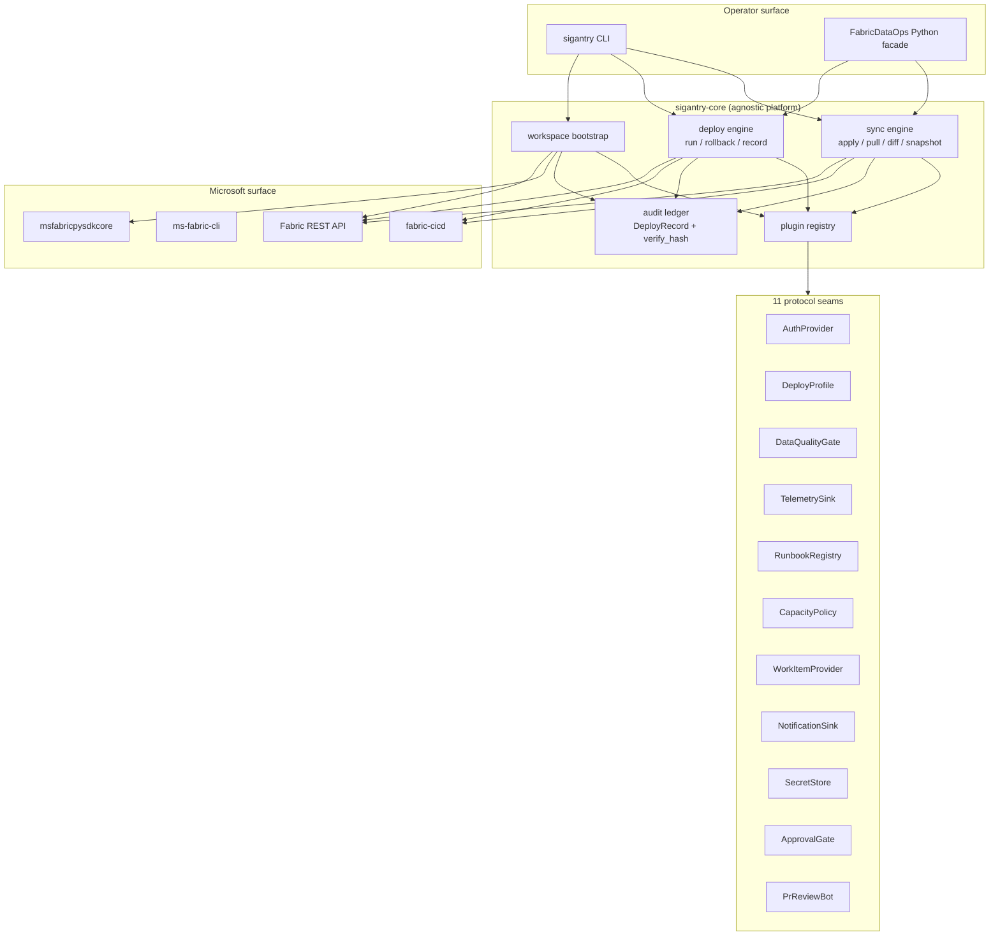

The two distinct Fabric clients shown -- `fabric-cicd` (deploys + folder
reconcile) and `msfabricpysdkcore` (REST primitives) -- are deliberately
both wired through one HTTP front door (`sigantry_core.client`) so
retry, throttling, and audit instrumentation apply uniformly. Operator
code never imports `httpx` or `requests` directly.

The *plugin registry* is the load-bearing piece. Sigantry's base
package does not ship a single HS2-, JToye-, or customer-X-specific
default. Every customer-shaped behaviour is loaded at startup from
Python entry points -- which means the same `sigantry-core` wheel runs
identically against an HS2 tenant, a JToye tenant, or a brand-new
deployment with zero plugins installed.

## 3. The plugin model

Sigantry ships as **two or more independent wheels**: the agnostic base
package and one optional plugin package per customer or organisation.

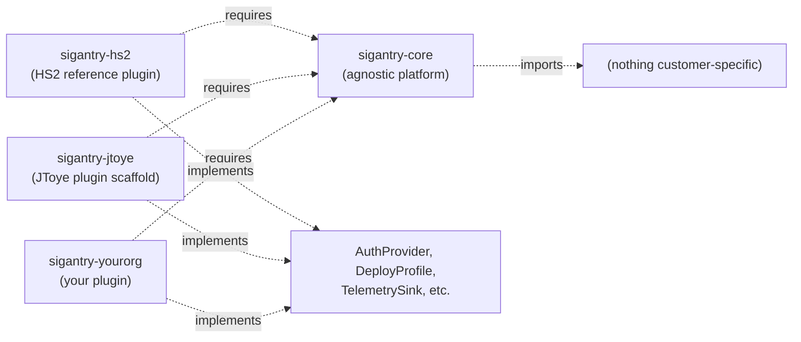

The dependency arrow only ever points from a plugin towards the core
package. Core never imports plugin code. An automated test in
`tests/prereqs/test_phase8_banned_apis.py` enforces this -- any HS2
string outside `sigantry-hs2/`, or any JToye string outside
`sigantry-jtoye/`, fails CI.

### What this means for installation

If you are an operator who has nothing to do with HS2, **install only
`sigantry-core`**. You get the full sync / deploy / governance / audit
machinery, plus the in-base reference plugins for `email`, `slack`,
`teams` notification sinks, three secret stores
(`key_vault`, `github_secrets`, `ado_variable_group`), and three
approval gates (`ado_environments`, `github_environments`, `opa`).
`sigantry doctor` will report **9 plugins discovered across 11 seam
groups**.

If you are working inside HS2 and need the AIMS deploy profile, the
DQ-framework gate, the Log Analytics telemetry sink, or the HS2 Entra
group auth provider, additionally install `sigantry-hs2`. Doctor will
then report **15 plugins**.

To author your own plugin pack, see Part V.

---

# Part II -- Getting started

## 4. Prerequisites

Sigantry has a small, pinned dependency surface. Get these in place
before installing.

### 4.1 Python runtime

You need **Python 3.11 or newer**: `requires-python` is `>=3.11` with no
upper bound, and 3.11, 3.12 and 3.13 are all declared supported. Python
3.10 will refuse the install (`requires-python` mismatch).

The recommended path is a dedicated Conda environment, mirroring how
the development team works:

```bash
conda create -n sigantry python=3.11 -y
conda activate sigantry
```

If you do not have Conda available, a standard `venv` is fine:

```bash
python3.11 -m venv ~/sigantry-env
source ~/sigantry-env/bin/activate    # Windows: ~\sigantry-env\Scripts\activate
```

Never install Sigantry into your system Python. Several of its
transitive dependencies (`azure-identity`, `pydantic`, `fabric-cicd`)
pin specific minor versions, and a system-wide install can collide
with other Python tooling on your machine.

### 4.2 Fabric tenant access

To run anything beyond `sigantry doctor` and `sigantry --help`, you
need credentials that can reach a Fabric tenant. The recommended
identity model is a **service principal** (SPN) with workload identity
federation, but interactive `az login` works for one-off operator
sessions.

The minimum scopes you will exercise on a typical workflow:

- `https://api.fabric.microsoft.com/.default` -- core Fabric REST
  surface.
- The corresponding Power BI API scope on tenants where Fabric items
  are still partially Power-BI-shaped (Reports, Semantic Models).
- Optionally, the Azure DevOps PAT scope (`vso.work_write`) if you
  use the work-item-traceability seam to attach Sigantry releases to
  ADO work items.

If you do not yet have credentials, ask your tenant administrator for
an SPN with **Contributor** on a sandbox workspace. Sigantry will tell
you politely when it lacks an authorisation it needs; it does not
require admin-of-everything to do useful work.

### 4.3 Optional system tools

Some workflows are smoother with these installed; none are mandatory:

- **`az` CLI** -- if you plan to authenticate interactively.
- **`gh` CLI** -- for the work-item-traceability seam against GitHub.
- **`pwsh` (PowerShell 7.4 LTS)** -- if you want to use the
  `Sigantry` PowerShell module alongside the Python CLI.

## 5. Installation

There are three install paths, in order of polish.

### 5.1 From PyPI (the normal path)

The distribution is published as `sigantry`. The install is the
canonical Python one-liner:

```bash
pip install sigantry
pip install sigantry-hs2            # optional, only for HS2 sites
```

> The distribution name is `sigantry`, not `sigantry-core`: the
> pre-v1.0 plan reserved the bare name, and the open-source release
> took it instead. `sigantry-core` does not resolve on PyPI. See
> [ADR-0017](decisions/ADR-0017-distribution-name-sigantry.md).

### 5.2 From a wheel

If you received a wheel by email, signed link, or direct download:

```bash
# Verify the file integrity first
sha256sum sigantry-1.0.0-py3-none-any.whl
# Compare against the SHA256 your distributor provided

# Install
pip install /path/to/sigantry-1.0.0-py3-none-any.whl
```

If you also received the HS2 plugin wheel and need its capabilities:

```bash
pip install /path/to/sigantry-1.0.0-py3-none-any.whl \
            /path/to/sigantry_hs2-<version>-py3-none-any.whl
```

Install both wheels in the same `pip install` invocation when you are
installing from files rather than an index: pip can only satisfy the
plugin's dependency on the base package when both wheel files are
supplied together.

### 5.3 Editable install from a clone

For contributors and for local debugging:

```bash
git clone <repo-url> sigantry
cd sigantry
pip install -e .
pip install -e sigantry-hs2     # if you want the HS2 plugin live
```

Editable installs pick up source-tree edits immediately, which is
useful when you are also authoring a plugin and want both packages
live at once.

## 6. Authentication

Sigantry uses Azure's `DefaultAzureCredential` chain. You do not call
the auth code directly; you set environment variables or run an
interactive login, and Sigantry resolves the right credential at the
right moment.

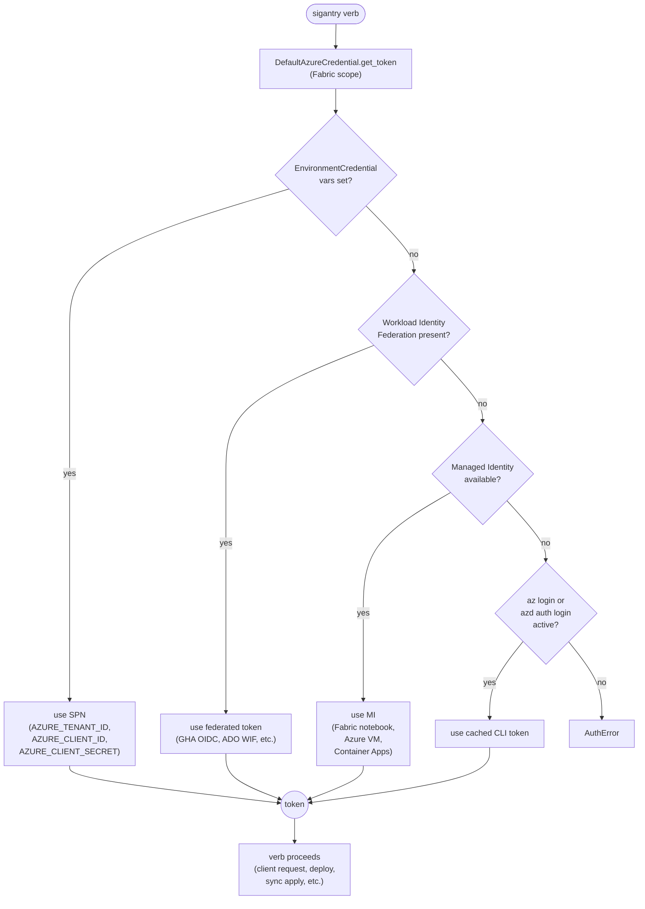

### 6.1 The four working paths

Pick the one that matches where you are running Sigantry.

**For local development on your laptop**, run an interactive login once
per shell session:

```bash
az login                # OR: azd auth login
sigantry doctor         # tokens resolve via the CLI cache
```

**For CI on GitHub Actions or Azure DevOps**, use workload identity
federation. No static credentials live in the repo:

```yaml
# GitHub Actions example -- in your workflow YAML
- uses: azure/login@v2
  with:
    client-id: ${{ secrets.AZURE_CLIENT_ID }}
    tenant-id: ${{ secrets.AZURE_TENANT_ID }}
    subscription-id: ${{ secrets.AZURE_SUBSCRIPTION_ID }}
```

**For service principal with secret** (legacy; avoid where possible):

```bash
export AZURE_TENANT_ID="<tenant-guid>"
export AZURE_CLIENT_ID="<spn-app-id>"
export AZURE_CLIENT_SECRET="<spn-secret>"
sigantry doctor
```

**Inside a Fabric notebook**, use the Spark utility's token broker. The
default `DefaultAzureCredential` chain often misses the right scope
inside a notebook; Sigantry exposes a hook so you can supply a custom
`AuthProvider` plugin.

### 6.2 Scope checklist

The most common authentication failure is **token resolved but with
the wrong scope**. The full list of scopes Sigantry requests:

| Verb | Scope |
|------|-------|
| `sigantry doctor` | none -- registry-only |
| `sigantry workspace list` | `https://api.fabric.microsoft.com/.default` |
| `sigantry sync apply` | `https://api.fabric.microsoft.com/.default` (folders + items REST) |
| `sigantry sync apply --with-publish` | the same, plus the Power BI API scope where relevant for Reports / SemanticModels |
| `sigantry deploy run` | the same as `sync apply --with-publish` |
| `sigantry rbac-audit` | the Fabric scope and the Power BI **admin** scope -- SPNs without admin role get a `forbidden-admin-only` row, not a crash |
| `sigantry workspace bootstrap` | the Fabric scope, plus `vso.work` if Git connect is enabled |

To debug which credential resolved and whether the tenant toggle is
visible, run the bundled auth doctor -- a standalone console script
installed alongside `sigantry`, not a subcommand:

```bash
diagnose-auth
# exit 0 = healthy; 2 = degraded (token works but a prerequisite such
# as the tenant toggle is missing); 3 = no credential produced a token
```

## 7. First steps

Once installed and authenticated, the verification ladder is short.

```bash
# Step 1: confirm the install is healthy.
sigantry doctor
# Expected last line:
#   "9 plugin(s) discovered across 11 seam group(s)."   # base alone
#   "15 plugin(s) discovered across 11 seam group(s)."  # base + sigantry-hs2

# Step 2: confirm Sigantry can reach Fabric.
sigantry workspace list
# Lists every workspace your identity can see.

# Step 3: confirm read-only introspection of one workspace.
sigantry sync snapshot --workspace-id <guid> --output snap.json
# Writes a JSON snapshot of folder topology + item index.
```

If step 1 fails, your install is broken; re-do Section 5.

If step 1 passes but step 2 fails with an `AuthError`, walk the chain
in Section 6.1 -- nine times out of ten the issue is that the active
credential resolves but does not include the Fabric scope.

If steps 1 and 2 pass but step 3 returns an empty snapshot, you have
auth but lack workspace-read permission on the GUID you passed -- ask
your administrator for at least the *Viewer* role on a sandbox
workspace.

> Worked example: [Tutorial 01 — Setup and first contact](tutorials/01-setup-and-first-contact.md)
> walks this ladder end-to-end with expected outputs and a
> troubleshooting table.

---

# Part III -- Core workflows

## 8. The seven verbs

Sigantry's surface is small on purpose. Seven verbs cover every
workflow you will run.

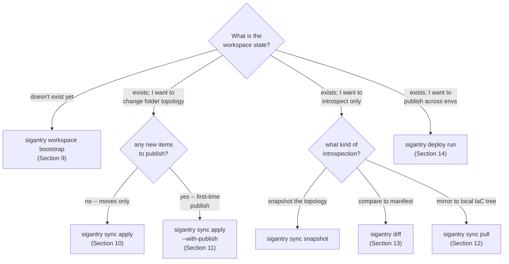

The boundary between `sync apply` and `deploy run` is the most common
source of operator confusion; Sections 10, 11, and 14 walk through it
in detail.

### 8.1 At a glance

| Verb | Touches workspace? | First-time item creation? | Audit record? |
|------|--------------------|---------------------------|---------------|
| `workspace bootstrap` | yes -- creates workspace, capacity bind, folders, Git connect | yes (greenfield) | `BootstrapRecord` |
| `sync snapshot` | no -- read-only | n/a | none |
| `sync apply` | yes -- folder create/move + existing-item placement | **no** (existing items only) | `DeployRecord` (`provider="sync-engine"`) |
| `sync apply --with-publish` | yes -- folder reconcile + first-time publish | **yes** | `DeployRecord` (`provider="sync-engine-publish"`) |
| `sync pull` | no -- read-only | n/a | none |
| `diff` | no -- read-only | n/a | none |
| `deploy run` | yes -- multi-env deploy via `fabric-cicd` | yes | `DeployRecord` (`provider="deploy-run"`) |
| `deploy run --rollback` | yes -- replays a prior `DeployRecord` | n/a | `DeployRecord` (`provider="rollback"`) |

## 9. Bootstrapping a workspace

When you start a new project on Fabric, the **greenfield** sequence has
five steps that all need to happen, in order, idempotently. Sigantry
collapses them into one verb, `sigantry workspace bootstrap`.

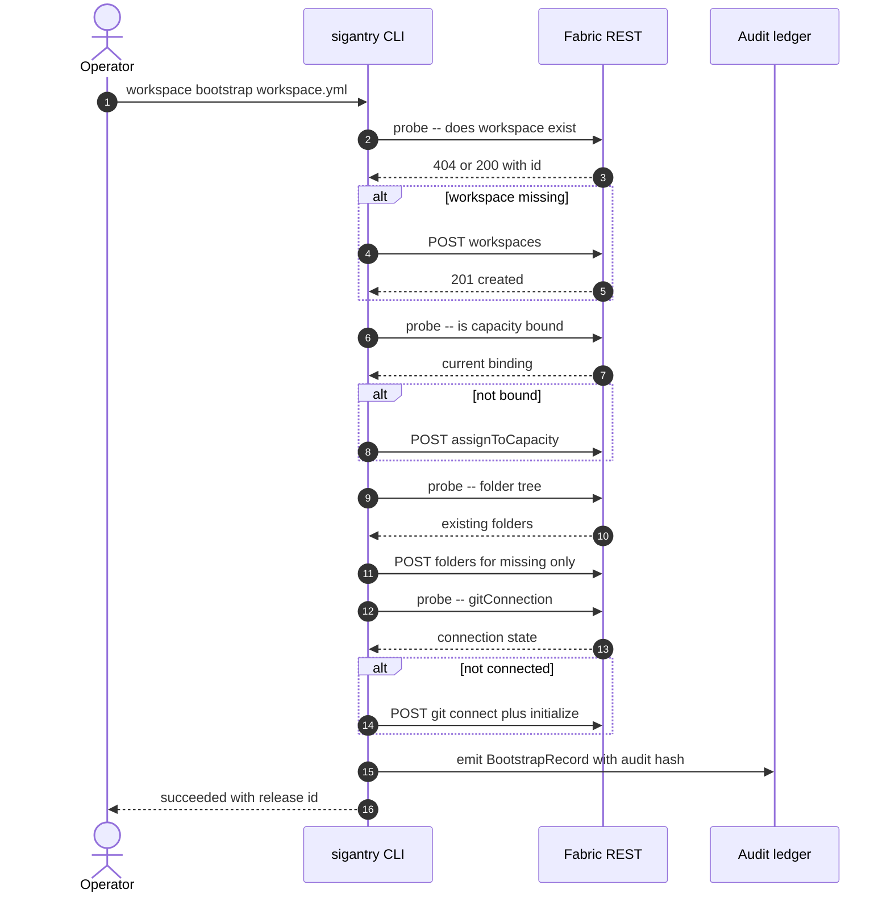

The load-bearing property is **probe-before-act**. Every step inspects
current state and no-ops if already converged. Re-running the same
manifest against a partially-set-up workspace finishes the remaining
steps and reports `already-converged` for the rest.

### 9.1 The `workspace.yml` manifest

A minimal manifest:

```yaml
schema_version: "1.0"
workspace:
  name: myproject_dev
  description: "Sandbox workspace for myproject (DEV)"
  capacity_id: "$ENV:FABRIC_CAPACITY_ID"
folders:
  blueprint: minimal_starter   # or "medallion", or "list:" for explicit names
git:
  enabled: false               # set true and supply the git block to wire source control
```

Two blueprints ship in the base package:

- **`minimal_starter`** -- 8 folders in numbered pipeline-flow order:
  `000 Orchestrate`, `100 Ingest`, `200 Store`, `300 Prepare`,
  `400 Model`, `500 Visualize`, `999 Libraries`, `Archive`. The
  numbering keeps the Fabric UI listing folders in flow order.
- **`medallion`** -- an alias for the identical `minimal_starter`
  layout, for operators who prefer that framing. There are no
  bronze/silver/gold folders -- if you want them, declare an explicit
  `folders:` list instead.

Either blueprint can be replaced with an explicit `folders: list:` of
folder names.

### 9.2 Running it

```bash
sigantry workspace bootstrap workspace.yml --dry-run    # see the plan first
sigantry workspace bootstrap workspace.yml --operator you@example.com
```

On a clean tenant the run finishes in 5-10 seconds and prints one JSON
report (`workspace_id`, `step_outcomes`, `audit_hash`). Re-running the
same manifest reports every executed step as `already-converged` (steps
gated off by the manifest, such as `git` when `git.enabled: false`,
report `skipped`) -- the locked idempotency invariant.

> Worked example: [Tutorial 06 — Bootstrap a new workspace](tutorials/06-bootstrap-workspace.md)
> (dry-run, real run, convergence proof, audited teardown).

## 10. Sync apply

`sigantry sync apply` is the **brownfield** verb. It reconciles a
declarative folder topology and existing-item placement against a
workspace that already exists. It does not create new items.

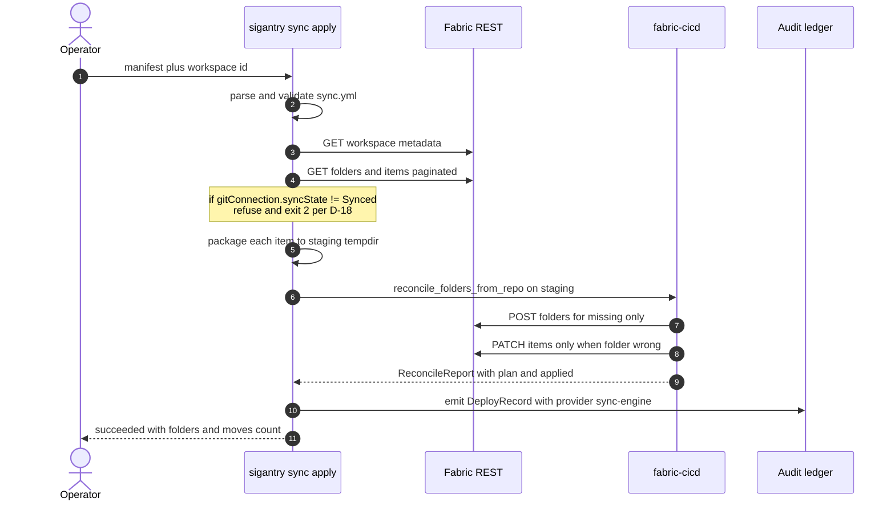

### 10.1 The `sync.yml` manifest

```yaml
schema_version: "1.0.0"
items:
  - local_path: notebooks/00_AIMS_Orchestration.ipynb
    type: Notebook
    target_folder: AIMS/01_NOTEBOOKS_AIMS_2026_V2
    display_name: 00_AIMS_Orchestration
  - local_path: notebooks/01_AIMS_Bronze_Ingest.ipynb
    type: Notebook
    target_folder: AIMS/01_NOTEBOOKS_AIMS_2026_V2
    display_name: 01_AIMS_Bronze_Ingest
  # ... more items
folders:
  - AIMS                       # preservation set (Council D #5)
  - AIMS/01_NOTEBOOKS_AIMS_2026_V2
```

The `folders[]` preservation set declares paths that the engine must
**not** auto-cleanup, even when `--unpublish-orphans` is enabled.
Adding a path implicitly adds all its ancestors.

The supported `type` values are exactly those listed by
`fabric_cicd.constants.ItemType`: `Notebook`, `DataPipeline`,
`SemanticModel`, `Report`, `SparkJobDefinition`, plus several others.
**Lakehouse and Warehouse are deliberately out-of-scope** for the v3.0
sync engine -- attempt to declare them and the manifest validator
rejects with a typed error pointing at this section.

### 10.2 Idempotency

The strongest contract `sync apply` ships is **second-run idempotency**.
Run the same manifest twice; the second run must report
`folders_created=0 items_moved=0`. If it does not, your manifest's
`folders[]` preservation set is wrong -- the engine is recreating
folders it should have considered already-present.

This is also the test that the sync engine ships with most prominently
(`tests/sync/test_apply.py::test_apply_idempotent_second_run_no_op`)
and the property the live brownfield UAT proves before any real
release.

> Worked example: [Tutorial 02 — Sync notebooks into a workspace](tutorials/02-sync-notebooks.md)
> (manifest authoring, dry-run, apply, idempotency proof). Note the
> boundary: sync governs topology only — a clean re-run says nothing
> about item *content*; see "Auditing content parity" in
> [Tutorial 05](tutorials/05-adopt-existing-workspace.md).

## 11. Sync apply --with-publish

`sync apply` does **not** create new items. If your manifest declares
items that do not exist in the workspace, the engine packages them to
a staging tempdir but never POSTs to `/v1/workspaces/{id}/items`.

When you want folder reconcile **and** first-time publish in one verb,
add `--with-publish`. This was introduced in May 2026 (ADR-0013) to
close the boundary surfaced by the `COE_F_SBDEVOPS_POC` brownfield UAT
on 2026-05-01, and is the path the first production utilisation run
used in June 2026.

```bash
sigantry sync apply \
  --manifest sync.yml \
  --workspace-id <guid> \
  --with-publish \
  --params parameters.yml \
  --environment DEV
```

### 11.1 What's different under `--with-publish`

- The packager output staging directory is handed to `fabric-cicd`'s
  `publish_all_items` instead of being cleaned up.
- A `parameters.yml` is **required** (the `--params` flag is mandatory
  with `--with-publish`); see Section 11.2.
- The audit record's `provider` field becomes `"sync-engine-publish"`
  and the `release_id` prefix is `"sync-publish-<TS>"` (instead of
  `"sync-<TS>"`), so audit-ledger consumers can bucket compose-runs
  distinctly from sync-only runs.
- The boundary trailer that the default `sync apply` prints when it
  detects "first-time-project-setup" signature is **suppressed** under
  `--with-publish` -- the publish actually happened, so the prompt to
  "use deploy run to publish" would be misleading.

### 11.2 parameters.yml at a glance

`parameters.yml` is `fabric-cicd`'s native substitution shape. The
loader validates two extra rules on top:

- No raw GUIDs anywhere; every workspace / capacity / item ID must
  resolve via `$workspace.$id`, `$items.<Type>.<Name>.$id`, `$ENV:<VAR>`,
  or the wildcard `_ALL_`.
- `$ENV:VAR` references are substituted at deploy time into a tempfile
  copy of the manifest before `fabric-cicd` sees it (a workaround for
  upstream's strict regex on `replace_value` slots, fixed in Sigantry
  <!-- docs-freshness: allow — names the version a fix landed in -->
  3.0.0rc1).

```yaml
find_replace:
  - find_value: "PLACEHOLDER_WORKSPACE_ID"
    replace_value:
      DEV:     "$workspace.$id"
      PREPROD: "$ENV:SIGANTRY_FABRIC_WORKSPACE_ID_PREPROD"
      PROD:    "$ENV:SIGANTRY_FABRIC_WORKSPACE_ID_PROD"
key_value_replace: []
spark_pool: []
```

See Appendix B for the full schema.

## 12. Sync pull

`sigantry sync pull` is the inverse of `sync apply`: it reads a live
workspace's folder topology and item index, then writes a `sync.yml`
plus packaged source files into a local directory. Use it to *IaC-fy*
a workspace that was set up interactively, then commit the output and
treat the manifest as the source of truth from that point on.

```bash
sigantry sync pull \
  --workspace-id <guid> \
  --into ./my-workspace-as-code/
# produces ./my-workspace-as-code/sync.yml + item sources at
# <folder-path>/<display_name>/ mirroring the workspace folder tree
```

The target directory must be empty (pass `--force` to deliberately
overwrite a previous pull); narrow the item types with `--type`
(default: Notebook, DataPipeline, SemanticModel, Report,
SparkJobDefinition). The output is byte-for-byte the same shape
`sync apply` consumes; the locked round-trip property is that `pull`
followed by `apply` against the same workspace is a no-op.

> Worked examples: [Tutorial 05 — Adopt an existing workspace](tutorials/05-adopt-existing-workspace.md)
> (brownfield adoption + the round-trip proof, plus pull as a
> read-only content-parity audit).

## 13. Diff and drift detection

`sigantry diff` compares a `sync.yml` against a live workspace and
reports drift without changing anything.

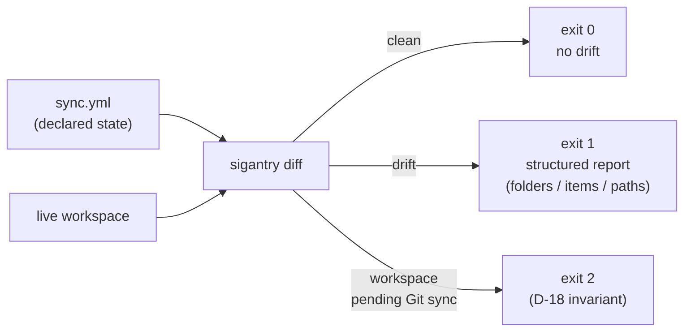

In CI, schedule `sigantry diff` as a recurring job. The exit code
discrimination -- 0 / 1 / 2 -- gives downstream pipelines a precise
signal: hard fail vs informational drift vs upstream-not-ready.

The toolkit ships a ready-made schedule pair — Azure DevOps at
`templates/schedules/drift-check.yml`, GitHub Actions at
`.github/workflows/drift-check.yml` (kept in lockstep by the dual-CI
parity gate); see the runbook at `docs/runbooks/drift-detection/` for
operator setup. Caution: a manifest that governs only a slice of a
shared workspace makes `--fail-on-drift` permanently red (every
ungoverned item counts as `+ added`) — scope scheduled checks to
fully-governed workspaces, or alert on `removed`/`modified` from the
JSON.

> Worked examples: [Tutorial 03 — Detect drift](tutorials/03-drift-detection.md)
> (inject, catch, reconcile) and [Tutorial 08 — Scheduled drift alerts](tutorials/08-scheduled-drift-alerts.md)
> (cron + Teams wiring, including the local sink smoke test).

## 14. Deploy run + rollback

When you need **multi-environment** deploys (DEV -> PREPROD -> PROD)
with parameter substitution, Sigantry's `deploy run` verb wraps
`fabric-cicd`'s publish path with audit-ledger and rollback support.

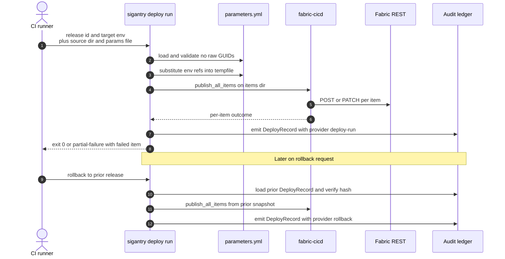

The audit ledger is the source-of-truth a rollback consumes; without
the prior `DeployRecord` and its verifiable `audit_hash`, the rollback
verb refuses to proceed. See Section 15 for the record's exact shape.

### 14.1 A typical CI invocation

```bash
sigantry deploy run \
  --source ./fabric_items \
  --params parameters.yml \
  --environment PROD \
  --workspace-id "$FABRIC_WORKSPACE_ID_PROD"
```

The `release_id` is generated by the verb and printed in the summary
(and lands in the ledger — `sigantry release list` shows it); to attach
a release to a work item under an operator-chosen id, use
`sigantry release record`.

The five-stage ADO + GHA template pair under
`templates/stages/cd-{dev,test,prod}.yml` shows how this composes
with build, test, and approval-gate stages.

### 14.2 Rolling back

```bash
# List recent deploys
sigantry release list --limit 5

# Pick the one to roll back to and re-apply it
sigantry deploy run \
  --rollback \
  --to-release "<release-id>" \
  --rollback-force \
  --rollback-runbook-id "INC-1234" \
  --source ./fabric_items \
  --params parameters.yml \
  --environment PROD \
  --workspace-id "$FABRIC_WORKSPACE_ID_PROD"
```

Rollback is destructive by definition (it supplants live workspace
state with the recorded item set), so it refuses without
`--rollback-force`; `--rollback-runbook-id` threads your incident
reference into the audit record. A rollback emits a brand-new
`DeployRecord` with `provider="rollback"` and
`release_id="rollback-of-<original>-<TS>"`, so the audit trail captures
the "we rolled back" event distinctly from the original release.
Cross-environment rollback (PROD -> DEV) is deliberately rejected;
stay within one workspace per release.

> Worked example: [Tutorial 07 — Roll back a release](tutorials/07-rollback.md)
> (two releases, ledger diff, audited restore — the full drill).

---

# Part IV -- Audit and governance

## 15. The audit ledger

Every workspace-mutating verb emits an audit record into a JSONL
ledger under `~/.sigantry/audit/`. There are three record types,
sharing one signing scheme.

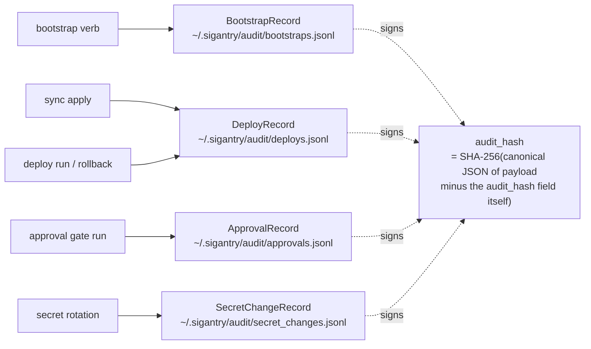

### 15.1 DeployRecord shape

```json
{
  "workspace": "<workspace-guid>",
  "release_id": "sync-publish-2026-05-06T12-32-18Z",
  "work_items": [],
  "fabric_items_changed": ["loader.Notebook", "transform.Notebook"],
  "test_evidence": {
    "provider": "sync-engine-publish",
    "outcome": "succeeded",
    "moved_items": "[]",
    "published_items": "[\"loader.Notebook\", \"transform.Notebook\"]"
  },
  "approver": "sync-engine",
  "audit_hash": "d233e6450...",
  "created_at": "2026-05-06T12:32:18Z"
}
```

The schema is `extra="forbid"` plus `frozen=True`; once a record is
written, neither the toolkit nor a consumer can mutate it without
breaking the hash check.

### 15.2 Verify-without-trust

Every record can be re-verified offline using only the JSONL line
itself:

```python
from sigantry_core.release.record import DeployRecord
import json

with open("/home/me/.sigantry/audit/deploys.jsonl") as f:
    for line in f:
        rec = DeployRecord.model_validate_json(line)
        assert rec.verify_hash(), f"tampered: {rec.release_id}"
```

The hash is computed over the canonical JSON of the payload **minus**
the `audit_hash` field itself, so the field cannot be self-signed
trivially. A tampered field anywhere in the record breaks the
verification.

### 15.3 File location and rotation

The ledger lives at `~/.sigantry/audit/<type>.jsonl`, mode `0o600`,
inside a directory created `0o700`. Each line is `fsync`'d before
the writer returns, so a crash mid-deploy leaves a complete file
through the previous record.

The toolkit does not rotate the ledger automatically -- it is a
**signed log**, not a metric. For long-running operators, copy the
ledger into a long-term store (Blob, S3, log analytics) on a
schedule. Any consumer can re-verify the hashes on the copy.

---

# Part V -- Plugin authoring

## 16. Why you might write a plugin

Sigantry's eleven *protocol seams* exist to capture exactly the points
where customer-shaped behaviour belongs. The base package has no
opinions about which Teams channel to notify, which Key Vault to read
secrets from, which capacity policy to enforce, or which work-item
system to attach a release to. If you want any of those decisions to
fire automatically on a workflow, you write a small plugin that
implements one or more seams.

The dependency arrow is one-way. Your plugin imports
`sigantry_core.protocols`; core never imports your plugin. This is
enforced by a CI test (`tests/prereqs/test_phase8_banned_apis.py`)
that fails if any HS2 string appears in the base package, and the
same shape applies to JToye, your-org, and any future plugin author.

## 17. Plugin discovery

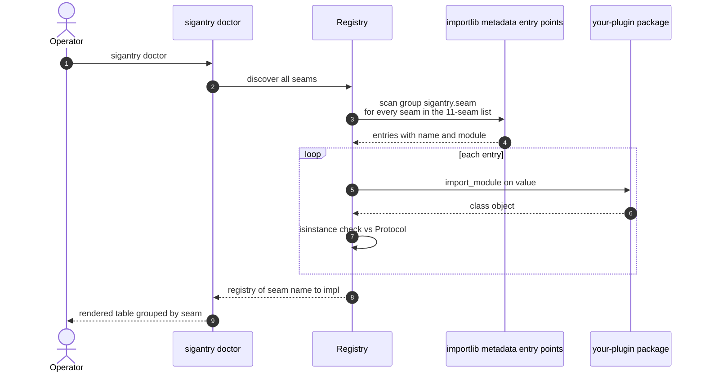

Your plugin's `pyproject.toml` registers entry points in the
`sigantry.<seam>` group:

```toml
[project.entry-points."sigantry.deploy_profiles"]
myorg = "myorg_sigantry_plugin.deploy:MyOrgDeployProfile"

[project.entry-points."sigantry.telemetry_sinks"]
myorg = "myorg_sigantry_plugin.telemetry:MyOrgTelemetrySink"
```

Once installed (`pip install your-package`), `sigantry doctor` picks
up the new rows automatically; no configuration step is needed.

### 17.1 The six base seams

The original v2 surface; you almost certainly extend one of these:

- `AuthProvider` -- credential resolution and token broking.
- `DeployProfile` -- per-customer deploy orchestration.
- `DataQualityGate` -- runs a DQ suite, returns pass/fail.
- `TelemetrySink` -- structured telemetry emission.
- `RunbookRegistry` -- maps event names to runbook URLs.
- `CapacityPolicy` -- decides scaling actions on a capacity.

(The `Registry` itself is the discovery layer, not a seam plugins
implement.)

### 17.2 The five v3 seams

Added in v3.0 to support the broader operator surface:

- `WorkItemProvider` -- attaches a release to an external tracker
  (Linear, JIRA, ADO Boards, GitHub Issues).
- `NotificationSink` -- end-user-visible notifications (email, Slack,
  Teams, on-call paging).
- `SecretStore` -- runtime secret resolution (Key Vault, ADO variable
  groups, GitHub Actions secrets).
- `ApprovalGate` -- pre-deploy approval step (ADO environments, GHA
  environments, OPA policy decision).
- `PrReviewBot` -- posts semantic model / Lakehouse schema diffs on
  pull requests (GitHub, ADO).
- `PrReviewBot` -- composes PR review comments from manifest diffs.

### 17.3 A 30-line minimal plugin

```python
# myorg_sigantry_plugin/notifications.py
from typing import Any
from sigantry_core.protocols import NotificationSink

class MyOrgWebhookSink:
    """NotificationSink implementation pointing at our internal webhook."""

    def __init__(self, *, webhook_url: str | None = None) -> None:
        self.webhook_url = webhook_url or "https://internal/webhook"

    def emit(self, *, event: str, payload: dict[str, Any]) -> None:
        import httpx
        httpx.post(self.webhook_url, json={"event": event, **payload}, timeout=5)
```

Register in `pyproject.toml`:

```toml
[project.entry-points."sigantry.notification_sinks"]
myorg_webhook = "myorg_sigantry_plugin.notifications:MyOrgWebhookSink"
```

Build and install your plugin wheel; `sigantry doctor` now reports
`myorg_webhook` under `notification_sinks`.

---

# Part VI -- Reference

## Appendix A. `sync.yml` schema

```yaml
schema_version: "1.0.0"        # required; "1.0" also accepted
items:                         # required; list[SyncItem]
  - local_path: <relative-path-to-source>     # required
    type: <ItemType-pascal-case>              # required; e.g. Notebook
    target_folder: <slash/separated/path>     # optional; default "/"
    display_name: <name-shown-in-fabric>      # required
    logical_id: <uuid4>                       # optional; pinned via sidecar otherwise
folders:                       # optional; preservation set (Council D #5)
  - <folder-path>
```

Validation rules enforced by the loader (`sigantry_core.sync.manifest`):

- `target_folder` depth capped at 10 segments.
- Each folder / display-name segment may not contain
  `~"#.&*:<>?{|}`, leading or trailing whitespace, or C0 / C1 control
  characters; max 255 chars.
- `type` must be a value from `fabric_cicd.constants.ItemType` after
  case-insensitive lookup. Lakehouse / Warehouse / SQLDatabase /
  MLExperiment are listed but **not registered** in the v3 packager
  registry; the manifest validator surfaces this with a typed error.
- `folders[]` segments follow the same rules as `target_folder`.

## Appendix B. `parameters.yml` schema

```yaml
find_replace:                  # bulk text substitution in item bodies
  - find_value: <literal-string-or-placeholder>
    item_type: <ItemType>      # optional; scope the substitution
    replace_value:
      <ENV-NAME>: <substitution-spec>
      _ALL_: <substitution-spec>     # wildcard; applies to every env

key_value_replace:             # JSONPath substitution in item bodies
  - find_key: <jsonpath-expression>
    replace_value:
      <ENV-NAME>: <substitution-spec>

spark_pool:                    # per-env Spark pool selection
  - instance_pool_id: <pool-name>
    replace_value:
      <ENV-NAME>:
        type: Capacity
        name: <pool-name-for-this-env>
```

Allowed substitution-spec forms (everything else fails validation):

- `$workspace.$id` -- resolved at deploy time by `fabric-cicd`.
- `$items.<Type>.<Name>.$id` -- resolved at deploy time.
- `$ENV:<VAR>` -- resolved from the operator's environment (Sigantry
  substitutes into a tempfile before handing to `fabric-cicd`).
- `_ALL_` -- environment wildcard.

## Appendix C. CLI reference

```text
sigantry <verb> [args] [flags]

(There is no `--version` flag. Read the version with
 `python -c "import sigantry_core; print(sigantry_core.__version__)"`.)

Verbs (18 subcommands; run `sigantry <verb> --help` for the full flag set):
  doctor                                 -- list discovered plugins per seam
    --strict                             exit 1 if any plugin failed to import
    --strict-trust                       exit 1 if any plugin is untrusted
  workspace
    list                                 -- list reachable workspaces
    get                                  -- one workspace's metadata
    create                               -- POST /workspaces
    delete                               -- DELETE /workspaces (--force required)
    list-items                           -- paginated item index
    assign-capacity                      -- bind capacity
    bootstrap <manifest>                 -- 5-call probe-before-act
      --dry-run                          report would-do steps; nothing POSTed
      --operator EMAIL                   identity recorded on the audit record
      --audit-dir PATH                   override ~/.sigantry/audit/
  capacity
    list                                 -- capacities your identity can see (id + SKU)
  sync
    apply                                -- folder reconcile + existing-item placement
      --manifest PATH                    (required) sync.yml
      --workspace-id GUID                (required)
      --environment LABEL                optional parameters.yml env
      --audit-dir PATH                   override ~/.sigantry/audit/
      --dry-run                          print plan, exit 0 without applying
      --with-publish                     compose folder reconcile + first-time publish
      --params PATH                      required when --with-publish
      --unpublish-orphans                delete folders/items absent from manifest
    pull                                 -- mirror live workspace into local IaC
      --workspace-id GUID                (required)
      --into DIR                         (required) destination; must be empty
      --force                            overwrite a non-empty destination
      --type TYPE                        repeatable item-type filter
    snapshot                             -- emit topology JSON
      --workspace-id GUID                (required)
      --output PATH                      optional; stdout otherwise
  diff                                   -- manifest vs live workspace
    --manifest PATH                      (required)
    --workspace-id GUID                  (required)
    --output human|json                  json = SemVer-pinned CI contract
    --fail-on-drift                      exit 1 on any drift
    --no-hint                            suppress operator hint trailer
  deploy
    run                                  -- multi-env deploy via fabric-cicd
      --source DIR                       (required) item directory tree
      --workspace-id GUID                (required)
      --environment LABEL                (required) DEV / PREPROD / PROD / etc.
      --params PATH                      parameters.yml (default: <source>/parameters.yml)
      --audit-dir PATH                   override ~/.sigantry/audit/
      --rollback                         replay a prior DeployRecord
      --to-release ID                    target release (required with --rollback)
      --rollback-force                   REQUIRED with --rollback (destructive ack)
      --rollback-runbook-id REF          incident reference for the audit record
      (scoping: --items-to-include, --item-name-exclude-regex,
       --folder-path-to-include, --folder-path-exclude-regex;
       orphan cleanup: --unpublish-orphans + --unpublish-force)
  release
    list                                 -- recent records (--limit, --workspace, --json, --audit-dir)
    show <release-id>                    -- one record, pretty-printed JSON
    diff <id-a> <id-b>                   -- added/removed/unchanged between two records (--json)
    record                               -- attach a release to a work item (--provider github|ado)
  rbac-audit                             -- RBAC sweep (workspace + capacity + item); tenant-wide by default
    --output csv|json                    -w/--workspace-id GUID (repeatable) scopes the sweep
    --out FILE | --out-dir DIR           file the audit (dated rbac-audit-<UTC>.csv) + one-line summary
  label-sync                             -- apply a sensitivity label to every item
    --workspace-id GUID --label-id GUID  (--sp / --user override SPN detection)
  tenant-settings export                 -- admin-only settings baseline + SHA-256 digest
    --output PATH
  pr-bot run                             -- post TMDL + Lakehouse diffs on a PR
    --provider github|ado --pr-id N
    --base-dir DIR --head-dir DIR        (--dry-run still fetches PR metadata)
  fabric-item
    copy                                 -- duplicate an item folder with a fresh
                                            logicalId + displayName
    set-binding                          -- attach an Environment and/or a default
                                            Lakehouse to a notebook
      --workspace-id GUID                (required) workspace holding the notebook
      --item-id GUID                     (required) notebook item
      --environment-id GUID              Environment to attach
      --environment-workspace-id GUID    workspace owning the Environment
      --lakehouse-id GUID                default lakehouse
      --lakehouse-name TEXT              default lakehouse by name
      --lakehouse-workspace-id GUID      workspace owning the lakehouse
      --tenant-id GUID                   override tenant for auth
  git                                    -- workspace <-> ADO Git integration surface
  variable-library                       -- Fabric Variable Library CRUD
  env                                    -- Fabric Environment wheel upload
  dq                                     -- run a registered DQ gate plugin
  config validate <path>                 -- pre-flight check parameters.yml
  preflight                              -- pre-deployment simulation + safety
                                            probes (ADR-0015)
    --manifest PATH / -m                 sync.yml or workspace.yml [default sync.yml]
    --params PATH / -p                   deployment parameters.yml
    --environment LABEL / -e             target environment [default dev]
    --strict                             treat warnings as failures
    --json                               emit the report as JSON

Standalone console script (not a sigantry subcommand):
  diagnose-auth                          -- credential/tenant-toggle doctor
                                            (exit 0 healthy / 2 degraded / 3 no token)
```

## Appendix D. Glossary

**audit_hash.** SHA-256 over the canonical JSON of a record's payload,
minus the `audit_hash` field itself. Re-computed by `verify_hash()`
to detect tampering.

**brownfield.** A workspace that already has folders and items;
Sigantry verbs that operate against it must respect existing
state. Counterpart of *greenfield*.

**Council D.** The internal review group whose constraints are
referenced in commit messages and validators (e.g. "Council D #5"
means "operator-created paths are preserved during orphan cleanup").

**DefaultAzureCredential.** Azure SDK's chained credential resolver
that walks env vars -> WIF -> managed identity -> CLI cache and uses
the first one that returns a token.

**DeployRecord.** The audit-ledger entry written for any
workspace-mutating deploy verb. Contains `release_id`,
`fabric_items_changed`, `test_evidence`, and `audit_hash`.

**fabric-cicd.** Microsoft's official Python deploy engine for
Fabric items. Sigantry wraps it; see `pyproject.toml` for the
pinned version range.

**greenfield.** A workspace that does not yet exist (or has only the
default Fabric-shipped artefacts); creating one from scratch is the
job of `sigantry workspace bootstrap`.

**logical_id.** A UUID4 minted per item that survives across deploys.
Persisted in `<source>/.sigantry/<type>-ids.json`. Commit this
sidecar to git so re-deploys produce stable item identifiers.

**preservation set.** The `folders[]` list at the top of `sync.yml`.
Operator-declared paths the engine must not auto-cleanup, even when
`--unpublish-orphans` is enabled.

**protocol seam.** A `runtime_checkable` Python `Protocol` that
defines a behaviour Sigantry expects from a plugin. There are 11
seams as of v3.0.

**release_id.** A unique identifier for one deploy. Convention is
operator-meaningful (`R-${BUILD_ID}`, `sync-2026-05-06T...`,
`rollback-of-R-122-...`); the only requirement is uniqueness within
the audit ledger.

**verify_hash().** Method on every audit record class. Re-computes
`audit_hash` and returns `True` only if it matches. Forms the
verify-without-trust contract.

## Appendix E. Troubleshooting

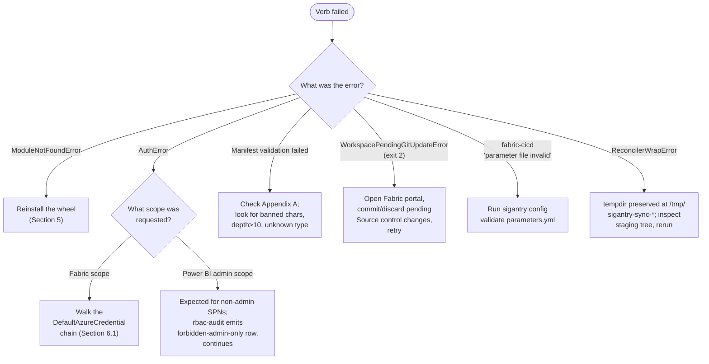

### Common errors

| Symptom | Likely cause | Remedy |
|---------|--------------|--------|
| `requires-python` mismatch on install | Python 3.10 or older active | Switch to 3.11+; redo Section 4.1 |
| `sigantry doctor` works but `sigantry workspace list` fails with `AuthError` | Token resolved without Fabric scope | Re-run `az login`; check `AZURE_*` env vars |
| `dry-run would create N folders and move 0 items` for `N` larger than expected | Manifest's `folders[]` preservation set is too small | Add the missing paths to `folders[]` |
| Idempotent re-run still reports `folders_created > 0` | Same as above | Same as above |
<!-- docs-freshness: allow — a fixed-in note names the version the bug predated -->
| `rbac-audit` aborts with `AuthError` | Pre-3.0.0rc1 bug, fixed in May 2026 | Upgrade to 3.0.0 or later |
| `--with-publish requires --params <parameters.yml>` | `--with-publish` was passed without `--params` | Add `--params parameters.yml` |
| `fabric-cicd` complains about `Invalid replace_value variable format` | `$ENV:VAR` substitution failed before fabric-cicd saw the file | Confirm the env var is exported; Sigantry substitutes into a tempfile |

### Where to look next

- **Tutorials.** Ten verified, hand-holding worked examples at
  `docs/tutorials/` -- setup, sync, drift, audit trail, brownfield
  adoption, bootstrap, rollback, scheduled alerts, PR bot,
  governance. Every step executed against a live tenant before
  publication. Start here if you learn by doing.
- **Operator runbooks.** Per-workflow deep-dives at
  `docs/runbooks/` -- one file per major workflow with a section
  for setup, command reference, troubleshooting table, and
  cross-references.
- **Architecture decision records.** ADR-0010 (commercial model),
  ADR-0011 (rename to Sigantry), ADR-0012 (sync apply vs deploy
  run boundary), ADR-0013 (`--with-publish` resolution rule). All
  under `docs/decisions/`.
- **Capability catalogue.** `docs/CAPABILITIES.md` -- the
  comprehensive in-repo reference, with verified citations to
  source line numbers.
- **Source code.** When all else fails, the source is the truth.
  The Python package is `sigantry_core/` in the repo; the entry
  point is `sigantry_core/cli.py`.

---

# Colophon

This guide is generated from `docs/USER-GUIDE.md` via
`scripts/userguide/render.py`. The pipeline runs Python's
`markdown` library through WeasyPrint, with diagram blocks
pre-rendered to SVG by `mermaid-cli` against the system Chrome
binary.

Sigantry is licensed under Apache-2.0. The toolkit's source is
available at the project's repository; consult the LICENSE file
for the full text.
