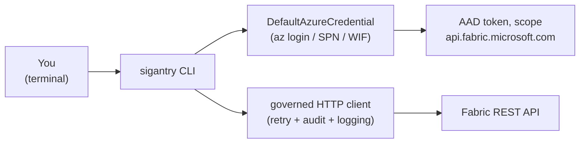

# Tutorial 01 — Setup and First Contact

**Goal:** a working Sigantry install, an authenticated session, and proof you can see
your Fabric estate — workspaces listed, plugins discovered, one workspace snapshotted
to JSON.

**Time:** ~15 minutes.

## What you need before starting

1. **Python 3.11** via conda (first-class path) or venv (fallback).
2. **An Azure identity** that can reach your Fabric tenant. Easiest: the Azure CLI
   (`az login`). Headless/CI: a service principal with the
   "Service principals can call Fabric public APIs" tenant setting enabled.
3. **Viewer access or better** to at least one Fabric workspace.

## How the pieces fit



Sigantry never stores credentials. Every command resolves a token through
`DefaultAzureCredential`, which tries (in order): environment variables, workload
identity, managed identity, and finally your `az login` session. For this tutorial,
`az login` is all you need.

## Step 1 — Install

Install the package directly from PyPI into your environment:

```bash
pip install sigantry
```

*(Or for local development from source: `git clone https://github.com/Bralabee/sigantry.git && cd sigantry && pip install -e ".[dev]"`).*

Verify the entry point exists:

```bash
sigantry --help | head -5
# expect: a usage banner listing subcommands (workspace, sync, deploy, diff, release, ...)
```

!!! tip

    If your terminal reports `sigantry: command not found` after `pip install`, run `hash -r` (in Bash) or `rehash` (in Zsh) to refresh your shell's command path cache, or invoke directly via `python -m sigantry_core.cli --help`.

> Full installation detail and troubleshooting: [getting-started/install.md](../getting-started/install.md).

## Step 2 — Authenticate

```bash
az login            # browser opens; pick the account with Fabric access
az account show --query user.name -o tsv
# expect: your@email
```

Prove the token actually mints for the Fabric resource (this is the call that fails
when your account lacks tenant access — better to find out now):

```bash
az account get-access-token --resource https://api.fabric.microsoft.com --query expiresOn -o tsv
# expect: a timestamp roughly 60-90 minutes in the future
```

## Aside — running headless or as a service principal (optional)

The tutorials run fine on `az login` alone — skip this on first read. But every
command in every tutorial also works unchanged under a service principal (SPN):
the credential is ambient, resolved through `DefaultAzureCredential` at call
time, never passed as a flag or config entry. Two prerequisites for any SPN: the
tenant setting **"Service principals can call Fabric public APIs"** must be
enabled, and the SPN needs a role on the target workspace.

For a headless shell without workload identity, set the three standard Azure
variables before any verb (shell or CI secret store only — never an `.env` file;
the project policy bans secret-bearing files):

```bash
export AZURE_TENANT_ID="<tenant-guid>"
export AZURE_CLIENT_ID="<spn-app-id>"
export AZURE_CLIENT_SECRET="<spn-secret>"   # legacy mode -- prefer WIF in CI
```

In CI, prefer **workload identity federation (WIF)**: `azure/login` with only
`client-id` + `tenant-id`, and the SPN proves itself with a short-lived OIDC
token — no secret exists to store, rotate, or leak. Note that Key Vault is not
the bootstrap path for the login credential (reading Key Vault already requires
one); it holds *downstream* secrets via the SecretStore seam.

Verify whichever path you chose with the bundled auth doctor (a standalone
script, not a `sigantry` subcommand):

```bash
diagnose-auth
# exit 0 = healthy; 2 = degraded (token works but e.g. the tenant toggle is
# off); 3 = no credential produced a token; --dry-run prints the plan offline
```

The full credential decision tree, all four supported auth paths and the
per-verb scope checklist live in the [User guide](../USER-GUIDE.md) section 6.

## Step 3 — Health check the install

```bash
sigantry doctor
# expect: a table of discovered plugins ending in a line like
#   "N plugin(s) across M seam group(s)"
```

`doctor` enumerates every plugin registered against Sigantry's protocol seams. On a
base install you will see the bundled reference implementations (notification sinks,
secret stores, approval gates). A plugin whose import fails shows `Status = error` —
that is your first place to look when something misbehaves later.

## Step 4 — First contact: list your workspaces

```bash
sigantry workspace list
# expect: one row per workspace your identity can see, with id + display name
```

Every row's `id` is a GUID you will use constantly. Pick one workspace you have at
least Contributor on and export it for the rest of the tutorials:

```bash
export WSID=<workspace-guid>
sigantry workspace get "$WSID"
# expect: JSON with displayName, type, capacityId
```

## Step 5 — Snapshot it

```bash
sigantry sync snapshot --workspace-id "$WSID" --output /tmp/snap.json
python3 -c "import json; s=json.load(open('/tmp/snap.json')); print('folders:', len(s['folder_path_index']), 'items:', len(s['items_by_id']))"
# expect: folders: <n> items: <m>  -- matching what the Fabric portal shows
```

You will see a one-time **Preview-API warning** about the Fabric Folders REST endpoint.
That is expected — folders are still a Preview API upstream. Acknowledge it permanently
by setting `workflow.preview_apis_acknowledged = true` in `.fabric-dataops.toml`.

Open the Fabric portal, count the folders and items in that workspace, and compare.
They should match 1:1 — that is your proof the toolkit sees exactly what you see.

## What just happened

You exercised the full stack once: credential resolution, the governed HTTP client
(notice the structured JSON log lines with `elapsed_ms` and `retry_count`), and the
read-only introspection surface. Nothing was written to the workspace; the only
artefact is `/tmp/snap.json` on your machine.

## Troubleshooting

| Symptom | Cause | Fix |
|---|---|---|
| `sigantry: command not found` | env not activated | `conda activate fabric-dataops-toolkits` |
| `DefaultAzureCredential failed to retrieve a token` | no az session | `az login`, re-check `az account show` |
| `401` on every call | account in the wrong tenant | `az login --tenant <tenant-id>` |
| `403` on a specific workspace | no role on that workspace | ask the workspace admin for Viewer+ |
| doctor shows `Status = error` for a plugin | plugin import failed | the reason is in the Status column itself; add `--strict` to turn it into a non-zero exit for CI |

## Success checklist

- [ ] `sigantry --help` prints the command catalogue
- [ ] `az account get-access-token --resource https://api.fabric.microsoft.com` returns a future timestamp
- [ ] `sigantry doctor` lists plugins with Status `ok`
- [ ] `sigantry workspace list` shows your workspaces
- [ ] `/tmp/snap.json` folder + item counts match the portal

**Next:** [Tutorial 02 — Sync notebooks into a workspace](02-sync-notebooks.md).
