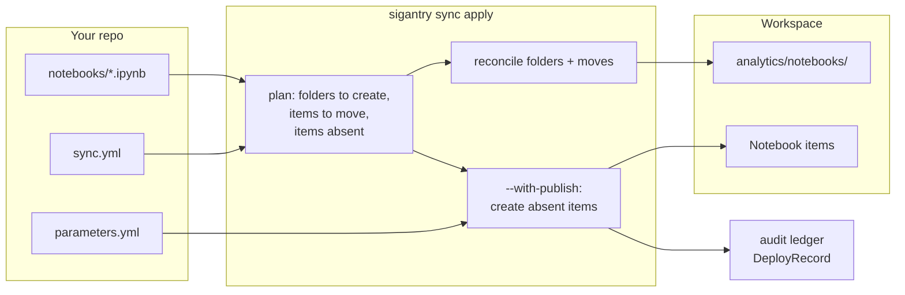

# Tutorial 02 — Sync Notebooks into a Workspace

**Goal:** a folder of local `.ipynb` notebooks governed by a `sync.yml` manifest:
declared once, published into the right workspace folder, with re-runs proven to be
safe no-ops. This is Sigantry's flagship workflow.

**Time:** ~30 minutes.
**Builds on:** [Tutorial 01](01-setup-and-first-contact.md) (`$WSID` exported, auth working).

## The mental model

A **manifest** declares the desired topology: which local files become which workspace
items, in which folders. `sync apply` converges the workspace toward the manifest —
additively by default (it creates folders and moves items; it never deletes unless you
explicitly opt in). Items that do not exist yet need `--with-publish` to be created
the first time.



## Step 1 — Make a working folder with two notebooks

Use real notebooks if you have them; otherwise create minimal valid ones:

```bash
mkdir -p ~/sigantry-tut02 && cd ~/sigantry-tut02
python3 - <<'PY'
import json
nb = {"cells": [{"cell_type": "code", "source": ["print('hello fabric')"],
                 "metadata": {}, "outputs": [], "execution_count": None}],
      "metadata": {}, "nbformat": 4, "nbformat_minor": 5}
for name in ("ingest_orders.ipynb", "transform_orders.ipynb"):
    json.dump(nb, open(name, "w"), indent=1)
print("wrote 2 notebooks")
PY
```

## Step 2 — Author the manifest

Create `sync.yml` next to the notebooks. `local_path` is relative to the manifest
file; `target_folder` is the workspace folder path (created if missing);
`display_name` is what the portal shows.

```yaml
schema_version: "1.0.0"
items:
  - {local_path: ingest_orders.ipynb,    type: Notebook, target_folder: analytics/notebooks, display_name: ingest_orders}
  - {local_path: transform_orders.ipynb, type: Notebook, target_folder: analytics/notebooks, display_name: transform_orders}
folders: []
```

The top-level `folders:` list is a **preservation set** — folders you list there are
never deleted even under orphan cleanup. Leave it empty for now.

> Field-by-field reference: [sync-schema.md](../reference/sync-schema.md).

## Step 3 — Author a minimal parameters.yml

First-time publish hands content to the deploy engine, which requires a parameters
file even when there is nothing to substitute:

```yaml
# parameters.yml -- minimal valid file; no replacements needed yet
find_replace: []
```

Validate it (catches hard-coded GUIDs and unset `$ENV:` references early):

```bash
sigantry config validate parameters.yml
# expect: OK -- 0 environment(s) parsed:
```

## Step 4 — Dry-run

Always preview first. Dry-run computes the plan and exits without touching Fabric:

```bash
sigantry sync apply --manifest sync.yml --workspace-id "$WSID" --dry-run
# expect (fresh workspace):
#   dry-run would create 2 folder(s) and move 0 item(s) for 2 manifest item(s).
# (2 folders because nested paths create parent-first: analytics, then
#  analytics/notebooks. If analytics already exists you will see 1.)
```

Read the plan critically: folder creates and item moves are shown; items that do not
exist yet are NOT in this plan (they surface in the publish step next). If the plan
shows moves you did not expect, your `target_folder` paths disagree with reality —
stop and check before applying.

## Step 5 — Apply with first-time publish

```bash
sigantry sync apply --manifest sync.yml --workspace-id "$WSID" \
  --with-publish --params parameters.yml
# expect, per absent item:
#   Publishing Notebook 'ingest_orders'
#   Published Notebook 'ingest_orders'
# and finally:
#   sync apply succeeded release_id=sync-publish-<timestamp>
#   items_packaged=2 folders_created=2 items_moved=0
```

Note the `release_id` — that is your audit-ledger key (Tutorial 04 uses it).

Open the Fabric portal: the workspace now has `analytics/notebooks/` containing both
notebooks. This portal check is the one step a machine cannot do for you.

## Step 6 — Prove idempotency

The property that makes this safe to automate: running the same command again changes
nothing.

```bash
sigantry sync apply --manifest sync.yml --workspace-id "$WSID" \
  --with-publish --params parameters.yml
# expect: sync apply succeeded ... folders_created=0 items_moved=0
# and NO "Publishing ..." lines -- the absent set is empty, publish short-circuits
```

## What just happened — and what deliberately did NOT

- The manifest now governs those two notebooks: their existence, names and folder.
- **Content of already-existing items is not re-pushed by sync.** The sync layer is
  topology-only by design; pushing changed cell content into an existing notebook is
  the deploy engine's job (`sigantry deploy run` — see [Tutorial 07](07-rollback.md)
  for that surface). This boundary is why re-runs are safe. To *prove* workspace
  content matches your local files, use the read-only pull-and-compare recipe in
  "Auditing content parity" ([Tutorial 05](05-adopt-existing-workspace.md)).
- Two `DeployRecord` entries (one per apply) landed in `~/.sigantry/audit/deploys.jsonl`.

## Troubleshooting

| Symptom | Cause | Fix |
|---|---|---|
| `--with-publish requires --params <parameters.yml>` | forgot `--params` | add `--params parameters.yml` |
| `HardcodedGuidError` on validate | raw GUID in parameters.yml | use `$items.`/`$workspace.`/`$ENV:` forms |
| publish succeeds but item lands at workspace root | `target_folder` typo | fix the path; re-run apply (it will move the item) |
| `403` on apply | Viewer-only role | you need Contributor+ to create folders/items |
| second apply still shows `Publishing ...` | display_name in manifest differs from the published item | make `display_name` match exactly; the absent-set join is on (display_name, type) |

## Success checklist

- [ ] `config validate` exits 0
- [ ] dry-run plan matched your expectation before you applied
- [ ] portal shows both notebooks inside `analytics/notebooks/`
- [ ] re-run printed `folders_created=0 items_moved=0` with no publish lines
- [ ] `sigantry release list | head -4` shows two `sync-publish-...` releases

**Next:** [Tutorial 03 — Detect drift](03-drift-detection.md), using this same manifest.
