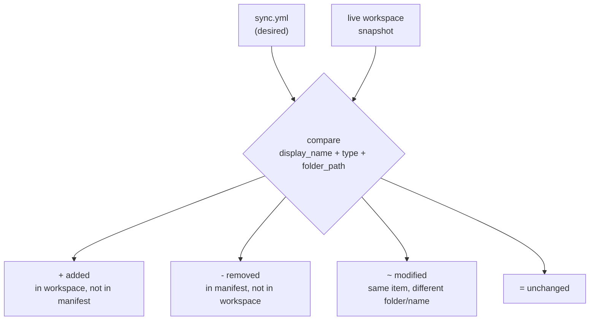

# Tutorial 03 — Detect Drift

**Goal:** establish a drift baseline for the manifest from Tutorial 02, deliberately
break it from the portal, watch `sigantry diff` catch the change, then reconcile.

**Time:** ~20 minutes.
**Builds on:** [Tutorial 02](02-sync-notebooks.md) (manifest applied, `$WSID` exported,
working dir `~/sigantry-tut02`).

## What drift means here

Drift = the live workspace disagrees with your committed manifest. Someone renames a
notebook in the portal, drags it to another folder, or deletes it — and two weeks
later your repo and your workspace silently describe different worlds. `sigantry diff`
compares the manifest against a live snapshot and classifies every item:



Comparison is **metadata-only by design** (name, type, folder). Cell-content changes
inside a notebook are not drift in this sense — content flows through Git integration
or the deploy engine, not the sync layer. A clean `=N` therefore certifies topology
only; for the content side, see "Auditing content parity" in
[Tutorial 05](05-adopt-existing-workspace.md).

## Step 1 — Baseline: prove you currently have no drift

```bash
cd ~/sigantry-tut02
sigantry diff --manifest sync.yml --workspace-id "$WSID"
# expect a table whose rows for your 2 items show "=" (unchanged), ending:
#   drift summary +<n> -0 ~0 =2
```

**Read the summary line carefully — this is the most misread output in the toolkit:**

- `=2` — both manifest items match the workspace. That is YOUR signal.
- `+<n>` — items that exist in the workspace but not in your manifest. In a workspace
  you share with other teams (or that has anything beyond your two notebooks), `+`
  counts everything else that lives there. **`+` is only meaningful when the manifest
  is intended to govern the entire workspace.**
- `-` and `~` are the alarming ones: something you declared is missing or moved.

## Step 2 — Inject drift from the portal

In the Fabric portal: open the workspace, find `transform_orders`, and **rename it**
to `transform_orders_TEMP` (or drag it out of `analytics/notebooks/` — either works).

This simulates the classic incident: a well-meaning colleague "just quickly fixes"
something in the UI.

## Step 3 — Catch it

```bash
sigantry diff --manifest sync.yml --workspace-id "$WSID"
# expect: transform_orders now shows as "-" (removed) and the renamed item as "+"
#   drift summary +<n+1> -1 ~0 =1
```

A rename is reported as remove+add because identity is matched on
(display_name, type). A pure folder move of an unrenamed item shows as `~ modified`.

For CI, get the same answer machine-readably and as an exit code:

```bash
sigantry diff --manifest sync.yml --workspace-id "$WSID" --output json --no-hint > /tmp/drift.json
sigantry diff --manifest sync.yml --workspace-id "$WSID" --fail-on-drift --no-hint; echo "exit=$?"
# expect: exit=1   (clean would be exit=0)
```

`/tmp/drift.json` follows a SemVer-pinned schema (`docs/reference/drift-schema.json`) —
safe to parse in pipelines.

## Step 4 — Reconcile

Two valid resolutions, depending on which side is right:

**The manifest is right (usual case)** — undo the portal change. Rename the notebook
back in the portal, or if the drift was a folder move, `sync apply` will move it home:

```bash
sigantry sync apply --manifest sync.yml --workspace-id "$WSID"
```

Note: `sync apply` re-converges folder placement for declared items, but it cannot
un-rename an item (a renamed item no longer matches the manifest identity). Renames
get fixed in the portal, or by deleting the renamed item and re-publishing.

**The workspace is right** — the change was intentional. Update `sync.yml` to declare
the new name, commit it, and the next diff is clean. The manifest is the contract;
changing the contract is fine, bypassing it is not.

## Step 5 — Confirm the clean state

```bash
sigantry diff --manifest sync.yml --workspace-id "$WSID" --fail-on-drift --no-hint; echo "exit=$?"
# expect: exit=0 and drift summary ... -0 ~0 =2
```

## Caveat that will save you a bad on-call page

Do not wire `--fail-on-drift` against a **shared workspace** your manifest only
partially governs: every other team's item counts as `+ added` and the check is
permanently red. Scope scheduled drift checks (Tutorial 08) to workspaces the manifest
fully owns, or treat `-`/`~` as the alert condition when consuming the JSON.

## Success checklist

- [ ] baseline run showed `=2` with `-0 ~0`
- [ ] after the portal rename, diff reported `-1` and exit code 1 with `--fail-on-drift`
- [ ] after reconciling, diff is back to `-0 ~0 =2` and exit code 0
- [ ] you can explain to a colleague why `+154` might be fine but `-1` never is

**Next:** [Tutorial 04 — Read the audit trail](04-audit-trail.md) — every apply you
just ran left evidence; go look at it.
