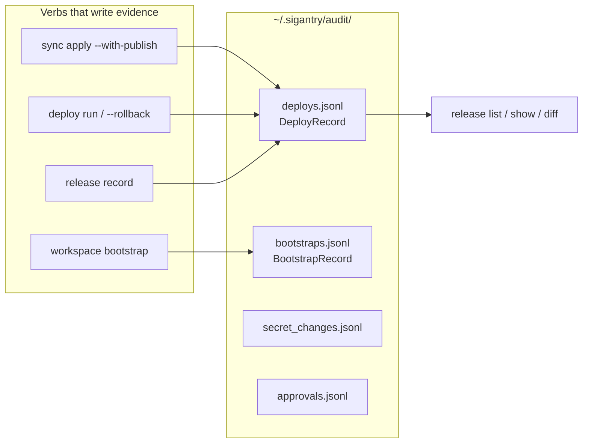

# Tutorial 04 — Read the Audit Trail

**Goal:** find the release records your previous tutorials created, inspect one,
diff two of them, and verify a record's tamper-evident hash — including watching the
verification fail when you tamper with a copy.

**Time:** ~15 minutes.
**Builds on:** [Tutorial 02](02-sync-notebooks.md) (you ran at least two applies).

## Where the evidence lives

Sigantry maintains append-only JSONL ledgers under `~/.sigantry/audit/`. Every record
carries an `audit_hash` — a SHA-256 over the canonical JSON of all its other fields —
so any post-hoc edit is detectable.



## Step 1 — List your releases

```bash
sigantry release list --limit 5
# expect: a table, most recent first, including your two
#   sync-publish-<timestamp> rows from Tutorial 02
```

Filter to one workspace (substring match on the workspace field):

```bash
sigantry release list --workspace "$WSID" --json | python3 -m json.tool | head -20
```

## Step 2 — Inspect one record

Take a `release_id` from the list:

```bash
sigantry release show sync-publish-<timestamp>
# expect: pretty-printed JSON with release_id, workspace, fabric_items_changed[],
#         test_evidence{}, approver, created_at, audit_hash
```

What the fields mean operationally: `fabric_items_changed` is the item set this
release touched; `test_evidence` is whatever the emitting verb captured (for
sync-publish: the moved/published item lists); `audit_hash` is the integrity seal.

## Step 3 — Diff two releases

```bash
sigantry release diff <earlier-release-id> <later-release-id> --json
# expect JSON with "added" / "removed" / "unchanged" arrays of
#   {logical_name, item_type, fabric_item_id}
```

This answers the release-manager question — "what changed between Tuesday's and
Thursday's deploy?" — from the ledger alone, without touching Fabric.

## Step 4 — Verify integrity, then break it on purpose

Start with the whole ledger. `release verify` walks every record in append order
and checks two things: that each record's own hash still matches its contents, and
that each record's `prev_hash` matches the record before it.

```bash
sigantry release verify
# expect: CHAIN VALID  N record(s) verified in append order from ...
```

Exit code is 0 for a valid chain and 1 for a broken or unreadable one, so this can
gate a pipeline. `--json` emits `{valid, records, vacuous, first_bad_index, reason}`
for machine consumers.

Two details worth knowing. The record count is always printed, and a ledger with no
records reports `NOTHING TO VERIFY` with `vacuous: true` rather than a bare success —
a pass over an empty file should not look like a pass over real records. And a
corrupt line is named as a corrupt line, not reported as a hash mismatch on the
record after it.

The per-record check is also exposed on the record class, which is what you want
when you are inspecting one specific release rather than the whole file:

```bash
python3 - <<'PY'
import json, pathlib
from sigantry_core.release.record import DeployRecord
path = pathlib.Path.home() / ".sigantry/audit/deploys.jsonl"
rec = DeployRecord(**json.loads(path.read_text().splitlines()[-1]))
print("release:", rec.release_id)
print("verify_hash():", rec.verify_hash())
PY
# expect: verify_hash(): True
```

Now prove the seal means something — tamper with a COPY and watch it fail:

```bash
python3 - <<'PY'
import json, pathlib
from sigantry_core.release.record import DeployRecord
path = pathlib.Path.home() / ".sigantry/audit/deploys.jsonl"
raw = json.loads(path.read_text().splitlines()[-1])
raw["approver"] = "mallory@example.com"        # the tamper
print("tampered verify_hash():", DeployRecord(**raw).verify_hash())
PY
# expect: tampered verify_hash(): False
```

One changed byte anywhere in the record flips verification to `False`. This is what
"verify without trust" means: an auditor does not have to trust the file, the
operator, or the machine — only the algorithm.

## Step 5 — (Optional) link a release to a work item

If you track work in GitHub issues or Azure DevOps work items, `release record`
writes a structured comment back onto the item so the ticket shows what shipped:

```bash
export GITHUB_TOKEN=<a-pat-with-repo-scope>
sigantry release record --provider github \
  --release-id manual-$(date -u +%Y%m%dT%H%M%SZ) \
  --workspace "$WSID" \
  --work-items 42 \
  --approver you@example.com \
  --fabric-items "ingest_orders.Notebook,transform_orders.Notebook" \
  --test-evidence '{"smoke":"passed"}' \
  --github-owner <owner> --github-repo <repo>
# expect: one-line summary; issue #42 gains a release comment with the audit hash
```

ADO works the same with `--provider ado --ado-organization ... --ado-project ...`.

## A note on ledger hygiene

The ledger is per-machine (`~/.sigantry/audit/`). For CI, pass `--audit-dir` to give
each pipeline run a hermetic ledger, and archive the directory as a build artefact —
that turns every pipeline run into auditable evidence.

## Success checklist

- [ ] `release list` shows your Tutorial 02 releases
- [ ] `release show` displays a full record with an `audit_hash`
- [ ] `release diff` between two releases returns the added/removed/unchanged sets
- [ ] `release verify` prints `CHAIN VALID` and a record count, exit 0
- [ ] untampered record verifies `True`; tampered copy verifies `False`

**Next:** [Tutorial 05 — Adopt an existing workspace](05-adopt-existing-workspace.md)
or jump to [Tutorial 07 — Roll back a release](07-rollback.md).
