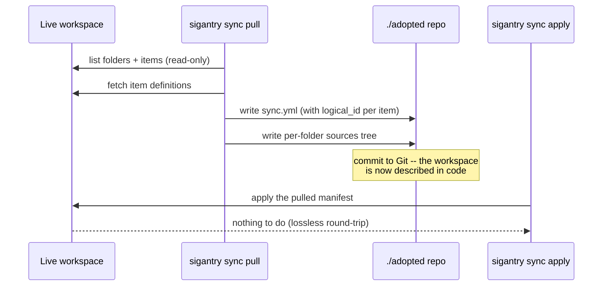

# Tutorial 05 — Adopt an Existing Workspace (Brownfield)

**Goal:** take a workspace that was built by hand in the portal and bring it under
manifest control — pulled into a committed `sync.yml` + sources tree, with the
round-trip proven lossless (re-applying the pulled manifest is a no-op).

**Time:** ~25 minutes.
**Builds on:** [Tutorial 01](01-setup-and-first-contact.md). Works on any workspace
you have Contributor on — including one full of items you did not create.

## Why this matters

Most real estates are brownfield: years of hand-built notebooks, pipelines and
folders. You cannot govern what is not declared. `sync pull` is the adoption verb:
it reads the live workspace and emits the manifest that *describes what already
exists* — without disturbing anything (pull is strictly read-only).



The key detail is `logical_id`: pull preserves each item's workspace identity in the
manifest, so a later apply recognises every item as "already there" instead of
trying to recreate it.

## Step 1 — Pull

```bash
mkdir -p ~/sigantry-tut05 && cd ~/sigantry-tut05
sigantry sync pull --workspace-id "$WSID" --into ./adopted
# expect: sync pull succeeded items_pulled=<n> sync_yml=./adopted/sync.yml
```

The target directory must be empty (or absent); pass `--force` only when you
knowingly want to overwrite a previous pull.

By default pull takes the common item types (Notebook, DataPipeline, SemanticModel,
Report, SparkJobDefinition). Narrow it with `--type`:

```bash
sigantry sync pull --workspace-id "$WSID" --into ./adopted-notebooks --type Notebook
```

## Step 2 — Read what you got

```bash
head -25 ./adopted/sync.yml
# expect: schema_version, then one items[] entry per pulled item, each carrying
#   local_path, type, target_folder, display_name and logical_id
ls ./adopted/
# expect: sync.yml plus one directory per top-level workspace folder; item
#   sources live at <folder-path>/<display_name>/ (there is no separate
#   sources/ directory -- the tree mirrors the workspace folder layout)
```

Inspect critically before committing:

- Do the `target_folder` paths mirror the portal's folder tree? They should, exactly.
- Every item has a `logical_id` GUID — that is the round-trip anchor. Do not edit these.
- Items of types pull does not handle were skipped, not broken — compare counts
  against your Tutorial 01 snapshot if you want the exact delta.

## Step 3 — Prove the round-trip is lossless

Apply the manifest you just pulled, in dry-run first, then for real:

```bash
sigantry sync apply --manifest ./adopted/sync.yml --workspace-id "$WSID" --dry-run
# expect: dry-run would create 0 folder(s) and move 0 item(s) for <n> manifest item(s).

sigantry sync apply --manifest ./adopted/sync.yml --workspace-id "$WSID"
# expect: sync apply succeeded ... folders_created=0 items_moved=0
```

`0 / 0` is the proof: the manifest fully and faithfully describes the workspace.
If the plan is NOT empty, the pull and the workspace diverged in the seconds between
the two commands (someone is editing live), or you edited the manifest — investigate
before proceeding.

## Step 4 — Commit and protect

```bash
cd ./adopted && git init -q && git add -A && git commit -qm "adopt workspace $WSID under manifest control"
```

If operators legitimately create scratch folders in this workspace via the UI, add
those paths to the manifest's top-level `folders:` preservation list now — that is
what keeps a future orphan-cleanup from eating them:

```yaml
folders:
  - /scratch/UI-experiments
```

## Step 5 — Baseline drift and you are done

```bash
sigantry diff --manifest ./adopted/sync.yml --workspace-id "$WSID"
# expect: every pulled item "=", summary -0 ~0 =<n>
```

From here the workspace is governed: Tutorial 03's drift loop and Tutorial 08's
scheduled checks apply to it unchanged.

## Auditing content parity

Drift detection certifies topology only — a clean `=N` says nothing about whether
the *content* of workspace items still matches your local files. Because pull
fetches full item definitions, it doubles as the read-only answer to that question:
pull into a scratch directory and compare cell sources.

```bash
sigantry sync pull --workspace-id "$WSID" --into /tmp/content-audit --type Notebook
python3 - <<'PY'
import json, pathlib

def cells(path):
    nb = json.loads(pathlib.Path(path).read_text())
    return [(c["cell_type"], "".join(c.get("source", []))) for c in nb["cells"]]

local  = pathlib.Path("<your-repo>/<notebook-name>.ipynb")
pulled = next(pathlib.Path("/tmp/content-audit").rglob("<notebook-name>/notebook-content.ipynb"))
print("content identical:", cells(local) == cells(pulled))
PY
# expect: content identical: True   (False = the two sides have diverged)
```

Compare cell sources, not raw bytes — Fabric strips outputs and rewrites notebook
metadata, so byte-level diffs always differ even when the code is identical. If
content has diverged and local is the truth, republish those items through the
deploy engine (`sigantry deploy run`, [Tutorial 07](07-rollback.md)); if the
workspace is the truth, re-pull and commit.

## Troubleshooting

| Symptom | Cause | Fix |
|---|---|---|
| `PullTargetNotEmptyError` | `--into` dir has files | use an empty dir, or `--force` deliberately |
| pulled count < portal count | unsupported item types skipped | check `--type` coverage; unsupported types stay portal-managed |
| round-trip apply shows moves | workspace changed mid-tutorial, or manifest edited | re-pull into a fresh dir; diff the two manifests |
| `403` on pull | Viewer role | pull fetches item definitions; you need Contributor+ |

## Success checklist

- [ ] `sync pull` reported `items_pulled=<n>` and wrote `sync.yml` + the per-folder sources tree
- [ ] every manifest item carries a `logical_id`
- [ ] round-trip apply printed `folders_created=0 items_moved=0`
- [ ] the manifest is committed to Git
- [ ] `sigantry diff` shows `=<n>` with `-0 ~0`

**Next:** [Tutorial 06 — Bootstrap a new workspace](06-bootstrap-workspace.md) for the
greenfield mirror image of what you just did.
