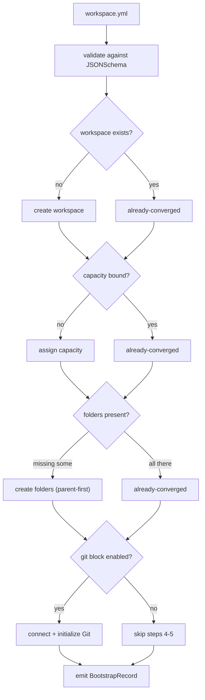

# Tutorial 06 — Bootstrap a New Workspace from One YAML File

**Goal:** a brand-new workspace materialised from a single `workspace.yml` — created,
bound to a capacity, folder blueprint laid out — with a `BootstrapRecord` in the audit
ledger and the re-run proven to converge to "nothing to do". Then torn down cleanly.

**Time:** ~25 minutes.
**Builds on:** [Tutorial 01](01-setup-and-first-contact.md). You also need a
**capacity GUID** you may create workspaces on (`sigantry capacity list` shows the
capacities your identity can see; a Trial capacity works fine).

## The five probes

`workspace bootstrap` runs a probe-before-act sequence: every step first checks
current state and does nothing if that step is already satisfied. That is the
property that makes it safe to keep in CI.



## Step 1 — Find your capacity

```bash
sigantry capacity list
# expect: rows with capacity id + sku; copy the GUID of one you can use
export CAPACITY_ID=<capacity-guid>
```

## Step 2 — Author workspace.yml

The minimum viable manifest (no Git wiring — add that later once a repo exists):

```yaml
schema_version: "1.0"
workspace:
  name: tut06-bootstrap-demo
  description: "Tutorial 06 scratch workspace"
  capacity_id: "<capacity-guid>"      # paste $CAPACITY_ID; quotes required
folders:
  blueprint: minimal_starter
git:
  enabled: false
```

Two folder strategies exist: `blueprint:` picks a named layout from the catalogue
(`minimal_starter` = 8 folders in numbered pipeline-flow order, `000 Orchestrate`
through `500 Visualize` plus `999 Libraries` and `Archive`; `medallion` is an alias
for the same layout), or `list:` declares explicit
folder names. Full schema with every key, including Git wiring and stage markers:
[workspace-bootstrap-operator.md](../runbooks/workspace-bootstrap-operator.md).

## Step 3 — Dry-run: see what WOULD happen

```bash
sigantry workspace bootstrap workspace.yml --dry-run
# expect: a JSON report ending like
#   "step_outcomes": {
#     "workspace": "created", "capacity": "created", "folders": "created",
#     "git": "skipped", "initialize": "skipped"
#   },
#   "audit_hash": "<sha-256>",
#   "dry_run": true
# "created" inside a dry_run:true envelope means WOULD-create. Nothing was POSTed.
```

A schema mistake exits 2 with a readable message pointing at the offending key —
fix and re-run until the dry-run plan looks right.

## Step 4 — Bootstrap for real

```bash
sigantry workspace bootstrap workspace.yml --operator you@example.com
# expect: the same JSON report shape as the dry-run, now with a real
#   "workspace_id", "step_outcomes" showing "created" for
#   workspace/capacity/folders ("skipped" for git/initialize),
#   an "audit_hash", and "dry_run": false
```

Check the portal: the workspace exists with the blueprint folder tree. Export the
`workspace_id` straight from the JSON report:

```bash
export TUT06_WSID=<workspace_id-from-the-report>
```

## Step 5 — Prove convergence

```bash
sigantry workspace bootstrap workspace.yml --operator you@example.com
# expect: workspace/capacity/folders report already-converged (git/initialize
#         stay skipped while git.enabled is false); a second BootstrapRecord
#         is written (the audit trail records the check itself)
```

This is the load-bearing property: bootstrap in CI cannot double-create, cannot
fight a human who already made the workspace, and documents every convergence check
it performs.

Verify the ledger:

```bash
python3 - <<'PY'
import json, pathlib
from sigantry_core.workspace.records import BootstrapRecord
path = pathlib.Path.home() / ".sigantry/audit/bootstraps.jsonl"
rec = BootstrapRecord(**json.loads(path.read_text().splitlines()[-1]))
print("step_outcomes:", rec.step_outcomes)
print("verify_hash():", rec.verify_hash())
PY
# expect: already-converged for workspace/capacity/folders, skipped for
#         git/initialize; verify_hash(): True
```

## Step 6 — Tear down (DESTRUCTIVE, scratch workspace only)

Delete the tutorial workspace. Destructive verbs demand explicit acknowledgement and
record who/why:

```bash
sigantry workspace delete "$TUT06_WSID" --force
# expect: 200; the deletion is audited
```

If the delete intermittently fails with Fabric's known `UnknownError`, the Python API
exposes a Power-BI-API fallback (`delete_workspace(..., pbi_fallback=True)`); simply
retrying the CLI delete usually also succeeds.

## Where this goes next

In real use, `workspace.yml` lives in the consumer repo next to `sync.yml`:
bootstrap makes the empty governed shell, Tutorial 02's sync-publish fills it, and
the Git block (set `git.enabled: true` with your repo coordinates) wires
source control from day one. For fleet-scale, state-managed provisioning instead,
see the Terraform comparison in [CONSUMING.md](../CONSUMING.md).

## Success checklist

- [ ] dry-run reported the would-create plan without touching the tenant
- [ ] portal shows the workspace with the blueprint folders
- [ ] second run reported `already-converged` on every executed step
- [ ] `BootstrapRecord.verify_hash()` returns `True`
- [ ] scratch workspace deleted

**Next:** [Tutorial 07 — Roll back a release](07-rollback.md).
