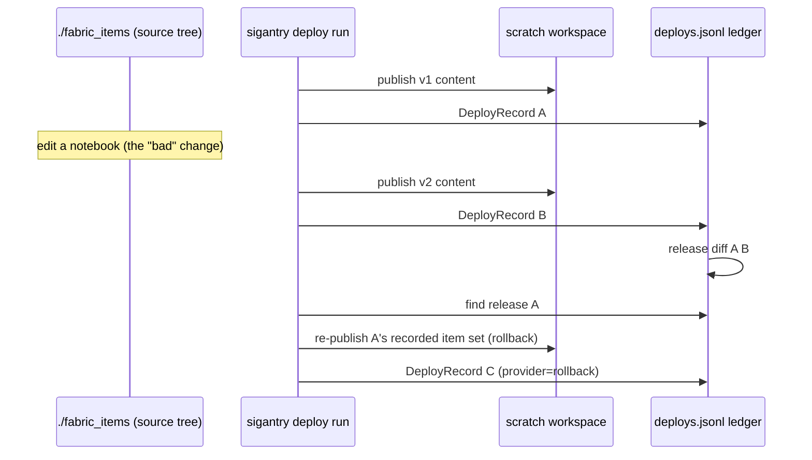

# Tutorial 07 — Roll Back a Release

**Goal:** two deliberate releases of an item tree into a scratch workspace, a ledger
diff showing exactly what changed between them, then the first release restored with
one audited command. After this drill, "bad deploy" stops being an incident and
becomes a procedure.

**Time:** ~30 minutes.
**Builds on:** [Tutorial 06](06-bootstrap-workspace.md) — use a scratch workspace
(rollback supplants live state; never drill on a shared workspace).
**Uses:** `sigantry deploy run` — the content-level deploy engine (distinct from the
topology-level `sync apply` you used in Tutorial 02). This is also the verb for
republishing the content of items sync already governs.

## The shape of the drill



## Step 1 — Get a deployable source tree

`deploy run` consumes a Fabric **item tree** — directories like
`<name>.Notebook/` each containing a `.platform` file plus content. The repo's
demo scaffold ships a ready-made one; copy it so you can edit freely:

```bash
cp -r templates/demo/fabric_items ~/sigantry-tut07 && cd ~/sigantry-tut07
ls
# expect: one or more *.Notebook / *.DataPipeline directories
printf 'find_replace: []\n' > parameters.yml
```

(Any item tree exported by Fabric Git integration works the same way.)

## Step 2 — Release A

Use a hermetic ledger dir for the drill so your real ledger stays clean:

```bash
export AUDIT_DIR=$(mktemp -d)
sigantry deploy run --source . --workspace-id "$TUT06_WSID" --environment DEV \
  --params parameters.yml --audit-dir "$AUDIT_DIR"
# expect: per-item "Published ..." lines, then a DeployRecord summary with a release_id
sigantry release list --audit-dir "$AUDIT_DIR"
# note the first release_id -> call it A
```

## Step 3 — Make the "bad" change and ship Release B

Edit any notebook in the tree (add a cell, change a line — content is what deploy
pushes), then deploy again:

```bash
sigantry deploy run --source . --workspace-id "$TUT06_WSID" --environment DEV \
  --params parameters.yml --audit-dir "$AUDIT_DIR"
sigantry release list --audit-dir "$AUDIT_DIR"
# expect: two records now; the newer is B
```

## Step 4 — Ask the ledger what changed

```bash
sigantry release diff <release-A-id> <release-B-id> --audit-dir "$AUDIT_DIR" --json
# expect: added/removed/unchanged item sets between the two releases
```

In a real incident this is your blast-radius answer before you touch anything.

## Step 5 — Roll back to A

Rollback is **DESTRUCTIVE by definition** — it supplants live workspace state with
the recorded item set — so it demands the full acknowledgement trio:

```bash
sigantry deploy run --rollback --to-release <release-A-id> --rollback-force \
  --rollback-runbook-id DRILL-001 \
  --workspace-id "$TUT06_WSID" --source . --environment DEV \
  --params parameters.yml --audit-dir "$AUDIT_DIR"
# expect: re-publish of A's item set, then a third DeployRecord
```

Without `--rollback-force` the command refuses — by design. The `--rollback-runbook-id`
threads your incident reference into the audit record, so six months later the ledger
still explains *why* production state jumped backwards.

## Step 6 — Verify the ledger tells the whole story

```bash
sigantry release list --audit-dir "$AUDIT_DIR"
# expect: three records -- A, B, and the rollback record pointing back at A
sigantry release show <rollback-release-id> --audit-dir "$AUDIT_DIR"
# expect: provider/rollback metadata + to-release linkage + audit_hash
```

Open the workspace notebook in the portal: the Step 3 edit is gone — content matches
Release A.

## What to take into production

- **Time yourself.** The promise to your stakeholders is rollback-in-minutes; the
  drill gives you your real number.
- The drill used `--audit-dir`; production rollbacks use the default ledger so the
  record sits beside the original deploys.
- Rollback restores the **recorded item set's content**. Items created after release
  A are not deleted by rollback — combine with orphan cleanup deliberately, not
  reflexively.
- Known cosmetic quirk: the rollback record's two timestamps may differ by
  microseconds (evaluated twice); harmless, tracked as accepted debt.

## Success checklist

- [ ] three DeployRecords in the drill ledger: A, B, rollback
- [ ] `release diff A B` showed the edited item
- [ ] rollback refused without `--rollback-force`, succeeded with it
- [ ] portal confirms content reverted to A
- [ ] you know your minutes-to-rollback number

**Next:** [Tutorial 08 — Scheduled drift alerts](08-scheduled-drift-alerts.md).
