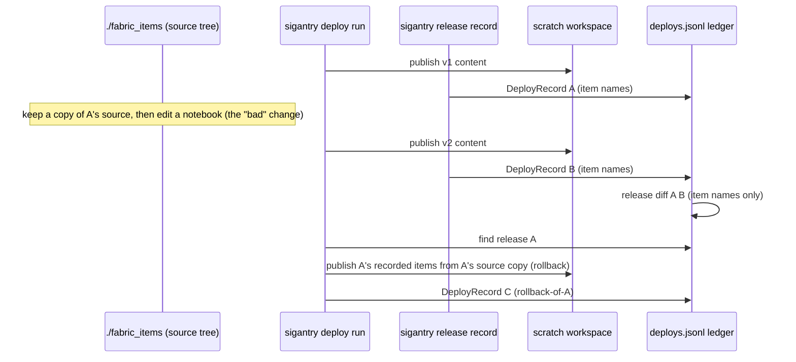

# Tutorial 07 — Roll Back a Release

**Goal:** two deliberate releases of an item tree into a scratch workspace, each
recorded in a scratch ledger, a ledger diff of the items each release recorded, then
release A's items published again from release A's source with one audited command.
After this drill, "bad deploy" stops being an incident and becomes a procedure.

**Time:** ~30 minutes.
**Builds on:** [Tutorial 06](06-bootstrap-workspace.md) — use a scratch workspace
(rollback supplants live state; never drill on a shared workspace).
**Uses:** `sigantry deploy run` — the content-level deploy engine (distinct from the
topology-level `sync apply` you used in Tutorial 02). This is also the verb for
republishing the content of items sync already governs. It also uses
`sigantry release record`, because a forward `deploy run` writes no ledger record.

> [!NOTE]
> In Steps 2 to 6, the `sigantry release record` calls, the copy of release A's
> source and the rollback from that copy have not been run against a tenant.
> Without the `release record` calls, Steps 4 to 6 find nothing in the
> ledger. `release record` links each release to a work item: it needs a work-item
> provider and posts a comment on the issue you name. Use a scratch GitHub
> repository and issue, and export a token for it as `GITHUB_TOKEN`.

## The shape of the drill


```mermaid
sequenceDiagram
    participant R as ./fabric_items (source tree)
    participant D as sigantry deploy run
    participant Rec as sigantry release record
    participant W as scratch workspace
    participant L as deploys.jsonl ledger

    D->>W: publish v1 content
    Rec->>L: DeployRecord A (item names)
    Note over R: keep a copy of A's source, then edit a notebook (the "bad" change)
    D->>W: publish v2 content
    Rec->>L: DeployRecord B (item names)
    L->>L: release diff A B (item names only)
    D->>L: find release A
    D->>W: publish A's recorded items from A's source copy (rollback)
    D->>L: DeployRecord C (rollback-of-A)
```

## Step 1 — Get a deployable source tree

`deploy run` consumes a Fabric **item tree** — directories like
`<name>.Notebook/` each containing a `.platform` file plus content. The repo's
demo scaffold ships a ready-made one; copy it so you can edit freely:

```bash
cp -r templates/demo/fabric_items ~/sigantry-tut07 && cd ~/sigantry-tut07
ls
# expect: one or more *.Notebook / *.DataPipeline directories
printf 'find_replace: []\n' > parameters.yml
```

(Any item tree exported by Fabric Git integration works the same way.)

## Step 2 — Release A

Use a hermetic ledger dir for the drill so your real ledger stays clean, and set the
work-item details `release record` needs:

```bash
export AUDIT_DIR=$(mktemp -d)
export TUT07_OWNER=<github-owner> TUT07_REPO=<scratch-repo> TUT07_ISSUE=<issue-number>
sigantry deploy run --source . --workspace-id "$TUT06_WSID" --environment DEV \
  --params parameters.yml
# expect: per-item "Published ..." lines, then a JSON summary of item counts
#   (no release_id: a forward deploy writes no ledger record)
ITEMS=$(ls -d */ | sed 's#/$##' | grep -E '\.(Lakehouse|Environment|Notebook|DataPipeline)$' | paste -sd, -)
sigantry release record --release-id tut07-A --workspace "$TUT06_WSID" \
  --fabric-items "$ITEMS" --work-items "$TUT07_ISSUE" --approver "$USER" \
  --provider github --github-owner "$TUT07_OWNER" --github-repo "$TUT07_REPO" \
  --audit-dir "$AUDIT_DIR"
# expect: "Recorded release tut07-A with audit_hash ...; commented on 1 work items."
sigantry release list --audit-dir "$AUDIT_DIR"
```

`--fabric-items` is what a rollback reads: `ITEMS` lists the item folders of the types
`deploy run` publishes by default (`--item-types`), as `<name>.<type>`. A record
without it names no items, and a rollback to it publishes nothing.

## Step 3 — Make the "bad" change and ship Release B

First keep a copy of release A's source: the ledger records item names, not content,
so the rollback in Step 5 needs it. Then edit any notebook in the tree (add a cell,
change a line — content is what deploy pushes), deploy again, and record release B:

```bash
cp -r . ../sigantry-tut07-A
# ... edit a notebook under ./ ...
sigantry deploy run --source . --workspace-id "$TUT06_WSID" --environment DEV \
  --params parameters.yml
sigantry release record --release-id tut07-B --workspace "$TUT06_WSID" \
  --fabric-items "$ITEMS" --work-items "$TUT07_ISSUE" --approver "$USER" \
  --provider github --github-owner "$TUT07_OWNER" --github-repo "$TUT07_REPO" \
  --audit-dir "$AUDIT_DIR"
sigantry release list --audit-dir "$AUDIT_DIR"
# expect: two records now; the newer is tut07-B
```

## Step 4 — Ask the ledger what changed

```bash
sigantry release diff tut07-A tut07-B --audit-dir "$AUDIT_DIR" --json
# expect: every item under "unchanged", none added or removed
```

`release diff` compares the item names the two records list, not item content, so a
content edit shows no difference. In a real incident it tells you which items each
release touched; what changed inside them is in your source history.

## Step 5 — Roll back to A

Rollback is **DESTRUCTIVE by definition** — it overwrites the recorded items in the
workspace with the content in `--source` — so it demands the full acknowledgement
trio. The record supplies only the item names, so point `--source` at release A's
source, the copy you kept in Step 3; pointing it at the edited tree would publish the
"bad" change again:

```bash
sigantry deploy run --rollback --to-release tut07-A --rollback-force \
  --rollback-runbook-id DRILL-001 \
  --workspace-id "$TUT06_WSID" --source ../sigantry-tut07-A --environment DEV \
  --params ../sigantry-tut07-A/parameters.yml --audit-dir "$AUDIT_DIR"
# expect: re-publish of A's recorded items, then a JSON summary with
#   "rollbackOfRelease": "tut07-A"; a third DeployRecord lands in $AUDIT_DIR
```

Without `--rollback-force` the command refuses — by design. The `--rollback-runbook-id`
threads your incident reference into the `DestructiveOpRecord` the destructive-op gate
appends to `~/.sigantry/audit/destructive_ops.jsonl` (that ledger does not follow
`--audit-dir`), so six months later the ledger still explains *why* production state
jumped backwards.

## Step 6 — Verify the ledger tells the whole story

```bash
sigantry release list --audit-dir "$AUDIT_DIR"
# expect: three records -- tut07-A, tut07-B, and rollback-of-tut07-A-<timestamp>
sigantry release show <rollback-release-id> --audit-dir "$AUDIT_DIR"
# expect: JSON with test_evidence {"rollback_of": "tut07-A"}, approver
#   "cli@sigantry", the item names copied from tut07-A, and an audit_hash
```

Open the workspace notebook in the portal: the Step 3 edit is gone — content matches
Release A, because that is what `../sigantry-tut07-A` holds.

## What to take into production

- **Time yourself.** The drill gives you your real minutes-to-rollback number.
- The drill used `--audit-dir`. In production, keep the ledger somewhere that outlives
  the machine or runner that wrote it (see the
  [audit ledger threat model](../reference/audit-ledger-threat-model.md)), and record
  every release you may need to roll back to with `--fabric-items`.
- Rollback publishes the **recorded item names** from the `--source` you give it; the
  record holds no content and no commit. Keep a way to check out each release's
  source, for example by using the commit SHA as the `--release-id`. Items created
  after release A are not deleted by rollback — combine with orphan cleanup
  deliberately, not reflexively.

## Success checklist

- [ ] three DeployRecords in the drill ledger: A, B, rollback
- [ ] `release diff A B` listed the items as unchanged (it compares names, not content)
- [ ] rollback refused without `--rollback-force`, succeeded with it
- [ ] portal confirms content reverted to A
- [ ] you know your minutes-to-rollback number

**Next:** [Tutorial 08 — Scheduled drift alerts](08-scheduled-drift-alerts.md).
