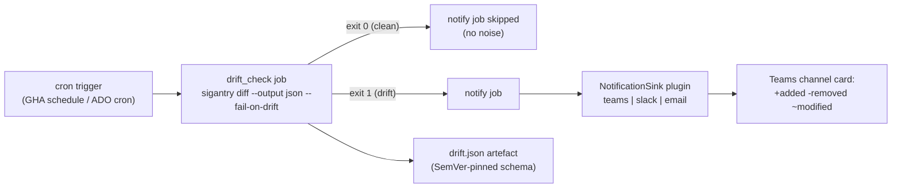

# Tutorial 08 — Scheduled Drift Alerts to Teams

**Goal:** the drift check from Tutorial 03 running unattended on a schedule, posting
a summary card to a Teams channel whenever a governed workspace drifts — and staying
silent when everything matches.

**Time:** ~30 minutes (most of it webhook + secret setup).
**Builds on:** [Tutorial 03](03-drift-detection.md) (a manifest with a clean drift
baseline, committed to the repo your CI runs from).

## The moving parts



The workflow pair ships in the repo: `.github/workflows/drift-check.yml` (GitHub
Actions) and `templates/schedules/drift-check.yml` (the Azure DevOps half — same
behaviour, kept in lockstep by the dual-CI parity gate).

## Step 0 — Pick the right workspace (read this twice)

Wire scheduled drift **only against a workspace your manifest fully governs** (e.g.
the one from Tutorial 06, or a team workspace where everything is declared). On a
shared workspace, every other team's item counts as `+ added` and the alert is
permanently red — an alarm that is always ringing is worse than no alarm. If you must
watch a partially-governed workspace, consume `drift.json` and alert on `removed`/
`modified` only.

## Step 1 — Create the Teams incoming webhook

In Teams: channel -> Manage channel -> Connectors (or Workflows app) -> Incoming
Webhook -> name it `sigantry-drift` -> copy the URL. Treat that URL as a secret —
anyone holding it can post to your channel.

## Step 2 — Store the webhook as a CI secret

GitHub:

```bash
gh secret set SIGANTRY_TEAMS_WEBHOOK --repo <owner>/<repo> --body "<webhook-url>"
```

Azure DevOps: add `SIGANTRY_TEAMS_WEBHOOK` to the variable group the pipeline uses,
marked secret.

## Step 3 — Smoke-test the sink locally before involving CI

Cheaper to debug a webhook from your terminal than from a cron log. Use the exact
module the workflow's notify job invokes, fed by a real drift JSON:

```bash
# 1. Produce a drift JSON from your governed manifest (read-only):
sigantry diff --manifest sync.yml --workspace-id "$WSID" \
  --output json --no-hint > /tmp/drift.json

# 2. Post it through the Teams sink:
export SIGANTRY_NOTIFICATION_SINK=teams
export SIGANTRY_TEAMS_WEBHOOK="<webhook-url>"
python -m sigantry_core.sync._notify_main \
  --drift-json /tmp/drift.json --workspace-id "$WSID"
# expect: a line like
#   sigantry _notify_main: posted drift summary for workspace=<id> drift=... (+a -r ~m =u)
# and a card in the Teams channel within seconds
```

Two contract details worth knowing: the sink posts an Adaptive Card by default (set
`SIGANTRY_TEAMS_WEBHOOK_FORMAT=messagecard` for legacy Connector webhooks), and the
sinks deliberately swallow transport errors at WARN — a broken webhook still exits 0.
The CI alarm is owned by `sigantry diff --fail-on-drift`, not by notification
delivery. So: no card but exit 0 means check the URL and look for the WARN log line;
also confirm outbound HTTPS to `*.webhook.office.com` / `*.logic.azure.com` is open.

## Step 4 — Trigger the workflow once by hand

Before trusting the schedule, run the workflow manually with your real inputs:

```bash
gh workflow run drift-check.yml --repo <owner>/<repo> \
  -f workspaceId=<governed-workspace-guid> \
  -f manifestPath=<path/to/sync.yml-in-repo> \
  -f environment=prod
gh run watch
# expect: drift_check job green; notify job SKIPPED (you are clean from Tutorial 03);
#         drift.json attached as a run artefact
```

## Step 5 — Prove the alert path end-to-end

Inject drift exactly as in Tutorial 03 (rename one governed item in the portal),
re-run the workflow, and confirm:

- `drift_check` exits 1 (run shows red — correct, that is the alarm),
- `notify` runs and the Teams card arrives with the +/-/~ summary,
- `drift.json` in the artefacts names the drifted item.

Then reconcile (portal undo or `sync apply`) and re-run once more to watch it go
green and silent again.

## Step 6 — Let the schedule take over

The workflow's `schedule:` block defaults to a daily cron. Adjust frequency to taste
(hourly for hot workspaces, daily for stable ones) and merge. From now on the only
time you hear about this workspace is when reality stops matching the contract.

## Operational notes

- **Auth in CI:** the workflow authenticates via the repo's federated credential /
  service connection (no secrets in YAML — see the workflow file's env block). The
  service principal needs Viewer+ on the workspace.
- **Slack or email instead of Teams:** set `SIGANTRY_NOTIFICATION_SINK=slack` (with
  `SIGANTRY_SLACK_WEBHOOK`) or `email` (with `SIGANTRY_SMTP_*`) — same plugin seam,
  same card content.
- The drift JSON schema is SemVer-pinned (`docs/reference/drift-schema.json`) — safe
  to build downstream automation on.

## Success checklist

- [ ] local sink smoke test posted a card
- [ ] manual run: clean workspace -> notify skipped, drift.json artefact present
- [ ] injected drift -> red run + Teams card naming the item
- [ ] reconciled -> green run, silence
- [ ] schedule merged

**Next:** [Tutorial 09 — PR review bot](09-pr-review-bot.md).
