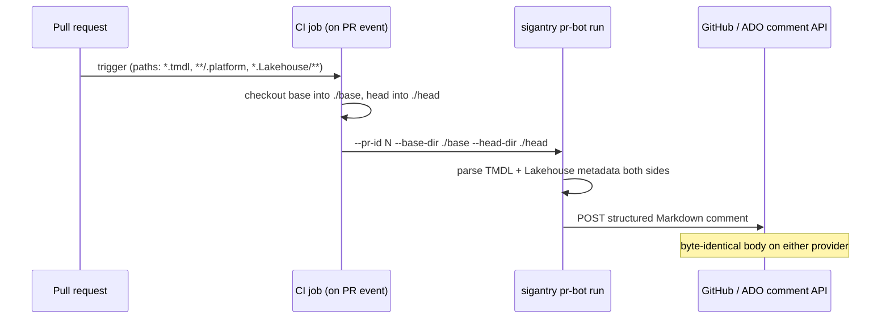

# Tutorial 09 — PR Review Bot for Semantic-Model and Lakehouse Diffs

**Goal:** schema changes made visible in code review. You will run the bot locally
against two checkouts and see the Markdown diff it produces, then wire it into CI so
every pull request that touches a `.tmdl`, `.platform`, or Lakehouse metadata file
gets an automatic review comment.

**Time:** ~25 minutes.
**Builds on:** [Tutorial 01](01-setup-and-first-contact.md).

## The problem this solves

Raw git diffs of TMDL files are readable but unreviewed in practice — a renamed
measure or a dropped Lakehouse column hides in line noise and gets caught by
downstream breakage instead of by a reviewer. The bot parses both sides and posts a
*semantic* summary: measures/columns/tables added, removed, changed.



## Step 1 — Diff locally with a synthetic change (zero credentials)

The diff engine is importable on its own — simulate a PR in two minutes.
**Indentation matters: TMDL uses spaces, not tabs.** A tab-indented file parses as
one opaque block and diffs as "no changes" — the most common first-run mistake.

```bash
mkdir -p ~/sigantry-tut09/{base,head}/model.SemanticModel/definition && cd ~/sigantry-tut09
cat > base/model.SemanticModel/definition/orders.tmdl <<'EOF'
table orders
    column order_id
        dataType: int64
    column amount
        dataType: decimal
    measure 'Total Amount' = SUM(orders[amount])
EOF
cp base/model.SemanticModel/definition/orders.tmdl head/model.SemanticModel/definition/orders.tmdl
cat >> head/model.SemanticModel/definition/orders.tmdl <<'EOF'
    measure 'Order Count' = COUNTROWS(orders)
EOF

python3 - <<'PY'
from pathlib import Path
from sigantry_core.pr_bot.tmdl_diff import diff_tmdl
print(diff_tmdl(Path("base"), Path("head")))
PY
# expect: ... measures_added=[MeasureChange(table='orders', name="'Order Count'")] ...
```

This local loop is also how you sanity-check the bot against your real model repos
before turning it on: point it at any two checkouts.

A note on `--dry-run`: the CLI's dry-run skips the comment POST but still **fetches
PR metadata from the provider API** — so it needs a real PR number, a valid token,
and (on GitHub) `GITHUB_REPOSITORY=owner/repo` in the environment. Use the Python
loop above for credential-free experimentation; use `--dry-run` to preview the exact
Markdown against a real PR.

## Step 2 — Understand what it watches

Three surfaces, diffed semantically:

| Surface | Files | What gets reported |
|---|---|---|
| Semantic models | `*.tmdl` | tables / columns / measures added, removed, changed |
| Item identity | `**/.platform` | item renames, type changes |
| Lakehouse | `*.Lakehouse/**` metadata files | table/schema-level changes |

Everything else in the PR is ignored — the bot complements, not replaces, human review.

## Step 3 — Post for real once

Pick (or open) a scratch PR in a repo you own, then run with a token:

```bash
export GITHUB_TOKEN=<pat-with-repo-scope>     # or rely on the CI-injected token later
export GITHUB_REPOSITORY=<owner>/<repo>       # the bot reads the repo coords from env
sigantry pr-bot run --provider github --pr-id <number> \
  --base-dir <path-to-base-checkout> --head-dir <path-to-head-checkout>
# expect: exit 0; the PR now carries a structured "Sigantry PR review" comment
# (add --dry-run first to print the exact Markdown without posting)
```

On Azure DevOps the same command takes `--provider ado` with the ADO env vars the
pipeline provides; the posted body is byte-identical across providers by contract.

## Step 4 — Wire it into CI

The trigger workflow ships in the repo — `.github/workflows/sigantry-pr-bot.yml`
(GHA) and `templates/pr-review/sigantry-pr-bot.yml` (ADO). The essential shape, if
you are adapting it to a consumer repo:

```yaml
on:
  pull_request:
    paths: ["**/*.tmdl", "**/.platform", "**/*.Lakehouse/**"]
jobs:
  pr-bot:
    runs-on: ubuntu-latest
    steps:
      - uses: actions/checkout@v6
        with: { ref: "${{ github.event.pull_request.base.sha }}", path: base }
      - uses: actions/checkout@v6
        with: { ref: "${{ github.event.pull_request.head.sha }}", path: head }
      - run: pip install sigantry  # or install from your checkout
      - run: |
          sigantry pr-bot run --provider github \
            --pr-id "${{ github.event.pull_request.number }}" \
            --base-dir ./base --head-dir ./head
        env:
          GITHUB_TOKEN: ${{ secrets.GITHUB_TOKEN }}
```

The path filter means the bot only spends CI minutes on PRs that touch model or
Lakehouse surfaces.

## Step 5 — Prove the no-change behaviour

Open a PR that touches only a README. The bot either does not trigger (path filter)
or, if invoked anyway, posts a "no model/Lakehouse changes" comment and exits 0 —
reviewers learn to trust its silence as a signal too.

## Troubleshooting

| Symptom | Cause | Fix |
|---|---|---|
| diff reports no changes on a file you edited | tab-indented TMDL | re-indent with spaces (TMDL spec) |
| `GitHub provider requires --token or GITHUB_TOKEN` | no token, even on dry-run | export `GITHUB_TOKEN` (dry-run still reads PR metadata) |
| `GITHUB_REPOSITORY env var must be 'owner/repo'` | running outside GHA | export it manually; CI sets it automatically |
| `HTTP 401` on dry-run | dummy/expired token | dry-run needs a REAL token; use the Python loop for credential-free testing |

## Exit codes (for CI wiring)

| Code | Meaning |
|---|---|
| 0 | comment posted (or dry-run printed, or clean no-change comment) |
| 1 | validation / auth misconfiguration (missing token, bad flags) |
| 2 | REST or auth runtime error |
| 3 | unexpected exception |

## Success checklist

- [ ] dry-run printed a semantic diff naming the added measure
- [ ] a real PR carries the bot's structured comment
- [ ] CI posts automatically on a `.tmdl`-touching PR
- [ ] a docs-only PR produces no schema-diff noise

**Next:** [Tutorial 10 — Governance sweeps](10-governance.md).
