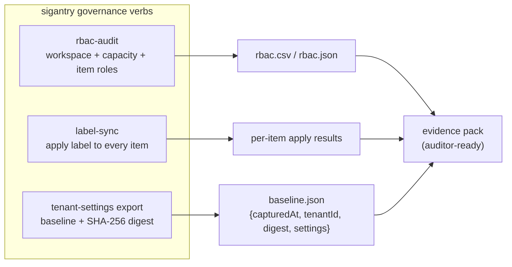

# Tutorial 10 — Governance Sweeps: RBAC, Labels, Tenant Settings

**Goal:** three pieces of compliance evidence produced on demand: a workspace RBAC
export an auditor can open in Excel, a sensitivity label applied across every item in
a workspace, and a hash-stamped tenant-settings baseline you can diff month on month.

**Time:** ~20 minutes.
**Builds on:** [Tutorial 01](01-setup-and-first-contact.md). Tenant-settings export
additionally requires a **Fabric administrator** identity; label-sync requires the
label GUID from your Purview / compliance portal.

## Why these three together

They answer the three questions every audit asks: *who can touch what* (RBAC),
*is data classified* (labels), and *what guardrails were configured* (tenant
settings) — each with evidence you can hand over rather than screenshots.



## Part A — RBAC audit

By default the audit is **tenant-wide**: it sweeps every workspace your identity
can see (plus capacity and item layers). Two flags make it actionable
day-to-day (added in 3.2.0 — if `sigantry rbac-audit --help`
does not show them, upgrade):

- `--workspace-id <guid>` / `-w` (repeatable) scopes the sweep to named
  workspaces; the capacity layer then narrows to the capacities those
  workspaces actually run on. A typo'd id fails loudly with `not found (404)`
  rather than producing an empty-but-green report.
- `--out-dir <dir>` files the rows as a UTC-dated
  `rbac-audit-<YYYYMMDDTHHMMSSZ>.csv` (or `.json` with `--output json`) and
  prints a one-line summary instead of dumping rows to the console.
  `--out <file>` writes an exact path instead; the two are mutually exclusive.

```bash
# The filed, scoped form -- the shape you act on later:
sigantry rbac-audit -w "$WSID" --out-dir ./access-reviews
# expect a single summary line (live-verified 2026-06-11 against COE_F_SBDEVOPS_POC,
# 18 rows):
#   wrote access-reviews/rbac-audit-20260611T181719Z.csv (rows=18, scope=1 workspace(s))

# The classic tenant-wide console stream still works:
sigantry rbac-audit --output csv > /tmp/rbac.csv     # may take minutes on a big tenant
head -3 /tmp/rbac.csv
# expect:
#   layer,resource_id,resource_name,principal_id,principal_type,principal_name,role,access_status
#   workspace,<guid>,<workspace name>,<guid>,Group,<group name>,Viewer,ok
#   workspace,<guid>,<workspace name>,<guid>,User,<person>,Viewer,via-group:<group name>
```

Note the `via-group:` rows — the audit expands group memberships, so you see the
*people* who hold access through a group, not just the group. That is usually the
column auditors actually ask about.

Find the admins in a (scoped or tenant-wide) export:

```bash
grep ",$WSID," /tmp/rbac.csv | awk -F, '$7=="Admin"'
```

(Names containing commas are CSV-quoted, which defeats naive `-F,` splitting —
for anything beyond eyeballing, parse the `--output json` form instead.)

`--output json` gives the same rows structured. Practical uses:

- diff this month's export against last month's to spot privilege creep —
  the dated `--out-dir` files are designed for exactly this comparison;
- review every `Admin` row and confirm each is justified;
- attach the CSV to the access-review ticket — done.

Notes on partial access: capacities your identity cannot read appear as rows with
`access_status="forbidden-admin-only"`, and item-level scope appears as
`not-accessible-via-rest` placeholders where the REST surface does not expose
assignments — the sweep records what it could not see instead of failing.

## Part B — Sensitivity label sweep

You need a label GUID from your compliance portal (Purview -> Information protection
-> Labels -> copy the label id).

**This writes to every item in the workspace** — run it first against the Tutorial 06
scratch workspace, not a shared one:

```bash
sigantry label-sync --workspace-id "$TUT06_WSID" --label-id "<label-guid>" --output json
# expect: per-item results -- each item id with applied/skipped/failed status
```

What to check in the output: `failed` entries usually mean the item type does not
support labels (some types cannot carry them) or the principal lacks label-apply
permission. Open one item in the portal and confirm the label badge shows.

Service-principal nuance: label APIs behave differently for SPNs vs users; the verb
auto-detects from your credential, with `--sp` / `--user` overrides when the
detection guesses wrong.

## Part C — Tenant-settings baseline

Requires Fabric admin — without it the call fails fast with `AuthError: HTTP 403`
(that is your identity lacking the admin API, not a toolkit problem). The export
sorts all settings, computes a SHA-256 digest over the canonical JSON, and stamps
capture time + tenant:

```bash
sigantry tenant-settings export --output /tmp/tenant-baseline-$(date -u +%Y%m).json
python3 - <<'PY'
import glob, json
path = sorted(glob.glob("/tmp/tenant-baseline-*.json"))[-1]
b = json.load(open(path))
print("capturedAt:", b["capturedAt"], "| settings:", len(b["settings"]), "| digest:", b["digest"][:16], "...")
PY
# expect: capture timestamp, settings count, digest prefix
```

The monthly ritual that makes this valuable:

```bash
# next month, export again, then:
python3 - <<'PY'
import glob, json
a, b = [json.load(open(p)) for p in sorted(glob.glob("/tmp/tenant-baseline-*.json"))[-2:]]
print("digests equal:", a["digest"] == b["digest"])
if a["digest"] != b["digest"]:
    na = {s["settingName"]: s for s in a["settings"]}
    for s in b["settings"]:
        if s != na.get(s["settingName"]):
            print("changed:", s["settingName"])
PY
```

Equal digests = provable "nothing changed". Unequal = a named list of exactly which
guardrails moved, with two timestamped files as evidence. Commit the baselines to a
governance repo and the history writes itself.

## Success checklist

- [ ] `/tmp/rbac.csv` opens with principal/role rows for your workspace
- [ ] scratch workspace items show the applied label in the portal
- [ ] baseline JSON has `capturedAt`, `tenantId`, `digest`, `settings[]`
- [ ] you can articulate the monthly digest-compare ritual

**You have now exercised every capability tier.** From here:
[runbooks](../runbooks/INDEX.md) for terse operational references,
[CAPABILITIES.md](../CAPABILITIES.md) for the full verb inventory, and the
[CI/CD template pair](../CAPABILITIES.md#5-cicd-pipeline-templates) to put the whole
loop — deploy, test, approve, promote, drift-watch — on rails.
