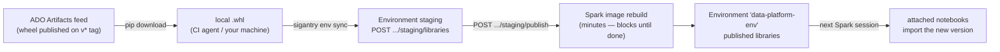

# Tutorial 11 — Environments and Libraries

**Goal:** understand exactly how a Fabric **Environment** consumes a custom Python
wheel, push one wheel to an Environment with a single command, and know precisely
when the notebooks attached to it start importing the new version. This is the
third plane Sigantry governs — alongside item *topology* (`sync apply`) and item
*content* (`deploy run`), this is the **runtime library** plane.

**Time:** ~20 minutes.
**Builds on:** [Tutorial 01](01-setup-and-first-contact.md) — install + authenticated session.
**Uses:** `sigantry env sync`.

> **Proven live (2026-06-14).** This flow was run end-to-end against a production
> workspace (`COE_F_EUC_P2`), publishing `aims_data_platform-1.6.0` into a live
> Environment. The publish/rebuild took ~6 minutes and `env sync` blocked for its
> whole duration. It was authenticated as a **normal user via `az login`**
> (AzureCliCredential through `DefaultAzureCredential`) — `env sync` is *not*
> restricted to a service principal; any identity with write on the workspace works.
> The dual-version failure and its fix in
> [Troubleshooting](#troubleshooting--the-dual-version-pitfall) were observed and
> resolved in that same run.

## The mental model

A **wheel does not flow from a feed straight into a workspace.** Fabric Environments
take *uploaded* custom libraries; their "public libraries" source is public PyPI/conda,
not an authenticated private ADO feed. So the path always has an upload hop:



Three facts that decide everything downstream:

1. **The Environment is the unit of sharing.** Every notebook attached to a given
   published Environment imports the same library set. Republish the Environment once
   and *all* of its notebooks benefit — you never sync notebook-by-notebook.
2. **Publish is a rebuild, not a copy.** Uploading a wheel stages it; the
   `staging/publish` step rebuilds the Spark image and takes minutes. `env sync`
   **blocks until that finishes** (it polls `publishDetails.state` to `Success`), so a
   green `env sync` means the library is genuinely importable — not merely uploaded.
3. **Running sessions do not hot-swap.** A notebook with a live Spark session keeps the
   old library; it picks up the new one on its **next** session start.

## Step 1 — Get a wheel to deploy

Any built wheel works. Build one from a sibling project, or pull a released version
from the feed:

```bash
# from a local project build:
ls dist/*.whl
# expect: e.g. data_platform-1.6.0-py3-none-any.whl

# or pull a pinned release from the feed (CI agents do this):
pip download --no-deps --dest dist "data-platform==1.6.0"
```

## Step 2 — Sync the wheel into the Environment

`env sync` is the single-target primitive: one workspace, one Environment, one wheel.
You need the **workspace GUID** and the **Environment GUID** (the Environment must
already exist — `env sync` updates libraries, it does not create Environments):

```bash
sigantry env sync \
  --workspace-id   <workspace-guid> \
  --environment-id <environment-guid> \
  --wheel dist/data_platform-1.6.0-py3-none-any.whl
# expect (after the publish blocks to completion):
# {
#   "wheelName": "data_platform-1.6.0-py3-none-any.whl",
#   "stagingUploadStatus": "...",
#   "publishLroStatus": "Success",
#   "installedLibraryName": "data_platform-1.6.0-py3-none-any.whl"
# }
```

`publishLroStatus: "Success"` is the load-bearing line: the rebuild finished and the
wheel is in the Environment's *published* library set. If the build fails the command
raises (non-zero) instead of falsely reporting success.

## Step 3 — Confirm a notebook actually imports it

Attach a notebook to that Environment (Fabric portal → notebook → Environment selector),
**start a fresh session**, and run:

```python
import data_platform
print(data_platform.__version__)   # expect: 1.6.0
```

If you had a session open *before* Step 2, restart it — that is the session-boundary
rule from the mental model, and it is the single most common "but I deployed it!"
confusion.

## What to take into production

- **One Environment, many notebooks.** Standardise: point a whole workspace's notebooks
  at one Environment (e.g. `data-platform-env`). Then a library update is *one* publish, and
  every notebook benefits on next session — no per-notebook work.
- **Budget for the rebuild.** Each publish costs minutes. Don't publish per-notebook or
  per-PR; publish per *release*.
- **You cannot point the Environment at the private feed.** The download→upload→publish
  hop is mandatory (as of 2026-06); that is *why* `env sync` exists. If Microsoft adds
  private-feed support to Environments later, revisit this.
- **Pre-create the Environment.** `env sync` will not create one; bootstrap it once
  (portal or `deploy run` of an `*.Environment` item) before the first sync.

## Success checklist

- [ ] you can state where a wheel physically lives before and after `env sync`
- [ ] `env sync` returned `publishLroStatus: "Success"`
- [ ] a freshly-started notebook session imported the new version
- [ ] you can explain why a *running* session didn't see the change

## Troubleshooting — the dual-version pitfall

`env sync` **adds** a wheel to the Environment; it does **not** remove older versions
of the same package. If staging ends up with two versions of one package — e.g.
`aims_data_platform-1.5.1` *and* `aims_data_platform-1.6.0` — the publish **fails**.
You will see (on the environment object) `publishDetails.state: "Failed"` with
`componentPublishInfo.sparkLibraries.state: "Failed"`, while `sparkSettings` succeeds.
The published library set is left unchanged (the old version stays live).

This was observed live on 2026-06-14: the first `env sync` of `1.6.0` failed because
`1.5.1` was still staged alongside it.

**Fix (recommended) — `sigantry env reconcile`.** This one command removes the
superseded version of each named package, uploads the new wheel, publishes **once**,
and blocks to completion. Packages you don't name are left untouched:

```bash
sigantry env reconcile \
  --workspace-id   <workspace-guid> \
  --environment-id <environment-guid> \
  --wheel dist/aims_data_platform-1.6.0-py3-none-any.whl   # repeat --wheel per package
# add --dry-run to preview the delete/upload plan first.
```

Proven live 2026-06-14 (`fabric_data_quality` 2.1.2 → 2.2.0 on `COE_F_EUC_P2`,
leaving `aims_data_platform-1.6.0` in place).

**Fix (manual fallback) — raw Fabric REST.** Equivalent to what `reconcile` does, if
you need to script it directly. With a token for the Fabric API
(`az account get-access-token --resource https://api.fabric.microsoft.com`):

```bash
WS=<workspace-guid>; ENV=<environment-guid>
TOKEN=$(az account get-access-token --resource https://api.fabric.microsoft.com --query accessToken -o tsv)

# 1. See what's staged
curl -s -H "Authorization: Bearer $TOKEN" \
  "https://api.fabric.microsoft.com/v1/workspaces/$WS/environments/$ENV/staging/libraries"

# 2. Delete the stale version (note: libraryToDelete is the exact .whl filename)
curl -s -X DELETE -H "Authorization: Bearer $TOKEN" \
  "https://api.fabric.microsoft.com/v1/workspaces/$WS/environments/$ENV/staging/libraries?libraryToDelete=aims_data_platform-1.5.1-py3-none-any.whl"

# 3. Republish the now-clean staging
curl -s -X POST -H "Authorization: Bearer $TOKEN" -H "Content-Length: 0" \
  "https://api.fabric.microsoft.com/v1/workspaces/$WS/environments/$ENV/staging/publish"

# 4. Poll until publishDetails.state is terminal (Success / Failed)
curl -s -H "Authorization: Bearer $TOKEN" \
  "https://api.fabric.microsoft.com/v1/workspaces/$WS/environments/$ENV" \
  | python3 -c "import sys,json;print(json.load(sys.stdin)['properties']['publishDetails']['state'])"
```

After step 4 reports `Success`, the published set holds exactly the intended versions
(verified live: `aims_data_platform-1.6.0` + `fabric_data_quality-2.1.2`, with `1.5.1`
gone). **Rule of thumb:** on a version *upgrade*, always strip the previous wheel from
staging before (or right after) `env sync`, so the publish never sees two versions of
the same package.

> `sigantry env reconcile` (above) is the supported upgrade path; the raw REST is
> kept here only for scripting/debugging.

**Next:** [Tutorial 12 — Config-driven auto-update](12-config-driven-autoupdate.md) —
turn this one-Environment command into a fleet you keep current from a single file.
