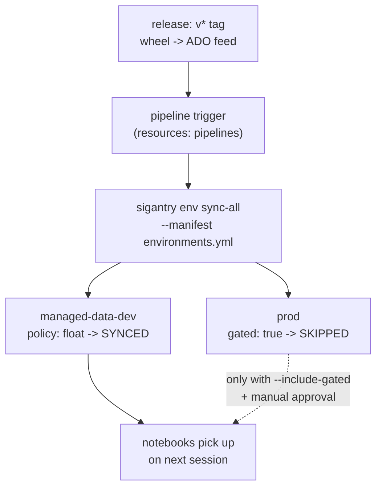

# Tutorial 12 — Config-Driven Auto-Update

**Goal:** keep *many* Fabric Environments current from a single `environments.yml`,
so that one successful release fans the new wheels out to every Environment that
should have them — with the risk controls (gating, pinning, idempotency,
fail-isolation) expressed as **data**, not as copy-pasted pipeline shell. Then wire
it to fire automatically on release, *safely*.

**Time:** ~30 minutes.
**Builds on:** [Tutorial 11](11-environments-and-libraries.md) — the single-Environment
`env sync` and the consumption model.
**Uses:** `sigantry env sync-all`.

> Every `env sync-all` invocation in this tutorial (including the JSON output blocks)
> was executed locally on 2026-06-14 in `--dry-run` mode, which performs no tenant
> calls. The live publish behaviour is the same `env sync` mechanism from Tutorial 11.

## Why a manifest, not a loop

The naive answer to "auto-update every workspace" is a bash loop over `env sync`. That
works until the day it matters: it has no idea which Environments are *production*, it
re-publishes things that are already current (minutes wasted each), and one failure
aborts the rest. `env sync-all` moves those decisions into a versioned file and a
tested orchestrator.



## Step 1 — Write `environments.yml`

```yaml
schema_version: "1.0"
targets:
  - name: managed-data-dev
    workspace_id: <dev-workspace-guid>
    environment_id: <dev-environment-guid>
    wheels: ["dist/*.whl"]      # float: take whatever the release built
    policy: float

  - name: prod
    workspace_id: <prod-workspace-guid>
    environment_id: <prod-environment-guid>
    wheels:                     # pin: exact files, no globs allowed
      - "dist/data_platform-1.6.0-py3-none-any.whl"
      - "dist/data_quality-2.2.0-py3-none-any.whl"
    policy: pin
    gated: true                 # never touched unless --include-gated
```

Four risk controls, all as data:

| Field | What it buys you |
|---|---|
| `policy: float` | DEV tracks the latest build (globs allowed). |
| `policy: pin` | PROD must name exact wheels — globs are **rejected at load**, so a prod target can never silently ship "latest". |
| `gated: true` | The target is **skipped** unless the operator passes `--include-gated`. An automatic on-release run keeps DEV current and leaves PROD untouched. |
| (orchestrator) | A wheel already published is **skipped** (no needless rebuild); one target failing does **not** abort the rest. |

## Step 2 — Dry-run first, always

`--dry-run` validates the manifest, resolves every wheel pattern, and prints the plan
**without a single tenant call**:

```bash
sigantry env sync-all --manifest environments.yml --dry-run
```

```json
{
  "ok": true,
  "summary": {
    "targets": 2,
    "wheelsSynced": 0,
    "wheelsSkipped": 0,
    "wheelsFailed": 0,
    "targetsGatedSkipped": 1
  },
  "targets": [
    {
      "name": "managed-data-dev",
      "action": "processed",
      "wheels": [
        { "wheel": "data_platform-1.6.0-py3-none-any.whl", "action": "dry-run" },
        { "wheel": "data_quality-2.2.0-py3-none-any.whl", "action": "dry-run" }
      ]
    },
    { "name": "prod", "action": "gated-skipped", "wheels": [] }
  ]
}
```

Read the plan before you trust the run: DEV would sync both wheels; PROD is
`gated-skipped`. If a wheel path is wrong you get a `failed` target here, offline,
instead of half-way through a live deploy.

## Step 3 — Run it for the non-gated targets

```bash
sigantry env sync-all --manifest environments.yml
# expect: same JSON, but DEV wheels now "synced" with installedLibraryName set;
#         PROD still "gated-skipped". Exit 0 because nothing failed.
```

Run it a **second** time immediately:

```bash
sigantry env sync-all --manifest environments.yml
# expect: DEV wheels now "skipped-unchanged" — already published, no rebuild.
```

That idempotency is what makes an on-release trigger cheap: re-running costs nothing
when nothing changed.

## Step 4 — Production is a deliberate, separate act

PROD only moves when a human opts in:

```bash
sigantry env sync-all --manifest environments.yml --include-gated
# acts on gated targets too — run this behind a manual approval, never on auto-trigger.
```

Because `prod` is `policy: pin`, this deploys *exactly* the named versions. If
`dist/data_platform-1.6.0-...whl` isn't present, that target fails loudly (and in
isolation) rather than shipping something else.

## Step 5 — Wire the automatic trigger (safely)

Make the deploy pipeline fire when the publish pipeline succeeds — but keep the auto
path pointed at non-gated targets only. In Azure DevOps:

```yaml
# azure-pipelines-fabric-deploy.yml (consumer pipeline, e.g. in your data-platform repo)
resources:
  pipelines:
    - pipeline: libPublish
      source: lib-publish-ci             # the pipeline that publishes wheels on v*
      trigger:
        tags: [ 'v*' ]                    # only real releases, not every build

# ... in the deploy job, after pip-downloading the wheels into dist/:
steps:
  - script: |
      sigantry env sync-all --manifest environments.yml
      # NOTE: no --include-gated. PROD targets stay gated; the auto path only
      # advances DEV/SANDBOX. PROD runs as a separate, manually-approved stage.
    displayName: 'Fan wheels out to non-gated Environments'
```

The result is the goal from the architecture question: **every successful release
auto-advances the Environments that opted in (DEV/managed-data), and their notebooks
pick the change up on next session** — while production stays a deliberate act.

## What to take into production

- **Never auto-push `latest` to PROD.** Keep prod targets `gated: true` + `policy: pin`,
  and run `--include-gated` only behind an approval gate. The manifest makes this the
  default, not a discipline you have to remember.
- **Mind the fan-out cost.** Each non-skipped target publishes serially (minutes each).
  Keep the auto-trigger target list small; let idempotency absorb the rest.
- **The summary is machine-readable.** `wheelsSynced` / `wheelsFailed` /
  `targetsGatedSkipped` are stable keys — gate the pipeline on them or post them to
  Teams (see [Tutorial 08](08-scheduled-drift-alerts.md) for the notification pattern).
- **`--fail-fast` is for interactive debugging.** In automation, prefer the default
  (isolate + continue) so one broken Environment doesn't strand the others; the
  non-zero exit still flags the run.

## Success checklist

- [ ] `--dry-run` showed your DEV target processed and PROD `gated-skipped`
- [ ] a real run synced DEV; an immediate re-run reported `skipped-unchanged`
- [ ] you confirmed PROD only moves with `--include-gated`
- [ ] your auto-trigger omits `--include-gated` (PROD stays manual)
- [ ] you can point to where pin-vs-float and gating live (the manifest, not the pipeline)

**Next:** revisit [Tutorial 07 — Rollback](07-rollback.md) — libraries and item content
roll back by different mechanisms; know both.
