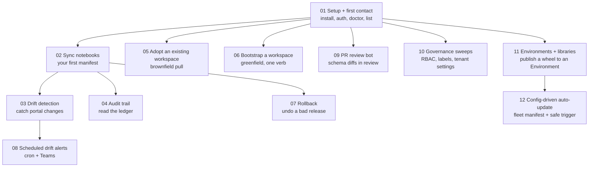

# Tutorials — Learn Sigantry by Doing

Each tutorial is a worked, end-to-end example you can follow verbatim. Every command
was executed (or, where destructive, dry-run-verified) against a live Fabric tenant
on 2026-06-11; expected output blocks show what you should actually see.

If you are brand new, do tutorials 01 and 02 in order — everything else builds on
them. After that, pick by need.

## Learning path

## The tutorials

| # | Tutorial | You will achieve | Time |
|---|---|---|---|
| 01 | [Setup and first contact](01-setup-and-first-contact.md) | Working install, authenticated session, your workspaces listed and snapshotted | 15 min |
| 02 | [Sync notebooks into a workspace](02-sync-notebooks.md) | Local notebooks governed by a manifest, published to Fabric, idempotency proven | 30 min |
| 03 | [Detect drift](03-drift-detection.md) | A drift baseline; a deliberately-injected change detected and reconciled | 20 min |
| 04 | [Read the audit trail](04-audit-trail.md) | Find, inspect, diff and hash-verify the release records your work created | 15 min |
| 05 | [Adopt an existing workspace](05-adopt-existing-workspace.md) | A live workspace pulled into a committed manifest, round-trip proven lossless | 25 min |
| 06 | [Bootstrap a new workspace](06-bootstrap-workspace.md) | A workspace + capacity + folders + Git wiring from one YAML file | 25 min |
| 07 | [Roll back a release](07-rollback.md) | Two releases in the ledger, a diff between them, the first restored | 30 min |
| 08 | [Scheduled drift alerts](08-scheduled-drift-alerts.md) | A cron workflow that posts to Teams when a workspace drifts | 30 min |
| 09 | [PR review bot](09-pr-review-bot.md) | Semantic-model and Lakehouse schema diffs posted on a pull request | 25 min |
| 10 | [Governance sweeps](10-governance.md) | RBAC export, sensitivity-label sweep, tenant-settings baseline | 20 min |
| 11 | [Environments and libraries](11-environments-and-libraries.md) | A custom wheel published to a Fabric Environment; you know exactly when notebooks see it | 20 min |
| 12 | [Config-driven auto-update](12-config-driven-autoupdate.md) | Many Environments kept current from one `environments.yml`; a safe on-release auto-trigger | 30 min |

## Conventions used in every tutorial

- **Two planes, two verbs.** `sync apply` and `sigantry diff` govern **topology** —
  an item's existence, name and folder. They never read or write the **content** of
  an item that already exists (`--with-publish` pushes content exactly once, at
  first publish). Content updates and republishes are the deploy engine's job:
  `sigantry deploy run` ([Tutorial 07](07-rollback.md)). A clean drift summary
  (`=N`) therefore certifies topology only — to verify content too, use the
  read-only recipe in "Auditing content parity"
  ([Tutorial 05](05-adopt-existing-workspace.md)).
- `<workspace-guid>` etc. are placeholders — substitute your real values. Everything
  else is copy-paste literal.
- Expected output is shown after `# expect:` comments or in its own block. Minor
  differences (timestamps, GUIDs, counts) are normal; structural differences are not.
- Commands marked **DESTRUCTIVE** change or delete things and always require
  `--force`-style acknowledgement flags. Tutorials only point these at workspaces you
  created in the same tutorial.
- Each tutorial ends with a **Success checklist** — if every box ticks, you achieved
  the goal.

## Prerequisites common to all tutorials

Covered once in [tutorial 01](01-setup-and-first-contact.md): a Python 3.11 environment
with the toolkit installed, an Azure identity (`az login` or a service principal), and
at least Contributor access to one Fabric workspace on a capacity. Service-principal
and CI auth paths are summarised in tutorial 01's headless aside and fully specified
in the [User guide](../USER-GUIDE.md) section 6.

## Related reading

- [Capability catalogue](../CAPABILITIES.md) — the full verb inventory with source citations.
- [Operator runbooks](../runbooks/INDEX.md) — terser operational references for each verb.
- [Getting started](../getting-started/install.md) — installation detail.
- [User guide](../USER-GUIDE.md) — the narrative operator manual.
